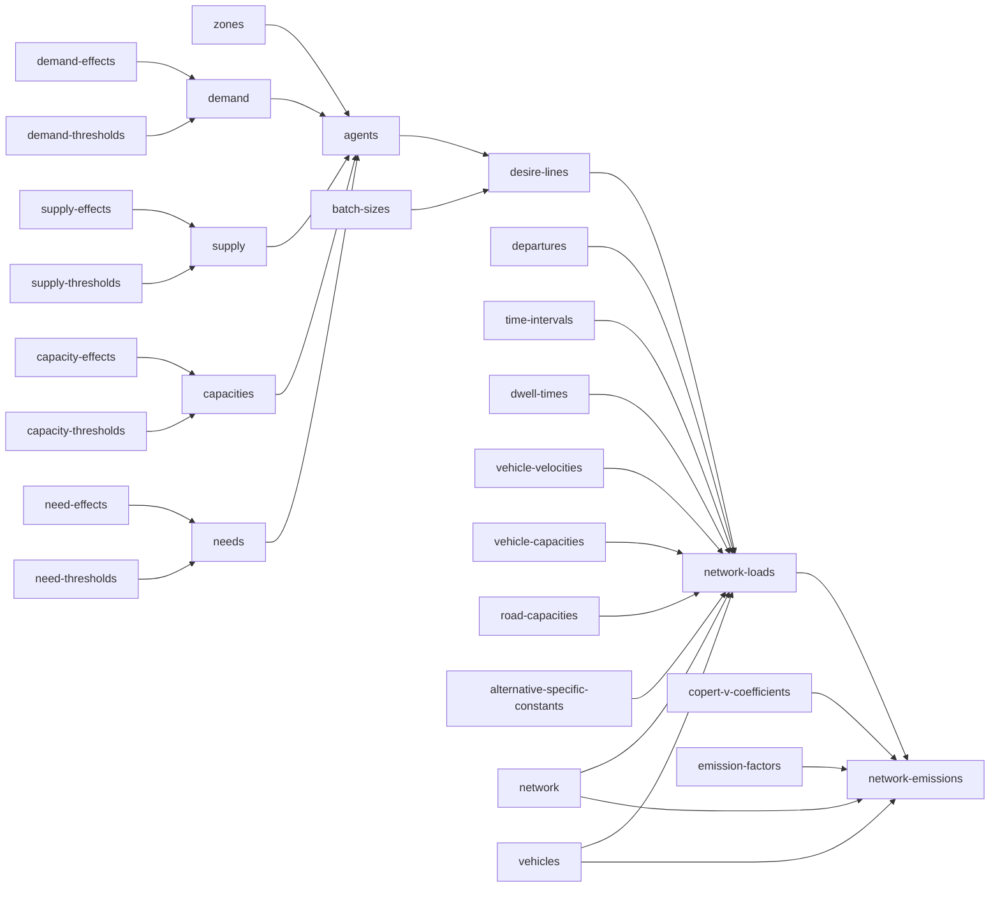

# urban-dollop

## `synth supply-effects` / `synth demand-effects` / `synth capacity-effects` / `synth need-effects`

Coefficients for a textbook additive (main-effects, no interactions among stratum
dimensions) ordered-logit linear predictor -- the cumulative logit / proportional odds
model of McCullagh (1980). Output is wide: one row per (stratum, stratum value) pair, one
column per resource.

| stratum | stratum_value | resource_1 | resource_2 |
|---|---|---|---|
| zone_id | 1 | 0.734 | -0.310 |
| zone_id | 2 | -0.051 | 0.884 |
| stratum_1 | value_1 | 0.512 | -0.204 |

A stratum value can repeat across different strata (`value_1` could belong to both
`stratum_1` and `stratum_2`) -- values are only unique within their own stratum, not across
the file. Each resource column is its own independent linear predictor ($\beta$), the sum
of whichever rows apply to a given stratum combination *for that resource* -- a resource
column indexes which independent model a cell belongs to, not a covariate on a shared one.
Every row carries a value for every resource column, so the stratum shape (which dimensions
exist, how many values each has) is structurally guaranteed to be shared across resources;
only the effect values differ per resource.

`supply`/`demand` describe a stratum's aggregate resource totals; `capacity`/`need`
describe the size distribution of individual agents drawn from that stratum later --
different questions, same statistical machinery, four independent files.

### Synthesis

Every effect value is drawn from a standard normal, `Normal(0, 1)`, fixed regardless of
`--sigma` -- it is the value being synthesized, not a count of how much to synthesize. Mean
zero is not an arbitrary default: with no reference category dropped and no separate
intercept anywhere in this design, each effect is a random effect (in the mixed-model
sense), and mean zero is exactly what makes that identifiable rather than an unmeasurable
duplicate of an intercept that doesn't exist here.

Each of these four commands is fully self-contained -- none of them look at any other file.
Run one with nothing on disk yet and it synthesizes shape and values together: dimension
count, each dimension's value count, and resource count are all `ceil(lognormal(0,
sigma))`, uncapped, `zone_id` always included. `zone_id` values are plain integers (`1`,
`2`, ...); every other dimension gets string labels (`value_1`, `value_2`, ...) -- `zone_id`
is the one stratum guaranteed to exist and the one with a natural real-world numeric
identity, so it's the one place that distinction is made. `--sigma 0` collapses this to the
smallest possible draw: one dimension (`zone_id`), one value, one resource column.

Alternatively, hand it a file that already has `stratum`/`stratum_value` filled in plus one
or more resource columns (real names and values are welcome here) with every resource
column left entirely empty, and it fills in just the values, leaving the shape untouched.
`stratum` must contain strings; `stratum_value` must be a string for every row except
`zone_id`'s, which may be int or string -- resource columns are identified by header name,
not by dtype, so this isn't needed for disambiguation, it's just that only `zone_id` has a
real-world numeric identity worth allowing. Filled resource columns must contain floats. A
file with any resource column already set anywhere -- fully or partially, in one column or
several -- is left alone and the command throws, rather than guessing whether you wanted it
regenerated. Passing `--sigma` against a file that already exists throws too: `--sigma`
only ever controls shape invention, and a file that already has shape has nothing left for
it to control.

## `synth supply-thresholds` / `synth demand-thresholds` / `synth capacity-thresholds` / `synth need-thresholds`

Cutpoints ($\mu$) for the same cumulative-logit model: a resource with $n$ ordered levels
gets `n - 1` thresholds, partitioning a latent continuous scale into the `n` discrete
outcomes.

| resource | resource_level | threshold |
|---|---|---|
| resource_1 | 1 | 0.432 |
| resource_1 | 2 | 1.738 |
| resource_1 | 3 | (empty) |
| resource_2 | 4 | -0.220 |
| resource_2 | 9 | (empty) |

`resource` must contain strings; `resource_level` must contain integers only -- a resource
is always counted in whole units (finer granularity means switching to a smaller unit, e.g.
tonnes to kilograms, not a fractional level). `resource_level` is a genuine numeric
quantity, not a category label -- it is the actual amount of the resource at that outcome,
used directly in a weighted sum downstream, even though it plays the same shape-defining
role `stratum_value` plays for effects. Levels are always distinct within a resource (a
repeated level would mean two ordinal categories mapping to the identical real-world
quantity, which has no meaningful interpretation) and always ascending; the largest level
in a resource has no upper threshold, hence empty.

### Synthesis

Every `threshold` is `Normal(0, 1)`, sorted ascending per resource, fixed regardless of
`--sigma` -- a value, not a count, same reasoning as `effect` above. Resource *count* and
*level count per resource* are both `ceil(lognormal(0, sigma))`, uncapped. Level *values*
are drawn from the same `--sigma` as the count that determined how many are needed, repeated
until the required number of levels is distinct within that resource -- `resource_level`
plays the same shape-defining role `stratum_value` plays for effects, even though it's
numeric.

Same self-contained contract as the effects commands: nothing on disk synthesizes shape and
values together; a file with `resource`/`resource_level` filled in and `threshold` entirely
empty gets just its thresholds filled; anything with `threshold` already set anywhere is
left alone and the command throws. Passing `--sigma` against a file that already exists
throws too, same reasoning as effects.
