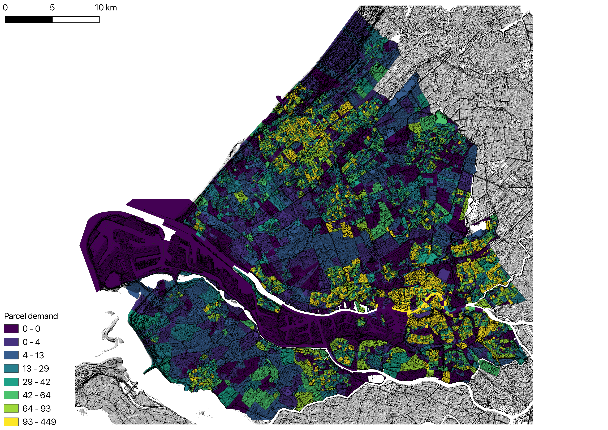
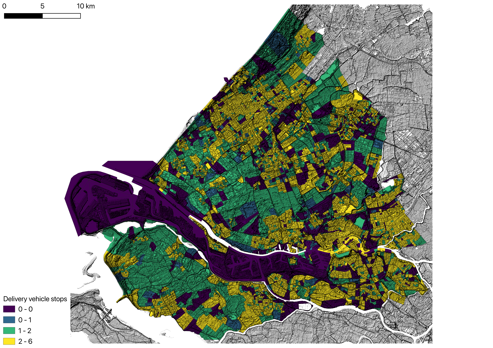

# urban-dollop

urban-dollop is a Python library that extracts and packages the mathematical models
from [MASS-GT](https://github.com/orgs/mass-gt/repositories) — a multi-agent urban
freight simulation system originally developed at TU Delft for the Dutch Randstad region.
The models are reimplemented as a transparent, installable Python pipeline intended for
academic research and reproducible urban logistics studies.

The primary novel contribution is the introduction of road grade as a dimension in
emission accounting, enabling topographically accurate estimates in hilly cities.

---

## Usage

### Parcel demand generation

Estimate the daily parcel delivery demand for a study area from zonal population and
employment data.

```python
from urban_dollop import Zone, Depot, Carrier, SkimMatrix, generate_parcel_demand

zones    = Zone.from_file("zones.gpkg")
depots   = Depot.from_file("depots.gpkg")
carriers = Carrier.from_file("carrier_shares.csv")
skim     = SkimMatrix.from_file("skim_time.mtx", zones)

demands  = generate_parcel_demand(zones, depots, carriers, skim)
```

`demands` is a `list[ParcelDemand]` — one record per unique
(destination zone, depot) combination:

| field | type | description |
|---|---|---|
| `destination_zone_id` | `int` | zone ID of the delivery address |
| `depot_id` | `int` | depot that handles this flow |
| `n_parcels` | `int` | number of parcels in this flow |

The origin zone of each flow is implicit — it is always the zone of the depot.

**Save to CSV** (join to your zones layer in QGIS or ArcGIS on `destination_zone_id`
to map parcels delivered per zone):

```python
ParcelDemand.to_file(demands, "parcel_demand.csv")
```

**Calibration — via `urban-dollop.toml`:**

Place an `urban-dollop.toml` in your current working directory to set calibration
parameters without touching code:

```toml
[parcel_demand]
parcels_per_household = 0.2054  # B2C daily deliveries per household
parcels_per_employee  = 0.0     # B2B daily deliveries per employee
delivery_success_b2c  = 0.75    # first-attempt success rate, residential
delivery_success_b2b  = 0.95    # first-attempt success rate, commercial
```

**Calibration — programmatic override:**

Pass a `ParcelDemandConfig` to override TOML values in code:

```python
from urban_dollop import ParcelDemandConfig

demands = generate_parcel_demand(
    zones, depots, carriers, skim,
    config=ParcelDemandConfig(
        parcels_per_household = 0.178,
        parcels_per_employee  = 0.029,
        delivery_success_b2c  = 0.80,
        delivery_success_b2b  = 0.95,
    ),
)
```

Programmatic values take precedence over TOML. Missing fields fall back to TOML.
Pydantic raises if a required field is absent from both sources.

**Column mapping** — when your files use different column names:

```python
zones = Zone.from_file("zones.gpkg", columns={
    "zone_id":    "id",
    "households": "hh_count",
    "employment": "jobs",
})

carriers = Carrier.from_file("shares.csv", columns={
    "name":  "courier",
    "share": "market_share",
})
```

Canonical column names:

| model | field | description |
|---|---|---|
| `Zone` | `zone_id` | unique integer zone identifier |
| `Zone` | `households` | household count |
| `Zone` | `employment` | employee count |
| `Depot` | `depot_id` | unique integer depot identifier |
| `Depot` | `zone_id` | zone the depot is located in |
| `Depot` | `carrier` | carrier name (must match `Carrier.name`) |
| `Carrier` | `name` | carrier name |
| `Carrier` | `share` | market share fraction (all carriers must sum to 1) |

#### CLI

Run the parcel demand module from canonical files:

```bash
urban-dollop generate-demand data/
```

This command:

- reads `urban-dollop.toml` from the current working directory
- reads `zones.gpkg`, `depots.gpkg`, `carrier_shares.csv`, and `skim_time.mtx` (or `skim_time.mtx.gz`) from `data/`
- writes `parcel_demand.csv` to the current working directory by default

To write the CSV somewhere else, pass `--outdir` with either an existing directory
or a full `.csv` path:

```bash
urban-dollop generate-demand --outdir results/ data/
urban-dollop generate-demand --outdir results/joinville_parcel_demand.csv data/
```

#### Example output



> [!NOTE]
> Example choropleth of simulated parcel deliveries aggregated by `destination_zone_id` for the Netherlands fixture scenario (5 925 zones, Randstad region). Zone geometry, household counts, and employment are from the [MASS-GT](https://github.com/mass-gt) LEADVersion dataset (SEGS2016, [CBS](https://www.cbs.nl/)). Travel times are derived from the MASS-GT Netherlands skim matrix. Depot locations and carrier shares are sourced from the MASS-GT LEADVersion scenario.

### Parcel delivery scheduling

Schedule the demand produced by `generate_parcel_demand` into vehicle tours.

```python
from urban_dollop import (
    Depot, ParcelDemand, SkimMatrix, Vehicle,
    schedule_parcel_deliveries,
)

depots   = Depot.from_file("depots.gpkg")
vehicles = Vehicle.from_file("vehicles.csv")
skim     = SkimMatrix.from_file("skim_time.mtx", zones)
demands  = ParcelDemand.from_file("parcel_demand.csv")

trips = schedule_parcel_deliveries(demands, depots, vehicles, skim)
```

`trips` is a `list[DeliveryTrip]` — one record per trip leg within a tour:

| field | type | description |
|---|---|---|
| `tour_id` | `int` | unique tour identifier |
| `trip_id` | `int` | sequential leg position within the tour |
| `depot_id` | `int` | depot the tour departs from and returns to |
| `carrier` | `str` | carrier operating the tour |
| `origin_zone_id` | `int` | zone at the start of this leg |
| `destination_zone_id` | `int` | zone at the end of this leg |
| `n_parcels` | `int` | parcels delivered at this stop (0 for the return leg) |
| `vehicle_id` | `int` | vehicle assigned to this tour |

Each tour begins at the depot, visits a sequence of delivery stops, and ends with a
return leg back to the depot (`n_parcels = 0`).

**Save to CSV:**

```python
DeliveryTrip.to_file(trips, "delivery_trips.csv")
```

**Calibration — via `urban-dollop.toml`:**

```toml
[parcel_scheduling]
seed = 42  # random seed for reproducible tour construction
```

**Calibration — programmatic override:**

```python
from urban_dollop import ParcelSchedulingConfig

trips = schedule_parcel_deliveries(
    demands, depots, vehicles, skim,
    config=ParcelSchedulingConfig(seed=42),
)
```

**Vehicle types — `vehicles.csv`:**

```python
vehicles = Vehicle.from_file("vehicles.csv")
```

| field | type | description |
|---|---|---|
| `vehicle_id` | `int` | unique vehicle type identifier |
| `name` | `str` | vehicle type label |
| `max_parcels` | `int` | maximum parcel capacity |

The scheduler assigns the smallest vehicle whose capacity fits the tour load. If
demand exceeds all vehicle capacities the largest vehicle is used.

#### CLI

Run the scheduling module from canonical files:

```bash
urban-dollop schedule-deliveries data/
```

This command:

- reads `urban-dollop.toml` from the current working directory
- reads `zones.gpkg`, `depots.gpkg`, `carrier_shares.csv`, `vehicles.csv`,
  `skim_time.mtx` (or `skim_time.mtx.gz`), and `parcel_demand.csv` from `data/`
- writes `delivery_trips.csv` to the current working directory by default

```bash
urban-dollop schedule-deliveries --outdir results/ data/
urban-dollop schedule-deliveries --outdir results/netherlands_trips.csv data/
```

#### Example output



> [!NOTE]
> Example choropleth of delivery vehicle stops aggregated by `destination_zone_id` for the Netherlands fixture scenario. Each stop represents one vehicle visit to a zone (one trip leg with `n_parcels > 0`). A zone receiving 6 stops has 6 separate vehicles — one per active carrier — stopping there on their respective tours. Same fixture as the parcel demand example above.

---

## Mathematical models

The following models are extracted from MASS-GT's `parcel_dmnd` module and implemented
in `generate_parcel_demand()`.

### Parcel demand generation

#### Zonal demand

The number of parcel flows destined for zone $z$ on an average weekday:

$$D_z = \left\lfloor \frac{H_z \cdot r_{HH}}{s_{B2C}} + \frac{E_z \cdot r_E}{s_{B2B}} \right\rceil$$

| symbol | `ParcelDemandConfig` field | description |
|---|---|---|
| $H_z$ | — | households in zone $z$ |
| $E_z$ | — | employees in zone $z$ |
| $r_{HH}$ | `parcels_per_household` | B2C parcels per household per day |
| $r_E$ | `parcels_per_employee` | B2B parcels per employee per day |
| $s_{B2C}$ | `delivery_success_b2c` | first-attempt delivery success rate, residential |
| $s_{B2B}$ | `delivery_success_b2b` | first-attempt delivery success rate, commercial |

The success rates correct for failed first-attempt deliveries: the generated volume
reflects shipments sent, not deliveries completed.

#### Carrier split

Total zonal demand is distributed across carriers by market share:

$$D_{z,k} = \left\lfloor \sigma_k \cdot D_z \right\rceil$$

where $\sigma_k$ is the market share of carrier $k$ (`Carrier.share`), and
$\sum_k \sigma_k = 1$. This normalization is required by the implementation and
validated before demand is allocated across carriers.

#### Depot assignment

Each (zone, carrier) flow is assigned to the nearest depot of that carrier by
travel time from the depot zone to the destination zone:

$$\delta(z, k) = \underset{n \in \mathcal{N}_k}{\arg\min}\ t(n_{\text{zone}}, z)$$

where:

- $\mathcal{N}_k$ is the set of depots operated by carrier $k$
- $t(n_{\text{zone}}, z)$ is the travel time from the depot's zone to zone $z$, read from the pre-computed skim matrix

#### Aggregation

Flows that share the same destination zone and depot are summed:

$$F_{z,n} = \sum_{k\,:\,\delta(z,k) = n} D_{z,k}$$

Each resulting $(z, n)$ pair with $F_{z,n} > 0$ becomes one `ParcelDemand` record.

### Parcel delivery scheduling

The following models are implemented in `schedule_parcel_deliveries()`.

#### Tour construction

Demand records are grouped by depot. Within each depot, records are packed into
tours using a greedy bin-packer that respects the maximum vehicle capacity $C$:

$$\sum_{i \in \text{tour}} p_i \leq C$$

where $p_i$ is the parcel count of demand record $i$ and $C$ is the
`max_parcels` of the largest available vehicle.

#### Nearest-neighbour routing

Each tour's stop sequence is initialised with a nearest-neighbour heuristic.
Starting from the depot zone $d$, the algorithm repeatedly appends the
unvisited stop closest in travel time to the current position:

$$\text{next} = \underset{j \in \mathcal{U}}{\arg\min}\ t(\text{current}, j)$$

where $\mathcal{U}$ is the set of unvisited stops and $t(\cdot, \cdot)$ is
the travel-time skim.

#### 2-opt improvement

The nearest-neighbour tour is refined with 2-opt. For each pair of edges
$(a \to b)$ and $(c \to d)$ in the tour, the swap is accepted if:

$$t(a, c) + t(b, d) < t(a, b) + t(c, d)$$

Passes continue until no improving swap is found or a maximum of 10 passes
is reached.

#### Vehicle assignment

After tour construction, the smallest vehicle whose capacity covers the tour
load is selected:

$$v^* = \underset{v\,:\,C_v \geq \sum_i p_i}{\arg\min}\ C_v$$

#### Trip generation

Each tour becomes a sequence of `DeliveryTrip` records. For a tour visiting
stops $s_1, s_2, \ldots, s_m$ departing from depot zone $d$:

$$d \to s_1 \to s_2 \to \cdots \to s_m \to d$$

The final leg $(s_m \to d)$ is the return trip with $p = 0$.
