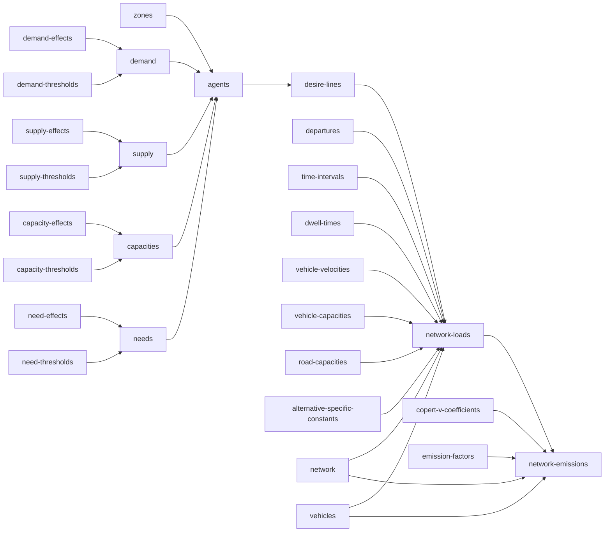

# urban-dollop

## `synth zones`

A GeoDataFrame of Voronoi-tessellated zone polygons over the unit square, one row per
`zone_id`, written to `zones.gpkg`. `zone_id` values are plain integers (`1`, `2`, ...),
matching the convention `effects.csv` uses for its own `zone_id` stratum.

### Synthesis

Fully self-contained, same leaf contract as every other command. Run it with nothing on
disk yet and it invents both the zone count (`ceil(lognormal(0, sigma))`, the only place
`--sigma` acts) and the labels, then tessellates geometry for them.

Alternatively, hand it a `zones.gpkg` that already has a `zone_id` column (real IDs are
welcome, and can be integers or strings) with `geometry` left entirely empty, and it
synthesizes geometry for exactly those zones, in that order -- the count comes from the
shape you gave it, not from `--sigma`. A file with geometry already populated anywhere is
left alone and the command is a no-op: it doesn't matter whether every zone has geometry or
only some do, any real geometry at all means the file is complete (partial geometry would
mean regenerating some zones' shapes but not others, which makes no sense for a
tessellation -- unlike `effects.csv`, there's no legitimate reason for geometry to be
partially populated on purpose). Passing `--sigma` against a file that already exists
throws either way (shape-only or complete): `--sigma` only ever controls count invention,
and a file that already has a zone_id list has nothing left for it to control.

## `synth supply-effects` / `synth demand-effects` / `synth capacity-effects` / `synth need-effects`

Coefficients for a textbook additive (main-effects, no interactions among stratum
dimensions) ordered-logit linear predictor -- the cumulative logit / proportional odds
model of McCullagh (1980). Output is wide: one row per (stratum, stratum value) pair, one
column per resource.

| stratum | stratum_value | resource_1 | resource_2 |
|---|---|---|---|
| zone_id | 1 | 0.734 | -0.310 |
| zone_id | 2 | -0.051 | 0.884 |
| stratum_1 | value_1 | 0.512 | -0.204 |

A stratum value can repeat across different strata (`value_1` could belong to both
`stratum_1` and `stratum_2`) -- values are only unique within their own stratum, not across
the file. Each resource column is its own independent linear predictor ($\beta$), the sum
of whichever rows apply to a given stratum combination *for that resource* -- a resource
column indexes which independent model a cell belongs to, not a covariate on a shared one.
A resource cell can be empty even in an otherwise-complete file: a stratum genuinely may not
participate in every resource's market (a zone that supplies grain may not supply parcels at
all), so an empty cell there is a real, permanent "not applicable," not a placeholder waiting
to be filled. The stratum shape (which dimensions exist, how many values each has) stays
shared across resources, but which rows actually carry a given resource's column at all is
independent per resource -- it's participation, not shape, that varies.

`supply`/`demand` describe a stratum's aggregate resource totals; `capacity`/`need`
describe the size distribution of individual agents drawn from that stratum later --
different questions, same statistical machinery, four independent files.

### Synthesis

Every effect value is drawn from a standard normal, `Normal(0, 1)`, fixed regardless of
`--sigma` -- it is the value being synthesized, not a count of how much to synthesize. Mean
zero is not an arbitrary default: with no reference category dropped and no separate
intercept anywhere in this design, each effect is a random effect (in the mixed-model
sense), and mean zero is exactly what makes that identifiable rather than an unmeasurable
duplicate of an intercept that doesn't exist here.

Each of these four commands is fully self-contained -- none of them look at any other file.
Run one with nothing on disk yet and it synthesizes shape and values together: dimension
count, each dimension's value count, and resource count are all `ceil(lognormal(0,
sigma))`, uncapped, `zone_id` always included. `zone_id` values are plain integers (`1`,
`2`, ...); every other dimension gets string labels (`value_1`, `value_2`, ...) -- `zone_id`
is the one stratum guaranteed to exist and the one with a natural real-world numeric
identity, so it's the one place that distinction is made. `--sigma 0` collapses this to the
smallest possible draw: one dimension (`zone_id`), one value, one resource column.

Each resource independently applies to a uniformly-random non-empty subset of the invented
rows (size drawn uniform over `[1, n]`, membership drawn without replacement) -- never
every row automatically, since that would silently assume every stratum participates in
every resource's market. This is deliberately *not* controlled by `--sigma`: choosing how
many of an already-fixed set of rows to include is a bounded selection problem, not an
unbounded count to invent, so it doesn't fit the `ceil(lognormal(0, sigma))` pattern used
everywhere else -- capping a lognormal draw at `n` would just pile up mass at the cap.

Alternatively, hand it a file that already has `stratum`/`stratum_value` filled in plus one
or more resource columns (real names and values are welcome here). If every resource cell
in the file is empty, it's shape-only -- the command fills every one of them, leaving the
shape untouched. If *any* resource cell already has a value, the file is treated as
complete and the command does nothing at all: it does not fill the remaining empty cells,
because by that point an empty cell no longer means "not yet decided" -- it means "this
stratum doesn't participate in this resource," and that's not a leaf command's call to make
or overwrite once real data exists. `stratum` must contain strings; `stratum_value` must be
a string for every row except `zone_id`'s, which may be int or string -- resource columns
are identified by header name, not by dtype, so this isn't needed for disambiguation, it's
just that only `zone_id` has a real-world numeric identity worth allowing. Filled resource
cells must contain floats. Passing `--sigma` against a file that already exists throws
either way (shape-only or complete): `--sigma` only ever controls shape invention, and a
file that already has shape has nothing left for it to control.

## `synth supply-thresholds` / `synth demand-thresholds` / `synth capacity-thresholds` / `synth need-thresholds`

Cutpoints ($\mu$) for the same cumulative-logit model: a resource with $n$ ordered levels
gets `n - 1` thresholds, partitioning a latent continuous scale into the `n` discrete
outcomes.

| resource | resource_level | threshold |
|---|---|---|
| resource_1 | 0 | 0.432 |
| resource_1 | 2 | 1.738 |
| resource_1 | 3 | (empty) |
| resource_2 | 4 | -0.220 |
| resource_2 | 9 | (empty) |

`resource` must contain strings; `resource_level` must contain integers only -- a resource
is always counted in whole units (finer granularity means switching to a smaller unit, e.g.
tonnes to kilograms, not a fractional level). `resource_level` is a genuine numeric
quantity, not a category label -- it is the actual amount of the resource at that outcome,
used directly in a weighted sum downstream, even though it plays the same shape-defining
role `stratum_value` plays for effects. Levels are always distinct within a resource (a
repeated level would mean two ordinal categories mapping to the identical real-world
quantity, which has no meaningful interpretation) and always ascending; the largest level
in a resource has no upper threshold, hence empty.

### Synthesis

Every `threshold` is `Normal(0, 1)`, sorted ascending per resource, fixed regardless of
`--sigma` -- a value, not a count, same reasoning as `effect` above. Resource *count* and
*level count per resource* are both `ceil(lognormal(0, sigma))`, uncapped -- genuine counts,
never zero. Level *values* are different: drawn from the same `--sigma` as the count that
determined how many are needed, repeated until the required number of levels is distinct
within that resource, but shifted down by one (`ceil(lognormal(0, sigma)) - 1`) so `0` is
reachable -- unlike a count of things to synthesize, a resource level legitimately starts at
zero (the "none of this resource" outcome), and needs a real threshold between zero and
whatever level comes next. `resource_level` plays the same shape-defining role
`stratum_value` plays for effects, even though it's numeric.

Same self-contained contract as the effects commands: nothing on disk synthesizes shape and
values together; a file with `resource`/`resource_level` filled in and `threshold` entirely
empty gets just its thresholds filled; anything with `threshold` already set anywhere is
left alone and the command throws. Passing `--sigma` against a file that already exists
throws too, same reasoning as effects.

## `synth supply` / `synth demand` / `synth capacities` / `synth needs`

Combines a pair of upstream files (`supply_effects.csv` + `supply_thresholds.csv`, and so on
for the other three) into the actual ordered-logit output. Unlike every other command, this
one invents nothing -- it's a pure function of already-computed data, so `--sigma` has no
meaning here at all: passing it throws unconditionally, not just when the output file
already exists.

Only resources present in **both** the effects file (as a column) and the thresholds file
(as a `resource` value) get combined -- a resource missing from either side has nothing to
evaluate it against. For each such resource, a full stratum combination (the cartesian
product of every dimension in `effects.csv`, e.g. every `zone_id` × every `stratum_1` value)
needs *every* constituent dimension-value's effect to compute a beta; if even one is
missing, that whole combination is omitted for that resource -- never given a
zero-contribution stand-in. `resource_level = 0` is itself a real, reachable outcome, so it
can never double as an "undefined" marker; omission and an explicit computed `0` stay
distinguishable all the way through.

`supply.csv`/`demand.csv` are wide: one column per stratum dimension plus one column per
combined resource, holding the **rounded** expected value of that resource's distribution --
resource is always counted in whole units, so a fractional expected value isn't a
deliverable quantity. A combination with no computable value for a resource simply doesn't
get that column set for that row.

`capacities.csv`/`needs.csv` are wide on stratum dimensions but long on resource: explicit
`resource`, `resource_level`, `probability` columns, multiple rows per stratum combination.
Nothing gets rounded or collapsed here -- this is the actual distribution individual agents
get sampled from later, so it has to stay a distribution.

### Synthesis

Deterministic, not random: the same effects + thresholds always produce the same output.
Because of that, once the output file exists, the command is a no-op rather than
overwriting it -- same protective posture as everywhere else in this arc (a user may have
hand-calibrated the output against real totals after generation), even though a fresh
recompute against unchanged inputs would give an identical file anyway. Delete the output
file to force a regenerate. If either upstream file is still absent or shape-only, the
command throws with a pointer to which leaf command to run first.

## `synth agents`

Combines `supply.csv`, `demand.csv`, `capacities.csv`, `needs.csv`, and `zones.gpkg` --
five independently-synthesized files -- into `agents.gpkg`: one row per synthesized agent,
with `agent_id`, `geometry`, the stratum dimension columns, and `{resource}_capacity` /
`{resource}_need` for every usable resource.

A stratum combination is only usable if its dimension *set* matches exactly across all four
data files -- not just overlaps. A dimension present in one file but not another means their
notion of "stratum" isn't even the same shape, so under pure independent synthesis (no
aligned shape-only input across the four upstream commands) this intersection can easily be
sparse or empty; that's expected, not a bug -- `--sigma 0` collapses every file to the same
single minimal stratum, so it always matches there, but larger, independent `--sigma` draws
make agreement increasingly unlikely by construction. Zone identity is matched separately
against `zones.gpkg`, normalized on both sides to guard against a numeric `zone_id`
silently stringifying on a CSV round-trip in a file that also has string-labeled sibling
dimensions.

A resource is usable for a stratum combination only if it has a real value in **all four**
files for that exact combination: supply and demand each need a defined aggregate (not an
omitted cell), and capacities and needs each need an actual distribution. An agent is a
single coherent record needing a valid draw for every usable resource at once, so a resource
missing from even one of the four isn't included for that stratum at all -- there'd be no
way to give an agent a well-defined value for it.

### Synthesis

Agents are drawn one at a time per stratum, depleting that stratum's supply/demand budget as
they go. Each draw independently truncates the capacity distribution to the remaining supply
and the need distribution to the remaining demand, renormalizes, and draws one value from
each via `uniform(0, 1)` -- capacity and need for the same resource are independent draws,
not correlated. Generation for a stratum halts the moment *any* resource can't produce a
feasible draw (its distribution's smallest level exceeds what's left) -- a single agent is
one coherent record, so if even one resource can't be given a valid value, no valid agent
can be produced, and every later attempt would only face equal-or-worse depletion. It also
halts after committing an agent that made zero progress on every tracked resource
simultaneously (e.g. a resource whose only synthesized level in that stratum is `0`, which
is always feasible and never depletes anything) -- otherwise that state would repeat forever
by the same idempotency the truncation itself relies on. A depleting-toward-zero-need agent
is a completely ordinary, expected outcome, not a stopping condition by itself.

Agent placement: uniform random `(x, y)` in the zone polygon's bounding box, rejected and
redrawn until the point actually falls inside the polygon.

Like `synth supply` and friends, this invents nothing new (agent *count* is emergent from
the depletion loop, not a synthesized shape), so `--sigma` throws unconditionally, and the
command is a no-op once `agents.gpkg` already exists -- even more important here than for
the pure combiners, since agent synthesis has genuine randomness: an accidental re-run
wouldn't just redundantly recompute the same file, it would silently replace the whole agent
population with a different random draw.

## `synth desire-lines`

Combines pairs of agents from `agents.gpkg` into `desire_lines.gpkg`: one row per resource
transaction between two agents -- `resource`, `quantity`, and a 2-point `LineString`
directed from the provider (capacity side) to the consumer (need side). No agent
identifiers -- nothing downstream needs to trace a line back to the agents that produced
it. The same two agents can produce more than one line, one per resource they trade, or even
more than one line for the *same* resource across separate draws -- each transaction is its
own row regardless of who's involved.

`agents.gpkg` alone has everything needed: capacity, need, and location, for every resource
that survived Layer 3 (found the same way Layer 3 finds them -- matching
`{resource}_capacity`/`{resource}_need` column pairs, no other file read). There is no
`batch_sizes.csv` anymore -- see Synthesis below for why.

### Synthesis

For each resource independently: the *currently* more-constrained side (whichever has less
total remaining across all agents, capacity or need) picks a primary agent weighted by their
own remaining value; the other side picks a secondary agent weighted by their remaining
value times a distance decay from the primary agent's location (`logistic(-distance)` --
the same sigmoid used for the ordered-logit models elsewhere in this pipeline, reused here
purely as a spatial gravity term, not a probability -- closer agents are more likely
paired). Self-pairing is excluded by agent id, not by coincidental location. The transacted quantity is `min` of the two specific agents' remaining values on
their respective sides -- that's the batch size now, derived from the actual pair instead of
sampled from an independent distribution, which is why `batch_sizes.csv` is gone: whichever
agent runs out first *is* the batch size for that transaction. Both agents' remaining values
are depleted by that quantity, and every quantity is recomputed -- which side is
constrained, and every candidate's weight -- fresh on every iteration, since depleting one
pair changes the totals for everyone.

The loop for a resource stops once either total (recomputed each pass) hits zero. Unlike
`synth agents`' stopping condition, no separate "made zero progress" check is needed here:
weight *is* the remaining value directly (not a probability of drawing a value that happens
to be zero), so a zero-remaining agent has zero weight and can never be selected, so every
drawn pair has strictly positive remaining on both sides and every iteration depletes a
real, positive amount. Termination is guaranteed by construction.

Same deterministic-consumer-with-real-randomness contract as `synth agents`: `--sigma`
throws unconditionally (nothing here is an invented shape either), and the command is a
no-op once `desire_lines.gpkg` already exists, for the same reason -- the pairing draws are
genuinely random, so a re-run would silently produce a different set of lines rather than
recomputing the same ones.

## `synth network`

A GeoDataFrame of road links over the unit square, written to `network.gpkg`: `link_id`,
`grade`, `road_type`, `oneway`, and a 2-point `LineString`. Self-contained -- reads nothing,
invents everything from scratch.

### Synthesis

Points are scattered uniformly over the unit square and connected by Delaunay triangulation,
which needs at least 3 non-degenerate points -- below that, the two smaller cases are handled
directly rather than attempted: zero or one point produces zero edges (nothing to connect),
and exactly two points are connected directly to each other, skipping triangulation.
`random_count(sigma)` is the only place `--sigma` acts, for both the point count and the size
of the invented `road_type` vocabulary (`road_type_1`, `road_type_2`, ...); `grade`
(`triangular(-6.0, 6.0, 0.0)`, unchanged from the original implementation) is a value, not a
count, and stays fixed regardless of sigma.

`oneway` is a plain boolean rather than a three-way flag. A `LineString`'s start and end are
just two points with no inherent direction of travel, so when a link is one-way the start/end
order is chosen (a coin flip) to already match the allowed direction, rather than storing an
arbitrary order alongside a flag saying whether to walk it backward -- the same footgun OSM's
`oneway=-1` tag exists to patch, avoided here by controlling construction instead of
correcting it after the fact. When `oneway` is false, both directions are legal and the
stored order is immaterial. `grade` is always relative to whichever order ends up stored --
the reverse direction is its negation, not an independently sampled value, since a road's
slope is one physical fact, not two.

Same leaf contract as `synth zones`: `--sigma` only controls invention, so it throws if
passed while `network.gpkg` already exists, and the command is a no-op on an existing file
otherwise.
