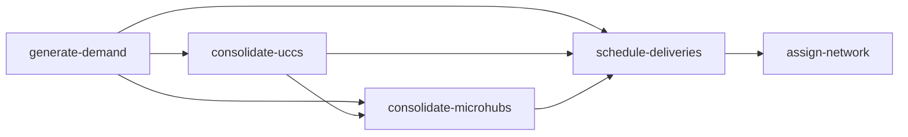

# urban-dollop

urban-dollop is a Python library for urban freight simulation. It generalizes
[MASS-GT](https://github.com/orgs/mass-gt/repositories) — a multi-agent freight
simulation system developed at TU Delft — covering demand generation, consolidation
routing, delivery scheduling, network assignment, and emission calculation including
road grade effects. It separates reusable model structure from study-area-specific
parameters so the same pipeline can be applied to any city.

---

## Modules

| Module | MASS-GT source | Status |
|---|---|---|
| Parcel demand generation | `parcel_dmnd` | implemented |
| Parcel consolidation (UCCs + microhubs) | `parcel_dmnd` | implemented |
| Parcel delivery scheduling | `parcel_schd` | implemented |
| Network / route assignment | `traf` | implemented |
| Emission calculation (COPERT V + grade) | `traf` + grade extension | planned |
| KPI indicators | `outp` | planned |
| Service trip demand | `service` | planned |
| Freight shipment demand | `ship` | planned |
| Freight tour scheduling | `tour` | planned |
| Firm synthesizer | `fs` | planned |

---

## Installation

```bash
pip install urban-dollop
```

---

## Pipeline



The consolidation steps are optional and composable — run either, both, or
neither between demand generation and scheduling. All steps read inputs from a
required directory argument and write output to the current directory by default.
All steps are configured via `urban-dollop.toml` in the working directory.

---

## Usage

### generate-demand

Estimates daily parcel delivery demand by zone and carrier. Reads zone
socioeconomics, depot locations, carrier market shares, and a travel-time skim
matrix. Writes one `parcel_demand.csv` row per `(origin_zone, destination_zone,
carrier)` triple.

**Canonical output — `parcel_demand.csv`:**

| field | type | description |
|---|---|---|
| `origin_zone_id` | `int` | zone of the carrier depot serving this flow |
| `destination_zone_id` | `int` | zone receiving the parcels |
| `carrier` | `str` | carrier name |
| `n_parcels` | `int` | number of parcels |

**Canonical inputs:**

| file | field | type | description |
|---|---|---|---|
| `zones.gpkg` | `zone_id` | `int` | unique zone identifier |
| `zones.gpkg` | `households` | `float` | household count |
| `zones.gpkg` | `employment` | `float` | employee count |
| `depots.gpkg` | `depot_id` | `int` | unique depot identifier |
| `depots.gpkg` | `zone_id` | `int` | zone the depot is located in |
| `depots.gpkg` | `carrier` | `str` | carrier name |
| `carrier_shares.csv` | `name` | `str` | carrier name |
| `carrier_shares.csv` | `share` | `float` | market share fraction (all shares must sum to 1.0) |

`zones.gpkg` and `depots.gpkg` also accept `.csv` if you don't have GeoPackage
files. Also requires a `skim_time.mtx` binary skim matrix: flat float32 values,
N² elements, one per zone pair in zone file order. A gzip-compressed
`skim_time.mtx.gz` is also accepted.

**Config — `[parcel_demand]` in `urban-dollop.toml`:**

```toml
[parcel_demand]
parcels_per_household = 0.178
parcels_per_employee = 0.029
delivery_success_b2c = 0.80
delivery_success_b2b = 0.95
# calibration_target = 50000
```

All four rates are required and study-area specific — there are no defaults.
`calibration_target` is optional; when set, all zone demands are scaled
proportionally so the study-area total matches the target.

**CLI:**

```bash
urban-dollop generate-demand data/
urban-dollop generate-demand --outdir results/ data/
```

Reads `zones.gpkg`, `depots.gpkg`, `carrier_shares.csv`, and `skim_time.mtx`
from `data/`. `.csv` is also accepted for zones and depots. Writes
`parcel_demand.csv` to the current directory by default.

**Python API:**

```python
from urban_dollop import LinearZone, Depot, Carrier, SkimMatrix
from urban_dollop import generate_parcel_demand, ParcelDemandConfig, ParcelDemand

zones = LinearZone.from_file("zones.gpkg", columns={
    "zone_id": "id",
    "households": "hh",
    "employment": "emp"
})
depots = Depot.from_file("depots.gpkg")
carriers = Carrier.from_file("carrier_shares.csv")
skim = SkimMatrix.from_file("skim_time.mtx", zones)

demands = generate_parcel_demand(
    zones, depots, carriers, skim,
    config=ParcelDemandConfig(
        parcels_per_household=0.178,
        parcels_per_employee=0.029,
        delivery_success_b2c=0.80,
        delivery_success_b2b=0.95,
        calibration_target=50000,
    ),
)
ParcelDemand.to_file(demands, "parcel_demand.csv")
```

All `from_file` calls accept a `columns` mapping to translate your file's column
names to the expected field names. All other API calls support it the same way.

#### Ordered logit formulation

Use `--logit` when your zone data has population and an integer urbanization
classification instead of household and employment counts. Demand is derived
from an ordered logit over urbanization level following the HARMONY v3
formulation. All inputs, outputs, and config options are identical to the linear
formulation except for the following.

Zone attributes required (instead of `households` and `employment`):

| field | type | description |
|---|---|---|
| `population` | `float` | total resident population |
| `urbanization_level` | `int` | integer urbanization class |

A `zones.gpkg` with all five columns works for both formulations — each loads
only what it needs. A `zones.csv` with the same columns works equally.

Config uses a separate section — `[parcel_demand_logit]` instead of
`[parcel_demand]`:

```toml
[parcel_demand_logit]
beta_urbanization = {1 = 2.0, 2 = 1.2, 3 = 0.4, 4 = -0.3, 5 = -1.0}
mu_thresholds = [-0.5, 1.0, 2.0, 2.8, 3.5, 4.0, 5.5, 7.0]
# calibration_target = 50000
# monthly_to_daily_divisor = 60.0
# parcel_levels = [0, 1, 2, 3, 4, 5, 10, 15, 20]
```

`beta_urbanization` and `mu_thresholds` are required and must be estimated from
a household survey for your study area. The Dutch estimates from HARMONY v3
(de Bok et al. 2025) are **not** appropriate defaults for other countries.

`parcel_levels` defaults to `[0, 1, 2, 3, 4, 5, 10, 15, 20]`, the HARMONY v3
survey response categories. Override this if your survey used different discrete
options; a wrong value here silently produces wrong results.
`monthly_to_daily_divisor` converts monthly survey responses to a daily rate and
defaults to `60.0`.

Add `--logit` to the CLI command; everything else is identical:

```bash
urban-dollop generate-demand --logit data/
urban-dollop generate-demand --logit --outdir results/ data/
```

**Python API:**

```python
from urban_dollop import LogitZone, Depot, Carrier, SkimMatrix
from urban_dollop import generate_logit_demand, LogitDemandConfig, ParcelDemand

zones = LogitZone.from_file("zones.gpkg")
depots = Depot.from_file("depots.gpkg")
carriers = Carrier.from_file("carrier_shares.csv")
skim = SkimMatrix.from_file("skim_time.mtx", zones)

demands = generate_logit_demand(
    zones, depots, carriers, skim,
    config=LogitDemandConfig(
        beta_urbanization={1: 2.0, 2: 1.2, 3: 0.4, 4: -0.3, 5: -1.0},
        mu_thresholds=[-0.5, 1.0, 2.0, 2.8, 3.5, 4.0, 5.5, 7.0],
        calibration_target=50000,
    ),
)
ParcelDemand.to_file(demands, "parcel_demand.csv")
```

---

### consolidate-uccs

Reroutes a fraction of parcels destined for UCC catchment zones through Urban
Consolidation Centres. Each rerouted flow is split into two legs: leg A
(origin → nearest UCC) and leg B (UCC → original destination). Non-catchment
parcels pass through unchanged.

The nearest UCC is selected per demand record by minimising total two-leg
distance: `dist(origin → UCC) + dist(UCC → destination)`. UCCs are
carrier-agnostic — any carrier's parcels can be rerouted through any UCC.

**Canonical inputs:**

| file | field | type | description |
|---|---|---|---|
| `uccs.csv` | `ucc_id` | `int` | unique UCC identifier |
| `uccs.csv` | `zone_id` | `int` | zone the UCC is located in |
| `ucc_catchment_zones.csv` | `zone_id` | `int` | zone whose inbound parcels are eligible for UCC rerouting |

Also requires a `skim_distance.mtx` binary distance skim matrix: flat float32
values, N² elements, in zone file order. A `.mtx.gz` is also accepted.

**Config — `[ucc_consolidation]` in `urban-dollop.toml`:**

```toml
[ucc_consolidation]
probability = 0.30
```

`probability` is required and study-area specific. It controls the fraction of
catchment-zone parcels rerouted through a UCC; the remainder continue as direct
flows.

**CLI:**

```bash
urban-dollop consolidate-uccs data/
urban-dollop consolidate-uccs --outdir results/ data/
```

Reads `zones.gpkg`, `parcel_demand.csv`, `uccs.csv`, `ucc_catchment_zones.csv`,
and `skim_distance.mtx` from `data/`. `zones.csv` is also accepted. Writes
`parcel_demand.csv` to the current directory by default.

**Python API:**

```python
from urban_dollop import (
    ParcelDemand, SkimDistance, UCC, UCCCatchmentZone, UCCConfig, Zone,
    consolidate_uccs,
)

zones = Zone.from_file("zones.gpkg")
demands = ParcelDemand.from_file("parcel_demand.csv")
uccs = UCC.from_file("uccs.csv")
catchment_zones = UCCCatchmentZone.from_file("ucc_catchment_zones.csv")
skim_distance = SkimDistance.from_file("skim_distance.mtx", zones)

result = consolidate_uccs(
    demands=demands,
    uccs=uccs,
    catchment_zones=catchment_zones,
    skim_distance=skim_distance,
    config=UCCConfig(probability=0.30),
)
ParcelDemand.to_file(result, "parcel_demand.csv")
```

---

### consolidate-microhubs

Reroutes all parcels destined for zero-emission zones through carrier-specific
microhubs. Each flow is split into two legs: leg A (origin → nearest microhub)
and leg B (microhub → original destination, zero-emission last mile).
Non-ZEZ parcels pass through unchanged.

The nearest microhub is carrier-specific and selected by minimising last-mile
distance: `dist(microhub → destination)`. Every carrier with ZEZ-destined
parcels must have at least one microhub configured.

**Canonical inputs:**

| file | field | type | description |
|---|---|---|---|
| `microhubs.csv` | `microhub_id` | `int` | unique microhub identifier |
| `microhubs.csv` | `zone_id` | `int` | zone the microhub is located in |
| `microhubs.csv` | `carrier` | `str` | carrier this microhub serves |
| `zero_emission_zones.csv` | `zone_id` | `int` | zone where conventional vehicles are prohibited |

Also requires `skim_distance.mtx` in the same format as `consolidate-uccs`.

This step has no config section — rerouting is 100% for all ZEZ-bound parcels.

**CLI:**

```bash
urban-dollop consolidate-microhubs data/
urban-dollop consolidate-microhubs --outdir results/ data/
```

Reads `zones.gpkg`, `parcel_demand.csv`, `microhubs.csv`,
`zero_emission_zones.csv`, and `skim_distance.mtx` from `data/`. `zones.csv`
is also accepted. Writes `parcel_demand.csv` to the current directory by default.

**Python API:**

```python
from urban_dollop import (
    Microhub, ParcelDemand, SkimDistance, Zone, ZeroEmissionZone,
    consolidate_microhubs,
)

zones = Zone.from_file("zones.gpkg")
demands = ParcelDemand.from_file("parcel_demand.csv")
microhubs = Microhub.from_file("microhubs.csv")
zez_zones = ZeroEmissionZone.from_file("zero_emission_zones.csv")
skim_distance = SkimDistance.from_file("skim_distance.mtx", zones)

result = consolidate_microhubs(
    demands=demands,
    microhubs=microhubs,
    zez_zones=zez_zones,
    skim_distance=skim_distance,
)
ParcelDemand.to_file(result, "parcel_demand.csv")
```

---

### schedule-deliveries

Assigns parcel demand to vehicle tours. Groups demand by `(origin_zone, carrier)`,
clusters delivery stops spatially, and assigns a vehicle type by capacity.
Returns one row per tour leg.

**Canonical output — `delivery_trips.csv`:**

| field | type | description |
|---|---|---|
| `tour_id` | `int` | unique tour identifier |
| `trip_id` | `int` | sequential leg position within the tour |
| `carrier` | `str` | carrier operating the tour |
| `origin_zone_id` | `int` | zone at the start of this leg |
| `destination_zone_id` | `int` | zone at the end of this leg |
| `n_parcels` | `int` | parcels delivered at this stop (0 for the return leg) |
| `vehicle_id` | `int` | vehicle type assigned to this tour |

**Canonical inputs:**

| file | field | type | description |
|---|---|---|---|
| `zones.gpkg` | `zone_id` | `int` | unique zone identifier |
| `vehicles.csv` | `vehicle_id` | `int` | unique vehicle type identifier |
| `vehicles.csv` | `name` | `str` | vehicle type label |
| `vehicles.csv` | `max_parcels` | `int` | maximum parcel capacity |

Also requires a `skim_distance.mtx` binary distance skim matrix: flat float32
values, N² elements, in zone file order. A `.mtx.gz` is also accepted.
When zones are loaded from a GeoPackage, centroid coordinates are extracted
from the geometry column and blended with skim distance in the spatial
clustering step, improving cluster stability in sparse zones. `zones.csv` is
also accepted; include `x` and `y` columns to provide centroids explicitly
and get the same blend.

The scheduler assigns the smallest vehicle whose capacity fits the tour load.

**Config — `[parcel_scheduling]` in `urban-dollop.toml`:**

```toml
[parcel_scheduling]
# seed = 42
```

`seed` is optional; set it to make tour clustering reproducible.

**CLI:**

```bash
urban-dollop schedule-deliveries data/
urban-dollop schedule-deliveries --outdir results/ data/
```

Reads `zones.gpkg`, `vehicles.csv`, `skim_distance.mtx`, and `parcel_demand.csv`
from `data/`. `zones.csv` is also accepted. Writes `delivery_trips.csv` to the
current directory by default.

**Python API:**

```python
from urban_dollop import (
    DeliveryTrip, ParcelDemand, ParcelSchedulingConfig, SkimDistance, Vehicle, Zone,
    schedule_parcel_deliveries,
)

zones = Zone.from_file("zones.gpkg")
vehicles = Vehicle.from_file("vehicles.csv")
skim_distance = SkimDistance.from_file("skim_distance.mtx", zones)
demands = ParcelDemand.from_file("parcel_demand.csv")

trips = schedule_parcel_deliveries(
    demands=demands,
    vehicles=vehicles,
    skim_distance=skim_distance,
    zones=zones,
    config=ParcelSchedulingConfig(seed=42),
)
DeliveryTrip.to_file(trips, "delivery_trips.csv")
```

---

### assign-network

Assigns delivery trips to road network links via shortest-path routing. For
each trip leg in `delivery_trips.csv`, finds the minimum-distance path through
the road network using Dijkstra's algorithm and accumulates vehicle traversal
counts per link. Returns one row per `(link_id, vehicle_id)` pair that carries
at least one trip.

**Canonical output — `loaded_links.csv`:**

| field | type | description |
|---|---|---|
| `link_id` | `int` | joins back to `network_links` |
| `road_type` | `str` | `urban`, `rural`, or `highway` |
| `distance_m` | `float` | link length in metres |
| `grade_pct` | `float` | average grade (0.0 if not provided in input) |
| `vehicle_id` | `int` | vehicle type traversing this link |
| `n_trips` | `int` | number of traversals by this vehicle type |

**Canonical inputs:**

| file | field | type | description |
|---|---|---|---|
| `delivery_trips.csv` | *(all fields)* | — | output of `schedule-deliveries` |
| `network_links.gpkg` | `link_id` | `int` | unique link identifier |
| `network_links.gpkg` | `from_node_id` | `int` | origin node |
| `network_links.gpkg` | `to_node_id` | `int` | destination node |
| `network_links.gpkg` | `road_type` | `str` | `urban`, `rural`, or `highway` |
| `network_links.gpkg` | `grade_pct` | `float` | average grade %; defaults to 0.0 if column absent |
| `zone_nodes.csv` | `zone_id` | `int` | zone identifier |
| `zone_nodes.csv` | `node_id` | `int` | network gateway node for trips entering or leaving this zone |
| `vehicles.csv` | *(all fields)* | — | same file as `schedule-deliveries` |

`network_links.csv` is also accepted; requires an explicit `distance_m` column
since there is no geometry to derive it from. When loading from a GeoPackage,
`distance_m` is derived from the LineString geometry automatically if the column
is absent.

`zone_nodes.csv` maps each zone to its entry point in the road network — the
node where vehicles from that zone join or leave the graph. This is a flat
two-column lookup; how the mapping is determined (e.g. nearest node to zone
centroid) is left to the user.

**Config — `[network_assignment]` in `urban-dollop.toml`:**

```toml
[network_assignment]
# seed = 42
```

No required parameters. `seed` is reserved for future multi-routing support.

**CLI:**

```bash
urban-dollop assign-network data/
urban-dollop assign-network --outdir results/ data/
```

Reads `delivery_trips.csv`, `network_links.gpkg` (or `.csv`), `zone_nodes.csv`,
and `vehicles.csv` from `data/`. Writes `loaded_links.csv` to the current
directory by default.

**Python API:**

```python
from urban_dollop import (
    DeliveryTrip, LoadedLink, NetworkAssignmentConfig, NetworkLink,
    Vehicle, ZoneNode, assign_network,
)

trips = DeliveryTrip.from_file("delivery_trips.csv")
links = NetworkLink.from_file("network_links.gpkg")
zone_nodes = ZoneNode.from_file("zone_nodes.csv")
vehicles = Vehicle.from_file("vehicles.csv")

result = assign_network(
    trips=trips,
    links=links,
    zone_nodes=zone_nodes,
    vehicles=vehicles,
    config=NetworkAssignmentConfig(seed=42),
)
LoadedLink.to_file(result, "loaded_links.csv")
```
