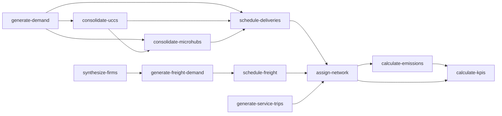

# urban-dollop

urban-dollop is a Python library for urban freight simulation. It generalizes
[MASS-GT](https://github.com/orgs/mass-gt/repositories) — a multi-agent freight
simulation system developed at TU Delft — covering demand generation, consolidation
routing, delivery scheduling, network assignment, and emission calculation including
road grade effects. It separates reusable model structure from study-area-specific
parameters so the same pipeline can be applied to any city.

---

## Installation

```bash
pip install urban-dollop
```

---

## Pipeline



The parcel consolidation steps are optional and composable — run either, both,
or neither between demand generation and scheduling. The freight pipeline
(`synthesize-firms` → `generate-freight-demand` → `schedule-freight`) and the
service pipeline (`generate-service-trips`) are independent of the parcel
pipeline and converge at `assign-network`, which reads all `*_trips.csv` files
present in the input directory. All steps read inputs from a required directory
argument and write output to the current directory by default. All steps are
configured via `urban-dollop.toml` in the working directory.

---

## Usage

### generate-demand

Estimates daily parcel delivery demand by zone and carrier. Reads zone
socioeconomics, depot locations, carrier market shares, and a travel-time skim
matrix. Writes one `parcel_demand.csv` row per `(origin_zone, destination_zone,
carrier)` triple.

**Canonical output — `parcel_demand.csv`:**

| field | type | description |
|---|---|---|
| `origin_zone_id` | `int` | zone of the carrier depot serving this flow |
| `destination_zone_id` | `int` | zone receiving the parcels |
| `carrier` | `str` | carrier name |
| `n_parcels` | `int` | number of parcels |

#### Linear formulation

Demand for each zone is proportional to its household and employment counts:

$$D = \frac{H \cdot r_\text{B2C}}{s_\text{B2C}} + \frac{E \cdot r_\text{B2B}}{s_\text{B2B}}$$

$H$ is household count, $E$ is employment count, $r$ is a daily parcel rate per
person or employee, and $s$ is delivery success rate — the fraction of
first-attempt deliveries that succeed. Dividing by $s$ inflates demand upward to
account for parcels that require a re-delivery attempt.

**Canonical inputs:**

| file | field | type | description |
|---|---|---|---|
| `zones.gpkg` | `zone_id` | `int` | unique zone identifier |
| `zones.gpkg` | `households` | `float` | household count |
| `zones.gpkg` | `employment` | `float` | employee count |
| `depots.gpkg` | `depot_id` | `int` | unique depot identifier |
| `depots.gpkg` | `zone_id` | `int` | zone the depot is located in |
| `depots.gpkg` | `carrier` | `str` | carrier name |
| `carrier_shares.csv` | `name` | `str` | carrier name |
| `carrier_shares.csv` | `share` | `float` | market share fraction (all shares must sum to 1.0) |

`zones.gpkg` and `depots.gpkg` also accept `.csv`. Also requires a
`skim_time.mtx` binary skim matrix: flat float32 values, N² elements, one per
zone pair in zone file order. A gzip-compressed `skim_time.mtx.gz` is also
accepted.

**Config — `[parcel_demand]` in `urban-dollop.toml`:**

```toml
[parcel_demand]
parcels_per_household = 0.178
parcels_per_employee = 0.029
delivery_success_b2c = 0.80
delivery_success_b2b = 0.95
# calibration_target = 50000
```

All four rates are required and study-area specific — there are no defaults.
`calibration_target` is optional; when set, all zone demands are scaled
proportionally so the study-area total matches the target.

**CLI:**

```bash
urban-dollop generate-demand data/
urban-dollop generate-demand --outdir results/ data/
```

Reads `zones.gpkg`, `depots.gpkg`, `carrier_shares.csv`, and `skim_time.mtx`
from `data/`. Writes `parcel_demand.csv` to the current directory by default.

**Python API:**

```python
from urban_dollop import LinearZone, Depot, Carrier, SkimMatrix
from urban_dollop import generate_parcel_demand, ParcelDemandConfig, ParcelDemand

zones = LinearZone.from_file("zones.gpkg", columns={
    "zone_id": "id",
    "households": "hh",
    "employment": "emp"
})
depots = Depot.from_file("depots.gpkg")
carriers = Carrier.from_file("carrier_shares.csv")
skim = SkimMatrix.from_file("skim_time.mtx", zones)

demands = generate_parcel_demand(
    zones, depots, carriers, skim,
    config=ParcelDemandConfig(
        parcels_per_household=0.178,
        parcels_per_employee=0.029,
        delivery_success_b2c=0.80,
        delivery_success_b2b=0.95,
        calibration_target=50000,
    ),
)
ParcelDemand.to_file(demands, "parcel_demand.csv")
```

All `from_file` calls accept a `columns` mapping to translate your file's column
names to the expected field names. All other API calls support it the same way.

#### Ordered logit formulation

Use `--logit` when your zone data has population and an integer urbanization
classification rather than household and employment counts. This formulation is
adapted from the HARMONY v3 demand model.

The model treats parcel ordering as an ordered discrete choice. `parcel_levels`
defines the ordered categories of monthly parcel volume a resident can belong to
(e.g. 0, 1, 2, … parcels per month). For a zone with urbanization class $u$,
the linear predictor is $\eta = \beta_u$, and the probability that a resident
orders at most $L_k$ parcels per month is:

$$P(X \leq L_k) = \frac{1}{1 + \exp(\eta - \mu_k)}$$

The `mu_thresholds` $(\mu_k)$ are the cut-points separating adjacent levels on
the latent scale — one per level except the last. Cell probabilities follow as
consecutive differences of the cumulative distribution:

$$p_k = P(X \leq L_k) - P(X \leq L_{k-1}), \quad P(X \leq L_{-1}) = 0$$

Expected monthly parcels per person is the probability-weighted sum over all
levels. Writing $N$ for zone `population` and $T$ for `monthly_to_daily_divisor`,
daily zone demand is:

$$D = \frac{N}{T} \sum_k p_k \cdot L_k$$

This makes each parameter concrete: `parcel_levels` supplies the $L_k$ values,
`mu_thresholds` controls how the probability mass distributes across them, and
$T$ converts the survey period to a daily figure.

When demographic stratification is available, the same equations apply within
each age × income cell using a cell-specific linear predictor
$\eta_{ai} = \beta_a[a] + \beta_i[i] + \beta_u$, and zone demand sums over all
cells weighted by their population count $n_{ai}$:

$$D = \frac{1}{T} \sum_a \sum_i n_{ai} \sum_k p_k(\eta_{ai}) \cdot L_k$$

**Zone inputs (replaces `households` and `employment`):**

| file | field | type | description |
|---|---|---|---|
| `zones.gpkg` | `population` | `float` | total resident population |
| `zones.gpkg` | `urbanization_level` | `int` | integer urbanization class matching a key in `beta_urbanization` |
| `population_strata.csv` | `zone_id` | `int` | zone this row belongs to |
| `population_strata.csv` | `age_cohort` | `int` | age cohort identifier matching a key in `beta_age` |
| `population_strata.csv` | `income_bracket` | `int` | income bracket identifier matching a key in `beta_income` |
| `population_strata.csv` | `population` | `float` | resident count for this zone × cohort × bracket cell |

`population_strata.csv` is optional. When present, the CLI and Python API use
the full stratified formulation; when absent, the model uses total population
and urbanization level only. All other canonical inputs (`depots.gpkg`,
`carrier_shares.csv`, `skim_time.mtx`) and the canonical output are identical
to the linear formulation.

**Config — `[parcel_demand_logit]` in `urban-dollop.toml`:**

```toml
[parcel_demand_logit.beta_urbanization]
1 = 2.0
2 = 1.2
3 = 0.4
4 = -0.3
5 = -1.0

[parcel_demand_logit]
mu_thresholds = [-0.5, 1.0, 2.0, 2.8, 3.5, 4.0, 5.5, 7.0]
parcel_levels = [0, 1, 2, 3, 4, 5, 10, 15, 20]
monthly_to_daily_divisor = 60.0
# beta_age = {1 = -0.2, 2 = 0.3}
# beta_income = {1 = -0.5, 2 = 0.0, 3 = 0.8}
# calibration_target = 50000
```

`mu_thresholds` must have exactly `len(parcel_levels) - 1` entries. `beta_age`
and `beta_income` are required when `population_strata.csv` is provided; both
must be set together or both omitted. All values are study-area specific and
must be estimated from a local household survey — the Dutch HARMONY v3 values
shown above are for reference only.

**CLI (add `--logit`):**

```bash
urban-dollop generate-demand --logit data/
urban-dollop generate-demand --logit --outdir results/ data/
```

Drop `population_strata.csv` into the data directory alongside `zones.gpkg` to
activate the stratified formulation automatically. If the file is absent the
urbanization-only formulation is used.

**Python API:**

```python
from urban_dollop import (
    LogitZone, Depot, Carrier, SkimMatrix,
    generate_logit_demand, LogitDemandConfig, ParcelDemand,
)

zones = LogitZone.from_file(
    "zones.gpkg",
    strata_path="population_strata.csv",
)
depots = Depot.from_file("depots.gpkg")
carriers = Carrier.from_file("carrier_shares.csv")
skim = SkimMatrix.from_file("skim_time.mtx", zones)

demands = generate_logit_demand(
    zones, depots, carriers, skim,
    config=LogitDemandConfig(
        beta_urbanization={1: 2.0, 2: 1.2, 3: 0.4, 4: -0.3, 5: -1.0},
        beta_age={1: -0.2, 2: 0.3},
        beta_income={1: -0.5, 2: 0.0, 3: 0.8},
        mu_thresholds=[-0.5, 1.0, 2.0, 2.8, 3.5, 4.0, 5.5, 7.0],
        parcel_levels=[0, 1, 2, 3, 4, 5, 10, 15, 20],
        monthly_to_daily_divisor=60.0,
    ),
)
ParcelDemand.to_file(demands, "parcel_demand.csv")
```

Omit `strata_path`, `beta_age`, and `beta_income` to use urbanization level
only — zones then load from file with `LogitZone.from_file("zones.gpkg")`.

---

### consolidate-uccs

Reroutes a fraction of parcels destined for UCC catchment zones through Urban
Consolidation Centres. Each rerouted flow is split into two legs: leg A
(origin → nearest UCC) and leg B (UCC → original destination). Non-catchment
parcels pass through unchanged.

The nearest UCC is selected per demand record by minimising total two-leg road
distance: `dist(origin → UCC) + dist(UCC → destination)`. UCCs are
carrier-agnostic — any carrier's parcels can be rerouted through any UCC.

**Canonical output — `parcel_demand.csv`:**

The output schema is identical to the input `parcel_demand.csv`. Rerouted flows
appear as two rows (depot → UCC and UCC → destination) replacing the original
single row; direct flows are unchanged.

**Canonical inputs:**

| file | field | type | description |
|---|---|---|---|
| `uccs.csv` | `ucc_id` | `int` | unique UCC identifier |
| `uccs.csv` | `zone_id` | `int` | zone the UCC is located in |
| `ucc_catchment_zones.csv` | `zone_id` | `int` | zone whose inbound parcels are eligible for UCC rerouting |

Also requires a `skim_distance.mtx` binary distance skim matrix: flat float32
values, N² elements, in zone file order. A `.mtx.gz` is also accepted.

**Config — `[ucc_consolidation]` in `urban-dollop.toml`:**

```toml
[ucc_consolidation]
probability = 0.30
```

`probability` is required and study-area specific. It controls the fraction of
catchment-zone parcels rerouted through a UCC; the remainder continue as direct
flows.

**CLI:**

```bash
urban-dollop consolidate-uccs data/
urban-dollop consolidate-uccs --outdir results/ data/
```

Reads `zones.gpkg`, `parcel_demand.csv`, `uccs.csv`, `ucc_catchment_zones.csv`,
and `skim_distance.mtx` from `data/`. `zones.csv` is also accepted. Writes
`parcel_demand.csv` to the current directory by default.

**Python API:**

```python
from urban_dollop import (
    ParcelDemand, SkimDistance, UCC, UCCCatchmentZone, UCCConfig, Zone,
    consolidate_uccs,
)

zones = Zone.from_file("zones.gpkg")
demands = ParcelDemand.from_file("parcel_demand.csv")
uccs = UCC.from_file("uccs.csv")
catchment_zones = UCCCatchmentZone.from_file("ucc_catchment_zones.csv")
skim_distance = SkimDistance.from_file("skim_distance.mtx", zones)

result = consolidate_uccs(
    demands=demands,
    uccs=uccs,
    catchment_zones=catchment_zones,
    skim_distance=skim_distance,
    config=UCCConfig(probability=0.30),
)
ParcelDemand.to_file(result, "parcel_demand.csv")
```

---

### consolidate-microhubs

Reroutes all parcels destined for zero-emission zones (ZEZs) through
carrier-specific microhubs. Each flow is split into two legs: leg A
(origin → nearest microhub) and leg B (microhub → destination, zero-emission
last mile). Non-ZEZ parcels pass through unchanged.

Unlike UCC consolidation, rerouting is unconditional — every ZEZ-bound parcel
is transferred at probability 1, since the constraint is a regulatory
requirement. Microhubs are also carrier-specific: a carrier's parcels can only
be routed through that carrier's facilities. The nearest microhub is selected by
minimising last-mile distance only: `dist(microhub → destination)`. Every
carrier with ZEZ-destined parcels must have at least one microhub configured.

**Canonical output — `parcel_demand.csv`:**

The output schema is identical to the input `parcel_demand.csv`. ZEZ-bound flows
appear as two rows (depot → microhub and microhub → destination) replacing the
original; non-ZEZ flows are unchanged.

**Canonical inputs:**

| file | field | type | description |
|---|---|---|---|
| `microhubs.csv` | `microhub_id` | `int` | unique microhub identifier |
| `microhubs.csv` | `zone_id` | `int` | zone the microhub is located in |
| `microhubs.csv` | `carrier` | `str` | carrier this microhub serves |
| `zero_emission_zones.csv` | `zone_id` | `int` | zone where conventional vehicles are prohibited |

Also requires `skim_distance.mtx` in the same format as `consolidate-uccs`.

This step has no config section — rerouting is 100% for all ZEZ-bound parcels.

**CLI:**

```bash
urban-dollop consolidate-microhubs data/
urban-dollop consolidate-microhubs --outdir results/ data/
```

Reads `zones.gpkg`, `parcel_demand.csv`, `microhubs.csv`,
`zero_emission_zones.csv`, and `skim_distance.mtx` from `data/`. `zones.csv`
is also accepted. Writes `parcel_demand.csv` to the current directory by default.

**Python API:**

```python
from urban_dollop import (
    Microhub, ParcelDemand, SkimDistance, Zone, ZeroEmissionZone,
    consolidate_microhubs,
)

zones = Zone.from_file("zones.gpkg")
demands = ParcelDemand.from_file("parcel_demand.csv")
microhubs = Microhub.from_file("microhubs.csv")
zez_zones = ZeroEmissionZone.from_file("zero_emission_zones.csv")
skim_distance = SkimDistance.from_file("skim_distance.mtx", zones)

result = consolidate_microhubs(
    demands=demands,
    microhubs=microhubs,
    zez_zones=zez_zones,
    skim_distance=skim_distance,
)
ParcelDemand.to_file(result, "parcel_demand.csv")
```

---

### schedule-deliveries

Converts the flat parcel demand table into vehicle delivery tours. For each
`(depot zone, carrier)` pair, it groups destination zones into
capacity-constrained tours, sequences stops within each tour to minimise
driving distance, and assigns a vehicle type. Returns one row per tour leg.

Demand records that meet or exceed the largest vehicle capacity are assigned
dedicated full-load tours immediately. Remaining records are grouped
iteratively: the destination furthest from the depot seeds each new cluster,
and the nearest unassigned destinations are added until the cluster fills
(furthest-seed, nearest-fill). Stop order within each cluster is then improved
by 2-opt: pairs of positions are reversed if doing so reduces total distance,
with passes repeating until no swap helps. The smallest vehicle whose capacity
meets the tour load is selected from the configured fleet.

**Canonical output — `parcel_trips.csv`:**

| field | type | description |
|---|---|---|
| `tour_id` | `int` | unique tour identifier |
| `trip_id` | `int` | sequential leg position within the tour |
| `carrier` | `str` | carrier operating the tour |
| `origin_zone_id` | `int` | zone at the start of this leg |
| `destination_zone_id` | `int` | zone at the end of this leg |
| `n_parcels` | `int` | parcels delivered at this stop (0 for the return leg) |
| `vehicle_id` | `int` | vehicle type assigned to this tour |
| `departure_hour` | `int \| null` | hour of departure (0–23); present only when `departure_time_distribution` is configured |

**Canonical inputs:**

| file | field | type | description |
|---|---|---|---|
| `zones.gpkg` | `geometry` | polygon | zone polygon; centroid extracted for spatial clustering |
| `zones.gpkg` | `zone_id` | `int` | unique zone identifier |
| `vehicles.csv` | `vehicle_id` | `int` | unique vehicle type identifier |
| `vehicles.csv` | `name` | `str` | vehicle type label |
| `vehicles.csv` | `max_parcels` | `int` | maximum parcel capacity |

Also requires `parcel_demand.csv` — the canonical output of `generate-demand` (or
one of the consolidation steps) — and `skim_distance.mtx` (flat float32, N²
elements, in zone-file order; `.mtx.gz` accepted). `zones.csv` is accepted instead
of `.gpkg`; include `x` and `y` columns to supply centroids explicitly.

**Config — `[parcel_scheduling]` in `urban-dollop.toml`:**

```toml
[parcel_scheduling]
# seed = 42
# departure_time_distribution = [
#     0.0, 0.0, 0.0, 0.0, 0.0, 0.0,   # hours 0–5 (no departures)
#     0.1, 0.3, 0.6, 0.85, 0.95, 1.0, # hours 6–11 (morning peak)
#     1.0, 1.0, 1.0, 1.0, 1.0, 1.0,   # hours 12–17 (all departed)
#     1.0, 1.0, 1.0, 1.0, 1.0, 1.0,   # hours 18–23
# ]
```

`seed` is optional; set it to make tour clustering and departure time sampling
reproducible. `departure_time_distribution` is optional; when omitted,
`departure_hour` is absent from the output and trips are treated as
time-invariant. When provided, it must be a 24-element array of cumulative
hourly shares (non-decreasing, last value exactly 1.0). Each tour draws a
departure hour from this distribution; all legs of the same tour share that
hour, enabling hourly traffic intensity reporting downstream.

**CLI:**

```bash
urban-dollop schedule-deliveries data/
urban-dollop schedule-deliveries --outdir results/ data/
```

Reads `zones.gpkg`, `vehicles.csv`, `skim_distance.mtx`, and `parcel_demand.csv`
from `data/`. `zones.csv` is also accepted. Writes `parcel_trips.csv` to the
current directory by default.

**Python API:**

```python
from urban_dollop import (
    DeliveryTrip, ParcelDemand, ParcelSchedulingConfig,
    SkimDistance, Vehicle, Zone,
    schedule_parcel_deliveries,
)

zones = Zone.from_file("zones.gpkg")
vehicles = Vehicle.from_file("vehicles.csv")
skim_distance = SkimDistance.from_file("skim_distance.mtx", zones)
demands = ParcelDemand.from_file("parcel_demand.csv")

trips = schedule_parcel_deliveries(
    demands=demands,
    vehicles=vehicles,
    skim_distance=skim_distance,
    zones=zones,
    config=ParcelSchedulingConfig(seed=42),
)
DeliveryTrip.to_file(trips, "parcel_trips.csv")
```

With a departure time distribution, pass it as a 24-element list of cumulative
hourly shares. Each tour is assigned a departure hour sampled from this
distribution; the `departure_hour` column appears in the output.

```python
peak = [0.1, 0.3, 0.6, 0.85, 0.95, 1.0]
tod = [0.0] * 6 + peak + [1.0] * 12   # morning peak, all departed by noon

trips = schedule_parcel_deliveries(
    demands=demands,
    vehicles=vehicles,
    skim_distance=skim_distance,
    zones=zones,
    config=ParcelSchedulingConfig(
        seed=42,
        departure_time_distribution=tod,
    ),
)
```

---

### synthesize-firms

Generates a synthetic firm register for the study area. For each
`(zone, sector)` employment cell in `zone_employment.csv`, the module draws
firms sequentially from a size class distribution until the cell's employment
is exhausted. Firms whose employment falls below `min_employment` are
discarded after synthesis. Surviving firms are numbered from 1 and written to
`firms.csv`.

`firms.csv` is consumed by `generate-freight-demand`. It is not consumed by
the parcel or service trip pipelines.

**Firm size drawing.** Each row of `zone_employment.csv` is a `(zone, sector)` cell with a total employment budget. The module runs an independent synthesis loop per cell, so zone and sector are fixed — only firm size is drawn. For each firm in a cell, a size class is selected by inverse CDF.
Let $p_k$ be the share of firms in class $k$ (the `probability` column of
`firm_size_distribution.csv`), and let $F_k = \sum_{i=1}^{k} p_i$ be the
cumulative share up to and including class $k$. Given a uniform draw
$u \sim U[0, 1]$, the selected class is:

$$k^\ast = \min\left\lbrace k : F_k \geq u \right\rbrace$$

Employment $e$ for the firm is then drawn uniformly within the bounds
$[a, b]$ of the selected class, where $a$ and $b$ are the `lower_bound` and
`upper_bound` columns of `firm_size_distribution.csv`:

$$e \sim U(a_{k^\ast}, b_{k^\ast})$$

The draw is capped at the remaining employment in the cell, so the last firm
in each `(zone, sector)` cell may have lower employment than its class bounds.
The loop runs until the cell's employment budget is exactly exhausted.
Firms with $e < e_{\min}$, where $e_{\min}$ is `min_employment` from config,
are then dropped. Their employment is not redistributed — it represents
establishments too small to model explicitly.

**Firm placement.** When zones are loaded from a GeoPackage, each firm is
placed at a uniformly random point within its zone polygon using rejection
sampling (up to 500 attempts, falling back to the polygon centroid). When
zones are loaded from a CSV with `x` and `y` columns, firms are placed at
the zone centroid.

**Canonical output — `firms.csv`:**

| field | type | description |
|---|---|---|
| `firm_id` | `int` | sequential identifier, 1-based after filtering |
| `zone_id` | `int` | zone the firm is located in |
| `employment_sector` | `int` | sector code matching `zone_employment.csv` |
| `employment` | `float` | number of employees (drawn from size class bounds) |
| `x_coord` | `float` | x coordinate in the CRS of `zones.gpkg` |
| `y_coord` | `float` | y coordinate |

**Canonical inputs:**

| file | field | type | description |
|---|---|---|---|
| `zones.gpkg` | `geometry` | polygon | zone polygon; used for within-zone coordinate sampling |
| `zones.gpkg` | `zone_id` | `int` | unique zone identifier |
| `zone_employment.csv` | `zone_id` | `int` | joins to zones |
| `zone_employment.csv` | `employment_sector` | `int` | sector code; must match codes in `firm_size_distribution.csv` |
| `zone_employment.csv` | `employment` | `float` | total employees in this zone × sector cell |
| `firm_size_distribution.csv` | `employment_sector` | `int` | sector code |
| `firm_size_distribution.csv` | `firm_size_class` | `int` | class identifier, ordered ascending by size |
| `firm_size_distribution.csv` | `lower_bound` | `float` | minimum employees in this class |
| `firm_size_distribution.csv` | `upper_bound` | `float` | maximum employees in this class; the largest class per sector is conventionally open-ended — set `upper_bound` to a practical maximum |
| `firm_size_distribution.csv` | `probability` | `float` | share of firms falling in this class; must sum to 1.0 per sector |

`zones.csv` is also accepted; include `x` and `y` columns to supply centroids
explicitly. When centroids are used, firms are placed at the zone centroid
rather than sampled within the polygon.

**Config — `[firm_synthesis]` in `urban-dollop.toml`:**

```toml
[firm_synthesis]
min_employment = 3
# seed = 42
```

`min_employment` is required and study-area specific — set it to the smallest
firm size that is meaningful for freight demand in your context. `seed` is
optional; when set, all stochastic steps (size class draw, within-class draw,
coordinate placement) are reproducible.

**CLI:**

```bash
urban-dollop synthesize-firms data/
urban-dollop synthesize-firms --outdir results/ data/
```

Reads `zones.gpkg` (or `.csv`), `zone_employment.csv`, and
`firm_size_distribution.csv` from `data/`. Writes `firms.csv` to the current
directory by default.

**Python API:**

```python
from urban_dollop import (
    Firm, FirmSizeClass, FirmSynthesisConfig, Zone, ZoneEmployment,
    synthesize_firms,
)

zones = Zone.from_file("zones.gpkg")
zone_employment = ZoneEmployment.from_file("zone_employment.csv")
size_classes = FirmSizeClass.from_file("firm_size_distribution.csv")

firms = synthesize_firms(
    zones=zones,
    zone_employment=zone_employment,
    firm_size_classes=size_classes,
    config=FirmSynthesisConfig(min_employment=3, seed=42),
)
Firm.to_file(firms, "firms.csv")
```

When zones are loaded from a GeoPackage the CLI handles polygon extraction
automatically. To use polygon sampling via the Python API, pass
`zone_polygons` explicitly:

```python
import geopandas as gpd

gdf = gpd.read_file("zones.gpkg")
zone_polygons = {int(row["zone_id"]): row["geometry"] for _, row in gdf.iterrows()}

firms = synthesize_firms(
    zones=zones,
    zone_employment=zone_employment,
    firm_size_classes=size_classes,
    config=FirmSynthesisConfig(min_employment=3, seed=42),
    zone_polygons=zone_polygons,
)
```

---

### generate-freight-demand

Synthesises discrete freight shipments from aggregate daily demand totals. A
logistic segment is a commodity group — food, chemicals, building materials,
and so on — that pools goods with similar handling and transport
characteristics. `freight_demand.csv` gives the total weight $B$ (tonnes per
day, converted to kg internally) per segment. The module runs one budget-fill
loop per segment, producing shipments one at a time until $B$ is exhausted.
Each shipment gets an origin zone, a destination zone, a weight, and a vehicle
type. The logistic segment is inherited from the outer loop — it is not drawn.

**Zone attractiveness weights.** The spatial disaggregation uses the firm
register and make/use coefficients rather than a pre-specified OD matrix.
Make/use coefficients encode which employment sectors produce and which consume
goods of each commodity type: a food-processing sector has a high make share
for food goods; a retail sector has a high use share. Let $e_f$ be the
employment of firm $f$, $s_f$ its sector, $u_s$ the use share of sector $s$,
and $m_s$ its make share. Each zone's receiver and sender attractiveness are
computed once before the loop:

$$\text{recv}[j] = \sum_{f \in j} e_f \cdot u_{s_f} \qquad \text{send}[i] = \sum_{f \in i} e_f \cdot m_{s_f}$$

**Generalised sourcing cost.** For every zone pair $(i, j)$, the generalised
sourcing cost combines travel time $t_{ij}$ (seconds) and distance $d_{ij}$
(metres) using cost rates $c_h$ (per hour) and $c_d$ (per km) from config:

$$c_{ij} = c_h \cdot \frac{t_{ij}}{3600} + c_d \cdot \frac{d_{ij}}{1000}$$

A logistic decay function converts this cost into a weight that shrinks as
cost grows, controlled by intercept $\alpha$ and slope $\beta$ from config
(`distance_decay_alpha`, `distance_decay_beta`):

$$f(c_{ij}) = \frac{1}{1 + \exp(\alpha + \beta \ln c_{ij})}$$

**Budget-fill loop — one iteration per shipment:**

**Step 1 — Draw destination zone $j$.** Normalize $\text{recv}$ into
probabilities and form a CDF over the $N$ zones:

$$p^r_j = \frac{\text{recv}[j]}{\displaystyle\sum_k \text{recv}[k]}, \qquad F^r_j = \sum_{k=1}^{j} p^r_k$$

Draw $u_1 \sim U(0, 1)$ and set $j = \min\{k : F^r_k > u_1\}$. Zones with
more employment in consuming sectors occupy larger slices of $[0, 1)$ and are
drawn more often.

**Step 2 — Draw origin zone $i$.** Weight each zone's sender attractiveness
by the decay to the already-drawn $j$, normalize, and form a CDF:

$$p^s_i = \frac{\text{send}[i] \cdot f(c_{ij})}{\displaystyle\sum_k \text{send}[k] \cdot f(c_{kj})}, \qquad F^s_i = \sum_{k=1}^{i} p^s_k$$

Draw $u_2 \sim U(0, 1)$ and set $i = \min\{k : F^s_k > u_2\}$. Only the
column $j$ of the full decay matrix is used here — the column is cached after
the first time $j$ is drawn.

**Step 3 — Draw size class $s$ and vehicle type $v$ jointly.** Let $S$ be the
set of size classes for this segment (each with representative weight $w_s$
from `shipment_size_classes.csv`) and $V$ the set of vehicle types (each with
capacity $\kappa_v$ and cost rates $c_h^v$, $c_d^v$ from
`freight_vehicle_params.csv`). For every pair $(s, v) \in S \times V$ compute
the MNL utility:

$$U_{sv} = B_{TC} \cdot \left\lceil \frac{w_s}{\kappa_v} \right\rceil \cdot (c_h^v \cdot t_{ij} + c_d^v \cdot d_{ij}) + B_{IC} \cdot w_s + \text{ASC}_v + \text{ASC}_s$$

where $\lceil w_s / \kappa_v \rceil$ is the number of vehicle trips required to
move the shipment. The four coefficients $B_{TC}, B_{IC}, \text{ASC}_v, \text{ASC}_s$
all come from `freight_mnl_params.csv`: the $B$ coefficients are negative
(higher transport cost or heavier inventory penalises utility) and the
$\text{ASC}$ terms capture residual preferences not explained by cost. Form a
CDF over all $|S| \times |V|$ alternatives:

$$P(s, v) = \frac{\exp(U_{sv})}{\displaystyle\sum_{s',v'} \exp(U_{s'v'})}, \qquad F_{sv} = \sum_{(s',v') \leq (s,v)} P(s', v')$$

Draw $u_3 \sim U(0, 1)$ and pick the first $(s, v)$ where $F_{sv} > u_3$.

Note that $c_h$ and $c_d$ in Step 2 are sourcing cost rates from config used
only to weight the spatial draw. $c_h^v$ and $c_d^v$ in Step 3 are
vehicle-specific operating cost rates from `freight_vehicle_params.csv` used
in the MNL utility. They are separate parameters.

**Step 4 — Emit shipment.** The shipment weight is $w = \min(w_s, B)$. Set
$B \leftarrow B - w$ and record the shipment with origin $i$, destination $j$,
vehicle $v$, weight $w$, and size class $s$. Return to Step 1 until $B \leq 0$.

**Canonical output — `shipments.csv`:**

| field | type | description |
|---|---|---|
| `shipment_id` | `int` | sequential identifier, 1-based |
| `origin_zone_id` | `int` | sender's zone |
| `destination_zone_id` | `int` | receiver's zone |
| `logistic_segment` | `int` | logistic segment code |
| `vehicle_id` | `int` | vehicle type chosen in the MNL |
| `weight_kg` | `float` | shipment weight in kg; may be smaller than the nominal class weight for the final budget-exhausting shipment |
| `weight_class` | `int` | size class chosen in the MNL |

**Canonical inputs:**

| file | field | type | description |
|---|---|---|---|
| `firms.csv` | `firm_id` | `int` | unique firm identifier (output of `synthesize-firms`) |
| `firms.csv` | `zone_id` | `int` | zone the firm is located in |
| `firms.csv` | `employment_sector` | `int` | sector code; must match codes in `make_use_coefficients.csv` |
| `firms.csv` | `employment` | `float` | number of employees |
| `freight_demand.csv` | `logistic_segment` | `int` | logistic segment code |
| `freight_demand.csv` | `tonnes_day` | `float` | total daily freight demand in tonnes for this segment |
| `make_use_coefficients.csv` | `logistic_segment` | `int` | logistic segment |
| `make_use_coefficients.csv` | `employment_sector` | `int` | sector code |
| `make_use_coefficients.csv` | `make_share` | `float` | proportional production weight for this sector; normalised internally |
| `make_use_coefficients.csv` | `use_share` | `float` | proportional consumption weight; normalised internally |
| `shipment_size_classes.csv` | `logistic_segment` | `int` | logistic segment this size class belongs to |
| `shipment_size_classes.csv` | `size_class` | `int` | identifier; maps to `ASC_SS_{size_class}` in `freight_mnl_params.csv` |
| `shipment_size_classes.csv` | `weight_kg` | `float` | representative weight assigned to shipments drawn in this class |
| `freight_vehicle_params.csv` | `vehicle_id` | `int` | must match `vehicle_id` in `vehicles.csv` |
| `freight_vehicle_params.csv` | `capacity_kg` | `float` | maximum payload in kg |
| `freight_vehicle_params.csv` | `cost_per_hour` | `float` | vehicle-specific monetary cost per hour used in MNL transport cost |
| `freight_vehicle_params.csv` | `cost_per_km` | `float` | vehicle-specific monetary cost per km |
| `freight_mnl_params.csv` | `logistic_segment` | `int \| *` | segment this row applies to; `*` means global default, overridden by segment-specific rows |
| `freight_mnl_params.csv` | `parameter` | `str` | one of `B_TransportCosts`, `B_InventoryCosts`, `ASC_VT_{vehicle_id}`, `ASC_SS_{size_class}` |
| `freight_mnl_params.csv` | `value` | `float` | coefficient value |

Also requires `skim_time.mtx` and `skim_distance.mtx` — the same binary flat
float32 files used by the parcel pipeline. `skim_time` values are in seconds;
`skim_distance` values in metres.

**Config — `[freight_demand]` in `urban-dollop.toml`:**

```toml
[freight_demand]
sourcing_cost_per_hour = 35.0   # monetary cost per hour for generalised sourcing cost
sourcing_cost_per_km = 0.50     # monetary cost per km for generalised sourcing cost
distance_decay_alpha = -6.172   # α intercept of the logistic decay function
distance_decay_beta = 2.180     # β slope of the logistic decay function
# seed = 42
```

All four parameters are required and must be calibrated for the study area;
the values above are from MASS-GT's Dutch calibration and are shown as
illustrative examples only. `seed` is optional; omit for a random draw each
run.

**CLI:**

```bash
urban-dollop generate-freight-demand data/
urban-dollop generate-freight-demand --outdir results/ data/
```

Reads all input files from `data/` and writes `shipments.csv` to the current
directory by default.

**Python API:**

```python
from urban_dollop import (
    Firm, FreightDemandConfig, FreightMNLParam, FreightTotal,
    FreightVehicleParams, MakeUseCoefficient, Shipment, ShipmentSizeClass,
    SkimDistance, SkimMatrix, Zone,
    generate_freight_demand,
)

zones = Zone.from_file("zones.csv")
skim_time = SkimMatrix.from_file("skim_time.mtx", zones)
skim_distance = SkimDistance.from_file("skim_distance.mtx", zones)

shipments = generate_freight_demand(
    firms=Firm.from_file("firms.csv"),
    freight_totals=FreightTotal.from_file("freight_demand.csv"),
    make_use=MakeUseCoefficient.from_file("make_use_coefficients.csv"),
    size_classes=ShipmentSizeClass.from_file("shipment_size_classes.csv"),
    vehicle_params=FreightVehicleParams.from_file("freight_vehicle_params.csv"),
    mnl_params=FreightMNLParam.from_file("freight_mnl_params.csv"),
    skim_time=skim_time,
    skim_distance=skim_distance,
    config=FreightDemandConfig(
        sourcing_cost_per_hour=35.0,
        sourcing_cost_per_km=0.50,
        distance_decay_alpha=-6.172,
        distance_decay_beta=2.180,
        seed=42,
    ),
)
Shipment.to_file(shipments, "shipments.csv")
```

---

### schedule-freight

Consolidates discrete freight shipments into vehicle trips by load. Shipments
are grouped by `(origin_zone_id, destination_zone_id, vehicle_id)` — the
vehicle type was already chosen by the MNL in `generate-freight-demand` and is
not revisited here. For each group the total shipment weight is divided by the
vehicle's capacity and rounded up:

$$n_\text{trips} = \left\lceil \frac{\sum w_s}{\kappa_v} \right\rceil$$

where $\sum w_s$ is the total weight of shipments in the group (kg) and
$\kappa_v$ is the capacity of vehicle type $v$ from
`freight_vehicle_params.csv`. Each of the $n_\text{trips}$ dispatches becomes
one row in `freight_trips.csv`, which `assign-network` then routes onto the
road network.

**Canonical output — `freight_trips.csv`:**

| field | type | description |
|---|---|---|
| `trip_id` | `int` | sequential identifier, 1-based |
| `origin_zone_id` | `int` | zone where the vehicle departs |
| `destination_zone_id` | `int` | zone where the vehicle delivers |
| `vehicle_id` | `int` | vehicle type |

**Canonical inputs:**

| file | field | type | description |
|---|---|---|---|
| `shipments.csv` | all fields | | output of `generate-freight-demand`; see its output table |
| `freight_vehicle_params.csv` | `vehicle_id` | `int` | must match vehicle_id values in `shipments.csv` |
| `freight_vehicle_params.csv` | `capacity_kg` | `float` | maximum payload used in the consolidation formula |

The other columns of `freight_vehicle_params.csv` (`cost_per_hour`,
`cost_per_km`) are not used here; the same file is shared with
`generate-freight-demand`.

This step has no required config parameters. An optional `[freight_scheduling]`
section in `urban-dollop.toml` is accepted but currently unused.

**CLI:**

```bash
urban-dollop schedule-freight data/
urban-dollop schedule-freight --outdir results/ data/
```

Reads `shipments.csv` and `freight_vehicle_params.csv` from `data/`. Writes
`freight_trips.csv` to the current directory by default.

**Python API:**

```python
from urban_dollop import (
    FreightSchedulingConfig, FreightTrip, FreightVehicleParams, Shipment,
    schedule_freight,
)

shipments = Shipment.from_file("shipments.csv")
vehicle_params = FreightVehicleParams.from_file("freight_vehicle_params.csv")

trips = schedule_freight(
    shipments=shipments,
    vehicle_params=vehicle_params,
)
FreightTrip.to_file(trips, "freight_trips.csv")
```

---

### generate-service-trips

Generates service vehicle trips from zone employment data. Service trips
represent discretionary vehicle movements made by service-sector workers —
tradespeople, repair crews, construction workers — as opposed to goods
deliveries. The module is a standalone source pipeline: it reads zone
employment and calibrated trip rates, and writes `service_trips.csv` directly
without a scheduling step. `service_trips.csv` is then picked up by
`assign-network` alongside parcel and freight trips.

**Step 1 — Trip production.** For each origin zone $i$, let $E_{is}$ be
employment in sector $s$ and $r_s$ the daily trip rate for that sector from
`service_trip_rates.csv`. The expected number of trips produced by zone $i$ is:

$$P_i = \sum_s E_{is} \cdot r_s$$

The integer part $\lfloor P_i \rfloor$ is produced deterministically. The
fractional remainder is resolved by drawing $u_1 \sim U(0, 1)$: one additional
trip is emitted if $u_1 < P_i - \lfloor P_i \rfloor$, otherwise zero. This
gives an unbiased integer trip count in expectation.

**Step 2 — Draw destination zone $j$.** Let $E_j = \sum_s E_{js}$ be total
employment in zone $j$ across all sectors, and let $t_{ij}$ be the travel time
in minutes from `skim_time.mtx`. The decay function

$$f(t_{ij}) = \frac{1}{1 + \exp(\alpha + \beta \ln t_{ij})}$$

discounts distant zones, with $\alpha$ (`distance_decay_alpha`) and $\beta$
(`distance_decay_beta`) from config. Normalize the product $E_j \cdot f(t_{ij})$
over all zones into a CDF:

$$p_j = \frac{E_j \cdot f(t_{ij})}{\displaystyle\sum_k E_k \cdot f(t_{ik})}, \qquad F_j = \sum_{k=1}^{j} p_k$$

Draw $u_2 \sim U(0, 1)$ and set $j = \min\{k : F_k > u_2\}$.

**Step 3 — Draw vehicle type.** Let $\sigma_v$ be the share of vehicle type
$v$ from `service_vehicle_shares.csv`, with $\sum_v \sigma_v = 1$. Form a CDF
over vehicle types:

$$F_v = \sum_{v' \leq v} \sigma_{v'}$$

Draw $u_3 \sim U(0, 1)$ and set $v = \min\{v' : F_{v'} > u_3\}$. Steps 2 and
3 repeat independently for each trip produced in Step 1.

**Canonical output — `service_trips.csv`:**

| field | type | description |
|---|---|---|
| `trip_id` | `int` | sequential identifier, 1-based |
| `origin_zone_id` | `int` | zone where the service worker departs |
| `destination_zone_id` | `int` | zone where the service worker arrives |
| `vehicle_id` | `int` | vehicle type drawn from vehicle shares |

**Canonical inputs:**

| file | field | type | description |
|---|---|---|---|
| `zone_employment.csv` | `zone_id` | `int` | zone identifier |
| `zone_employment.csv` | `employment_sector` | `int` | sector code; must match codes in `service_trip_rates.csv` |
| `zone_employment.csv` | `employment` | `float` | employees in this zone × sector cell |
| `service_trip_rates.csv` | `employment_sector` | `int` | sector code |
| `service_trip_rates.csv` | `trips_per_employee` | `float` | expected daily trips produced per employee in this sector |
| `service_vehicle_shares.csv` | `vehicle_id` | `int` | must match `vehicle_id` in `vehicles.csv` |
| `service_vehicle_shares.csv` | `share` | `float` | probability of this vehicle type; all shares must sum to 1.0 |

Also requires `skim_time.mtx` in the same binary flat float32 format as the
other modules. Values are in seconds.

Sectors absent from `service_trip_rates.csv` contribute zero trip production;
you do not need to list every sector.

**Config — `[service_trips]` in `urban-dollop.toml`:**

```toml
[service_trips]
distance_decay_alpha = -1.5   # α intercept of the logistic decay function
distance_decay_beta = 2.0     # β slope of the logistic decay function
# seed = 42
```

Both parameters are required and must be calibrated for the study area; the
values above are from MASS-GT's Dutch calibration and are shown as illustrative
examples only. `seed` is optional.

**CLI:**

```bash
urban-dollop generate-service-trips data/
urban-dollop generate-service-trips --outdir results/ data/
```

Reads `zone_employment.csv`, `service_trip_rates.csv`,
`service_vehicle_shares.csv`, and `skim_time.mtx` from `data/`. Writes
`service_trips.csv` to the current directory by default.

**Python API:**

```python
from urban_dollop import (
    ServiceTrip, ServiceTripConfig, ServiceTripRate, ServiceVehicleShare,
    SkimMatrix, Zone, ZoneEmployment,
    generate_service_trips,
)

zones = Zone.from_file("zones.csv")
skim_time = SkimMatrix.from_file("skim_time.mtx", zones)

trips = generate_service_trips(
    zone_employment=ZoneEmployment.from_file("zone_employment.csv"),
    trip_rates=ServiceTripRate.from_file("service_trip_rates.csv"),
    vehicle_shares=ServiceVehicleShare.from_file("service_vehicle_shares.csv"),
    skim_time=skim_time,
    config=ServiceTripConfig(
        distance_decay_alpha=-1.5,
        distance_decay_beta=2.0,
        seed=42,
    ),
)
ServiceTrip.to_file(trips, "service_trips.csv")
```

---

### assign-network

Assigns trip legs to road network links via shortest-path routing. For each
trip leg produced by any upstream scheduler, finds the minimum-distance path
through the road network using Dijkstra's algorithm and accumulates vehicle
traversal counts per link.

**Canonical output — `loaded_links.csv`:**

| field | type | description |
|---|---|---|
| `link_id` | `int` | joins back to `network_links` |
| `vehicle_id` | `int` | vehicle type traversing this link |
| `hour` | `int \| null` | departure hour (0–23); `null` when trips have no `departure_hour` |
| `n_trips` | `int` | number of traversals by this vehicle type (and hour, if disaggregated) |

**Canonical inputs:**

| file | field | type | description |
|---|---|---|---|
| `*_trips.csv` | `origin_zone_id` | `int` | zone where the trip leg originates |
| `*_trips.csv` | `destination_zone_id` | `int` | zone where the trip leg ends |
| `*_trips.csv` | `vehicle_id` | `int` | vehicle type for this leg |
| `*_trips.csv` | `departure_hour` | `int \| null` | hour of departure (0–23); enables hourly disaggregation |
| `network_links.gpkg` | `geometry` | LineString | link geometry; `distance_m` derived from length if that column is absent |
| `network_links.gpkg` | `link_id` | `int` | unique link identifier |
| `network_links.gpkg` | `from_node_id` | `int` | origin node |
| `network_links.gpkg` | `to_node_id` | `int` | destination node |
| `network_links.gpkg` | `distance_m` | `float` | link length in metres |
| `network_links.gpkg` | `road_type` | `str` | `urban`, `rural`, or `highway` |
| `network_links.gpkg` | `grade_pct` | `float` | average grade %; defaults to 0.0 if column absent |
| `zone_nodes.csv` | `zone_id` | `int` | zone identifier |
| `zone_nodes.csv` | `node_id` | `int` | network gateway node for trips entering or leaving this zone |
| `vehicles.csv` | `vehicle_id` | `int` | validates that all `vehicle_id` values in trips are known |

`network_links.csv` is also accepted; `distance_m` must then be an explicit
column. `zone_nodes.csv` maps each zone to its network entry point — a
two-column lookup that is study-area specific. `road_type` and `grade_pct` are
not used for routing but must be present; the same file is a required input to
`calculate-emissions`.

**Config — `[network_assignment]` in `urban-dollop.toml`:**

```toml
[network_assignment]
# seed = 42
```

No required parameters.

**CLI:**

```bash
urban-dollop assign-network data/
urban-dollop assign-network --outdir results/ data/
```

Reads all `*_trips.csv` files found in `data/`, plus `network_links.gpkg` (or
`.csv`), `zone_nodes.csv`, and `vehicles.csv`. Writes `loaded_links.csv` to
the current directory by default.

**Python API:**

```python
from urban_dollop import (
    DeliveryTrip, LoadedLink, NetworkAssignmentConfig, NetworkLink,
    Vehicle, ZoneNode, assign_network,
)

trips = DeliveryTrip.from_file("parcel_trips.csv")
links = NetworkLink.from_file("network_links.gpkg")
zone_nodes = ZoneNode.from_file("zone_nodes.csv")
vehicles = Vehicle.from_file("vehicles.csv")

result = assign_network(
    trips=trips,
    links=links,
    zone_nodes=zone_nodes,
    vehicles=vehicles,
    config=NetworkAssignmentConfig(seed=42),
)
LoadedLink.to_file(result, "loaded_links.csv")
```

---

### calculate-emissions

Calculates pollutant emissions for each loaded network link using
speed-polynomial emission factors. For each (link, vehicle, pollutant)
combination, it reads road attributes from `network_links`, applies bilinear
interpolation over road gradient and vehicle load, and multiplies by trip count
and link length. Per-link grade-sensitive interpolation — rather than a single
EF per road type — is the core improvement over the original MASS-GT code.

The polynomial form is shared by COPERT V, HBEFA, and compatible regional
models; the coefficients in `emission_factors.csv` determine which model's
calibration is applied.

**Canonical output — `link_emissions.csv`:**

| field | type | description |
|---|---|---|
| `link_id` | `int` | joins back to `network_links` and `loaded_links` |
| `vehicle_id` | `int` | vehicle type |
| `hour` | `int \| null` | departure hour (0–23); `null` when not disaggregated |
| `pollutant` | `str` | pollutant name (e.g. `CO2`, `NOx`, `PM10`) |
| `emission_g` | `float` | total grams of this pollutant emitted on this link by this vehicle type and hour |

**Canonical inputs:**

Also requires `loaded_links.csv` — the full output of `assign-network` (see
output table above) — and `network_links.gpkg` (the same file used by
`assign-network`; see its inputs table above). The module joins on `link_id`
to read `road_type`, `distance_m`, and `grade_pct` per link. `network_links.csv`
is also accepted.

| file | field | type | description |
|---|---|---|---|
| `emission_factors.csv` | `vehicle_id` | `int` | vehicle type these factors apply to |
| `emission_factors.csv` | `pollutant` | `str` | pollutant name |
| `emission_factors.csv` | `gradient_pct` | `float` | road gradient bin (e.g. −6, −4, −2, 0, 2, 4, 6) |
| `emission_factors.csv` | `load_pct` | `float` | vehicle load bin (0, 50, or 100) |
| `emission_factors.csv` | `alpha` | `float` | polynomial coefficient |
| `emission_factors.csv` | `beta` | `float` | polynomial coefficient |
| `emission_factors.csv` | `gamma` | `float` | polynomial coefficient |
| `emission_factors.csv` | `delta` | `float` | polynomial coefficient |
| `emission_factors.csv` | `epsilon` | `float` | polynomial coefficient |
| `emission_factors.csv` | `zeta` | `float` | polynomial coefficient |
| `emission_factors.csv` | `eta` | `float` | polynomial coefficient |
| `emission_factors.csv` | `rf` | `float` | deterioration correction factor (0.0 = no correction) |

The polynomial gives emission factor (g/km) as a function of speed
$V$ (km/h):

$$\mathrm{EF}(V) = \frac{\alpha V^2 + \beta V + \gamma + \delta/V}{\varepsilon V^2 + \zeta V + \eta} \cdot (1 - \mathrm{RF})$$

The seven coefficients $\alpha, \beta, \gamma, \delta, \varepsilon, \zeta, \eta$
and the deterioration factor RF are vehicle- and pollutant-specific. Total
emissions per link are then $\mathrm{emission\_g} = n \cdot (d / 1000) \cdot
\mathrm{EF}(V)$, where $n$ is the trip count from `loaded_links.csv`, $d$ is
link length in metres from `network_links`, and $V$ is the speed assigned to
the link's `road_type` in config.

**How grade enters.** For each link, the module looks up `grade_pct`,
`distance_m`, and `road_type` from `network_links` by joining on `link_id`.
`emission_factors.csv` tabulates polynomial coefficients at discrete
`gradient_pct` bins (typically −6, −4, −2, 0, +2, +4, +6 %) and discrete
`load_pct` bins (0, 50, 100). For each load bin, the library evaluates the
polynomial at every gradient bin and linearly interpolates those EF values to
the link's actual `grade_pct`. The resulting per-load EF values are then
linearly interpolated to the configured `fill_rate`. Gradient values outside
the bin range are clamped to the nearest bin.

For non-exhaust PM (tyre, brake, road wear), the polynomial reduces to a
constant rate — set $\alpha = \beta = \delta = 0$, $\varepsilon = \zeta = 0$,
$\eta = 1$ and encode the wear rate in $\gamma$.

Every `(vehicle_id, pollutant)` combination must cover the full Cartesian
product of gradient and load bins present in `emission_factors.csv`.

**Config — `[emission_calculation]` in `urban-dollop.toml`:**

```toml
[emission_calculation]
fill_rate = 0.5

[emission_calculation.speed_kmh]
urban = 30.0
rural = 80.0
highway = 120.0
```

Both `fill_rate` (vehicle load as a fraction, 0.0–1.0) and `speed_kmh` (mapping
from `road_type` to speed) are required. Add an entry for every road type in
your network.

**CLI:**

```bash
urban-dollop calculate-emissions data/
urban-dollop calculate-emissions --outdir results/ data/
```

Reads `loaded_links.csv`, `network_links.gpkg` (or `.csv`), and
`emission_factors.csv` from `data/`. Writes `link_emissions.csv` to the current
directory by default.

**Python API:**

```python
from urban_dollop import (
    EmissionCalculationConfig, EmissionFactor, LinkEmission, LoadedLink,
    NetworkLink, calculate_emissions,
)

loaded_links = LoadedLink.from_file("loaded_links.csv")
network_links = NetworkLink.from_file("network_links.gpkg")
emission_factors = EmissionFactor.from_file("emission_factors.csv")

result = calculate_emissions(
    loaded_links=loaded_links,
    emission_factors=emission_factors,
    network_links=network_links,
    config=EmissionCalculationConfig(
        speed_kmh={"urban": 30.0, "rural": 80.0, "highway": 120.0},
        fill_rate=0.5,
    ),
)
LinkEmission.to_file(result, "link_emissions.csv")
```

---

### calculate-kpis

Aggregates the outputs of all preceding modules into a flat indicator table.
This is the final step in the pipeline — it reads from files produced by
`assign-network` and `calculate-emissions`, plus any available trip files, and
writes `kpis.csv` with one row per indicator value.

Each row has four fields: `indicator` (what is being measured), `dimension`
(the breakdown — vehicle type, pollutant, trip type, or `total`), `value`, and
`unit`. This long format keeps the output schema stable regardless of how many
vehicle types, pollutants, or trip types are present.

The three indicators computed are:

**Vehicle kilometres travelled (VKT).** For each loaded link, VKT is
$n \cdot d / 1000$ where $n$ is the trip count from `loaded_links.csv` and $d$
is the link length in metres from `network_links`. Rows are emitted per
`vehicle_id` and as a `total`.

**Emissions.** Total grams per pollutant, summed across all links and vehicles
from `link_emissions.csv`. One row per pollutant name.

**Trip counts.** Number of rows in each available trip file (`parcel_trips.csv`,
`freight_trips.csv`, `service_trips.csv`) plus a `total`. Trip files that are
absent from the input directory contribute zero — not all pipelines need to be
run together.

**Canonical output — `kpis.csv`:**

| field | type | description |
|---|---|---|
| `indicator` | `str` | `vkt`, `emissions`, or `trip_count` |
| `dimension` | `str` | e.g. `vehicle_id=1`, `pollutant=CO2`, `type=freight`, `total` |
| `value` | `float` | indicator value |
| `unit` | `str` | `km`, `g`, or `trips` |

**Canonical inputs:**

| file | required | description |
|---|---|---|
| `loaded_links.csv` | yes | output of `assign-network` |
| `network_links.gpkg` or `network_links.csv` | yes | provides `distance_m` per link |
| `link_emissions.csv` | yes | output of `calculate-emissions` |
| `parcel_trips.csv` | no | output of `schedule-deliveries` |
| `freight_trips.csv` | no | output of `schedule-freight` |
| `service_trips.csv` | no | output of `generate-service-trips` |

This module has no config parameters. An optional `[kpi]` section in
`urban-dollop.toml` is accepted but currently unused.

**CLI:**

```bash
urban-dollop calculate-kpis data/
urban-dollop calculate-kpis --outdir results/ data/
```

Reads required files and any available trip files from `data/`. Writes
`kpis.csv` to the current directory by default.

**Python API:**

```python
from urban_dollop import (
    KPI, KPIConfig, LinkEmission, LoadedLink, NetworkLink,
    calculate_kpis,
)
from urban_dollop import DeliveryTrip, FreightTrip, ServiceTrip

loaded_links = LoadedLink.from_file("loaded_links.csv")
network_links = NetworkLink.from_file("network_links.gpkg")
link_emissions = LinkEmission.from_file("link_emissions.csv")

kpis = calculate_kpis(
    loaded_links=loaded_links,
    network_links=network_links,
    link_emissions=link_emissions,
    parcel_trips=DeliveryTrip.from_file("parcel_trips.csv"),
    freight_trips=FreightTrip.from_file("freight_trips.csv"),
    service_trips=ServiceTrip.from_file("service_trips.csv"),
)
KPI.to_file(kpis, "kpis.csv")
```
