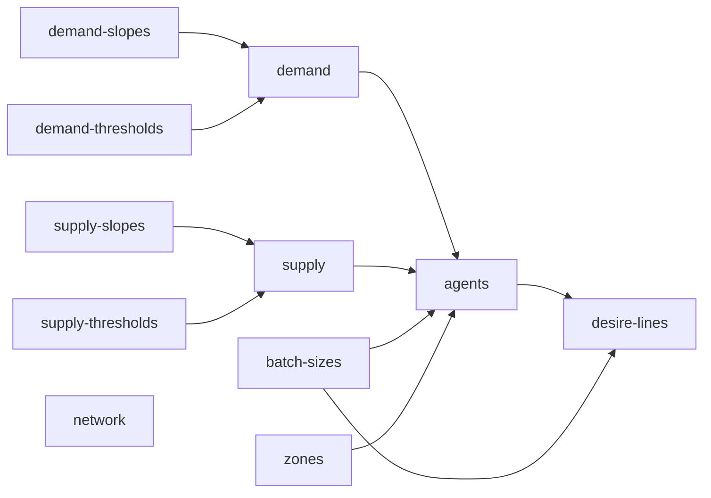

# urban-dollop

```mermaid
flowchart LR
    demand_slopes[demand-slopes] --> demand[demand]
    demand_thresholds[demand-thresholds] --> demand
    supply_slopes[supply-slopes] --> supply[supply]
    supply_thresholds[supply-thresholds] --> supply
    demand --> agents[agents]
    supply --> agents
    batch_sizes[batch-sizes] --> agents
    zones[zones] --> agents[agents]
    agents --> desire_lines[desire-lines]
    batch_sizes --> desire_lines
    network[network]
```
