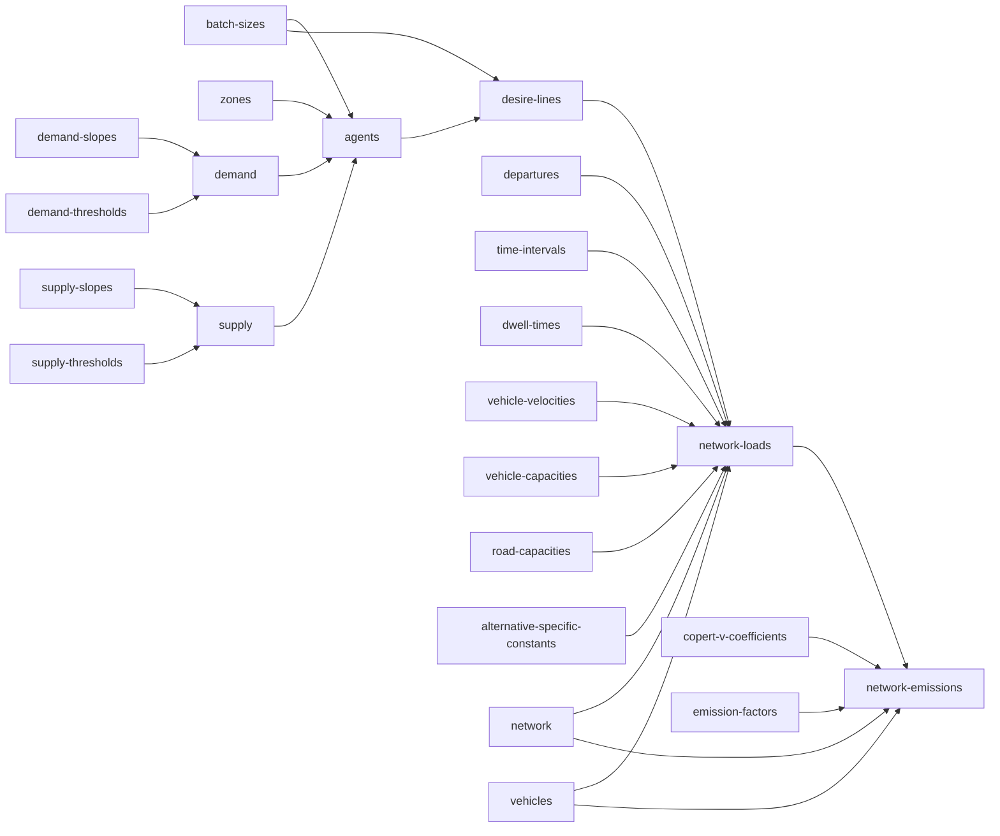

# urban-dollop

## `synth supply-effects` / `synth demand-effects` / `synth capacity-effects` / `synth need-effects`

Coefficients for a textbook additive (main-effects, no interactions) ordered-logit linear
predictor -- the cumulative logit / proportional odds model of McCullagh (1980). Output is
long-format: one row per (stratum column, stratum value) pair, never one row per full
combination.

| stratum_column | stratum_value | effect |
|---|---|---|
| zone_id | zone_1 | 0.734 |
| zone_id | zone_2 | -0.051 |
| stratum_1 | value_1 | 0.512 |
| stratum_1 | value_2 | -0.203 |
| stratum_2 | value_1 | 0.884 |

A stratum value can repeat across different stratum columns (`value_1` above belongs to
both `stratum_1` and `stratum_2`) -- values are only unique within their own column, not
across the file. A full stratum combination's linear predictor ($\beta$) is the sum of
whichever rows apply to it.

`supply`/`demand` describe a stratum's aggregate resource totals; `capacity`/`need`
describe the size distribution of individual agents drawn from that stratum later --
different questions, same statistical machinery, four independent files.

### Synthesis

Every `effect` is drawn from a standard normal, `Normal(0, 1)`, fixed regardless of
`--sigma` -- it is the value being synthesized, not a count of how much to synthesize. Mean
zero is not an arbitrary default: with no reference category dropped and no separate
intercept anywhere in this design, each effect is a random effect (in the mixed-model
sense), and mean zero is exactly what makes that identifiable rather than an unmeasurable
duplicate of an intercept that doesn't exist here.

Each of these four commands is fully self-contained -- none of them look at any other file.
Run one with nothing on disk yet and it synthesizes both the shape and the values from
scratch: dimension count and each dimension's value count are `ceil(lognormal(0, sigma))`,
uncapped, `zone_id` always included. `--sigma 0` collapses this to the smallest possible
draw: one dimension (`zone_id`), one value.

Alternatively, hand it a file that already has `stratum_column`/`stratum_value` filled in
(real column names and values are welcome here -- they're never validated against
anything) with `effect` left entirely empty, and it fills in just the values, leaving the
shape untouched. A file with `effect` already set anywhere -- fully or partially -- is left
alone and the command throws, rather than guessing whether you wanted it regenerated.

## `synth supply-thresholds` / `synth demand-thresholds` / `synth capacity-thresholds` / `synth need-thresholds`

Cutpoints ($\mu$) for the same cumulative-logit model: a resource with $n$ ordered levels
gets `n - 1` thresholds, partitioning a latent continuous scale into the `n` discrete
outcomes.

| resource | resource_level | threshold |
|---|---|---|
| resource_1 | 1 | 0.432 |
| resource_1 | 2 | 1.738 |
| resource_1 | 3 | (empty) |
| resource_2 | 4 | -0.220 |
| resource_2 | 9 | (empty) |

`resource_level` is a genuine numeric quantity, not a category label -- it is the actual
amount of the resource at that outcome, used directly in a weighted sum downstream, even
though it plays the same shape-defining role `stratum_value` plays for effects. Levels are
always distinct within a resource (a repeated level would mean two ordinal categories
mapping to the identical real-world quantity, which has no meaningful interpretation) and
always ascending; the largest level in a resource has no upper threshold, hence empty.

### Synthesis

Every `threshold` is `Normal(0, 1)`, sorted ascending per resource, fixed regardless of
`--sigma` -- a value, not a count, same reasoning as `effect` above. Resource *count* and
*level count per resource* are both `ceil(lognormal(0, sigma))`, uncapped. Level *values*
are drawn the same way but at fixed `sigma = 1`, since they too are values, repeated until
the required number of levels is distinct within that resource.

Same self-contained contract as the effects commands: nothing on disk synthesizes shape and
values together; a file with `resource`/`resource_level` filled in and `threshold` entirely
empty gets just its thresholds filled; anything with `threshold` already set anywhere is
left alone and the command throws.
