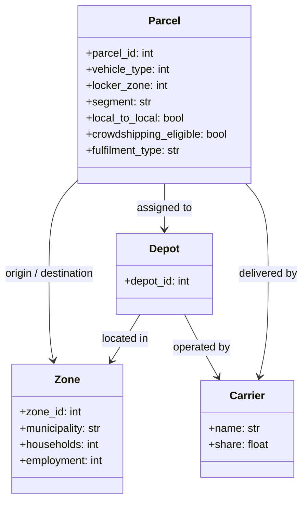

# urban-dollop

A Python package for urban freight simulation based on the MASS-GT multi-agent model.

---

## Domain Model

The library is built around five domain entities. `Zone` and `Depot` both extend `GeoEntity` because they have a physical location in the road network. `Carrier` and `Parcel` are non-spatial.

`Parcel` is the primary output of the pipeline: it is produced by parcel demand generation and consumed by every downstream module.

