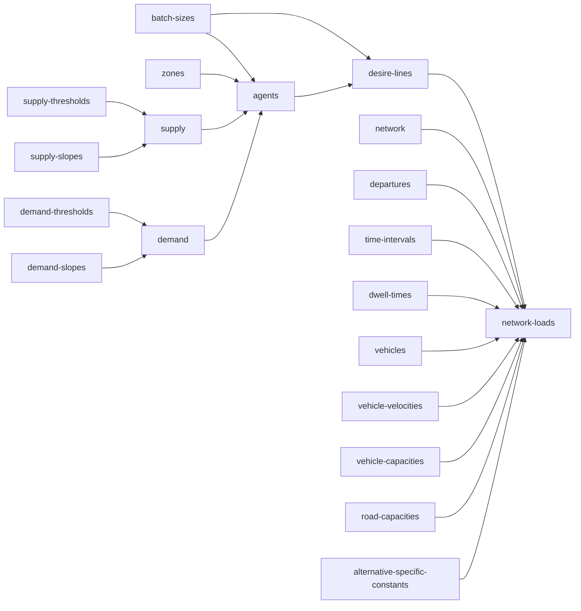

# urban-dollop

```mermaid
flowchart LR
    batch_sizes[batch-sizes] --> agents
    zones[zones] --> agents
    demand_slopes[demand-slopes] --> demand[demand]
    demand_thresholds[demand-thresholds] --> demand
    supply_slopes[supply-slopes] --> supply[supply]
    supply_thresholds[supply-thresholds] --> supply
    demand --> agents[agents]
    supply --> agents
    agents --> desire_lines[desire-lines]
    batch_sizes --> desire_lines
    desire_lines --> network_loads
    network[network] --> network_loads[network-loads]
    departures[departures] --> network_loads
    time_intervals[time-intervals] --> network_loads
    dwell_times[dwell-times] --> network_loads
    vehicles[vehicles] --> network_loads
    vehicle_velocities[vehicle-velocities] --> network_loads
    vehicle_capacities[vehicle-capacities] --> network_loads
    road_capacities[road-capacities] --> network_loads
    alternative_specific_constants[alternative-specific-constants] --> network_loads
```
