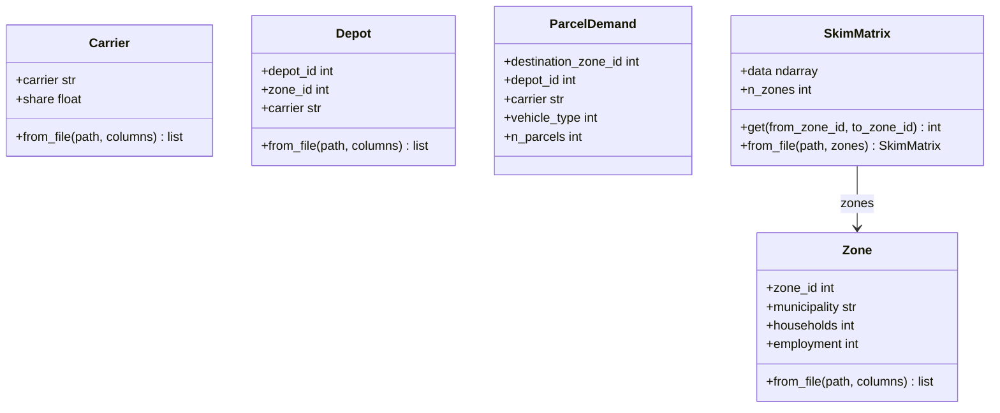

# urban-dollop

A Python package for urban freight simulation based on the MASS-GT multi-agent model.

---

## Domain Model

`FileModel` is the base for any domain entity that can be loaded from a file. It provides
`from_file()`, which dispatches to the right reader based on file extension and handles
column remapping. `GeoEntity` is reserved for entities whose geometry is structurally
meaningful (network links, nodes) — Zone and Depot do not inherit from it because their
spatial reference is `zone_id`, not a coordinate.

`Parcel` is the primary output of the pipeline: produced by parcel demand generation and
consumed by every downstream module.

