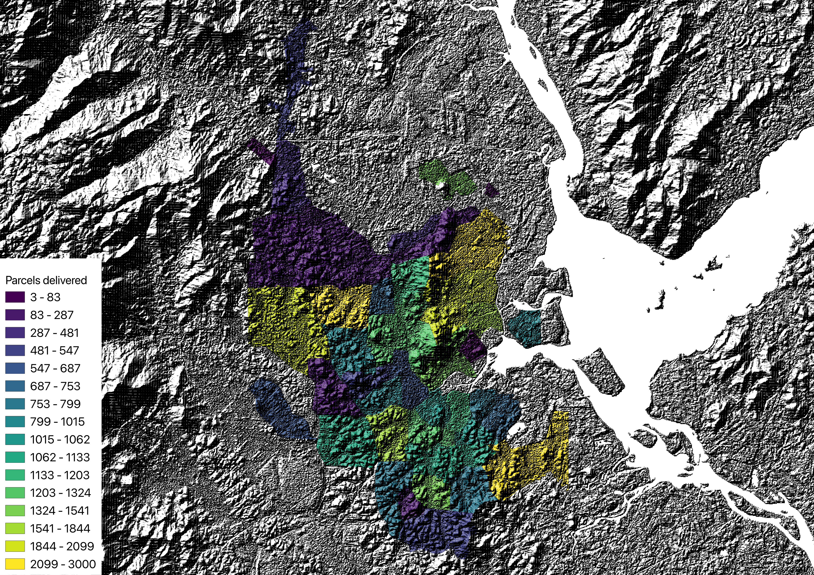

# urban-dollop

urban-dollop is a Python library that extracts and packages the mathematical models
from [MASS-GT](https://github.com/orgs/mass-gt/repositories) — a multi-agent urban
freight simulation system originally developed at TU Delft for the Dutch Randstad region.
The models are reimplemented as a transparent, installable Python pipeline intended for
academic research and reproducible urban logistics studies.

The primary novel contribution is the introduction of road grade as a dimension in
emission accounting, enabling topographically accurate estimates in hilly cities.

---

## Usage

### Parcel demand generation

Estimate the daily parcel delivery demand for a study area from zonal population and
employment data.

```python
from urban_dollop import Zone, Depot, Carrier, SkimMatrix, generate_parcel_demand

zones    = Zone.from_file("zones.gpkg")
depots   = Depot.from_file("depots.gpkg")
carriers = Carrier.from_file("carrier_shares.csv")
skim     = SkimMatrix.from_file("skim_time.mtx", zones)

demands  = generate_parcel_demand(zones, depots, carriers, skim)
```

`demands` is a `list[ParcelDemand]` — one record per unique
(destination zone, depot, vehicle type) combination:

| field | type | description |
|---|---|---|
| `destination_zone_id` | `int` | zone ID of the delivery address |
| `depot_id` | `int` | depot that handles this flow |
| `vehicle_type` | `int` | vehicle type code (default `7` = van) |
| `n_parcels` | `int` | number of parcels in this flow |

The origin zone of each flow is implicit — it is always the zone of the depot.

**Save to CSV** (join to your zones layer in QGIS or ArcGIS on `destination_zone_id`
to map parcels delivered per zone):

```python
ParcelDemand.to_file(demands, "parcel_demand.csv")
```

**Calibration — via `urban-dollop.toml`:**

Place an `urban-dollop.toml` in your current working directory to set calibration
parameters without touching code:

```toml
[parcel_demand]
parcels_per_household = 0.2054  # B2C daily deliveries per household
parcels_per_employee  = 0.0     # B2B daily deliveries per employee
delivery_success_b2c  = 0.75    # first-attempt success rate, residential
delivery_success_b2b  = 0.95    # first-attempt success rate, commercial
default_vehicle_type  = 7       # 7 = van
random_seed           = 42
```

**Calibration — programmatic override:**

Pass a `ParcelDemandConfig` to override TOML values in code:

```python
from urban_dollop import ParcelDemandConfig

demands = generate_parcel_demand(
    zones, depots, carriers, skim,
    config=ParcelDemandConfig(
        parcels_per_household = 0.178,
        parcels_per_employee  = 0.029,
        delivery_success_b2c  = 0.80,
        delivery_success_b2b  = 0.95,
        default_vehicle_type  = 7,
    ),
)
```

Programmatic values take precedence over TOML. Missing fields fall back to TOML.
Pydantic raises if a required field is absent from both sources.

**Column mapping** — when your files use different column names:

```python
zones = Zone.from_file("zones.gpkg", columns={
    "zone_id":    "id",
    "households": "hh_count",
    "employment": "jobs",
})

carriers = Carrier.from_file("shares.csv", columns={
    "name":  "courier",
    "share": "market_share",
})
```

Canonical column names:

| model | field | description |
|---|---|---|
| `Zone` | `zone_id` | unique integer zone identifier |
| `Zone` | `households` | household count |
| `Zone` | `employment` | employee count |
| `Depot` | `depot_id` | unique integer depot identifier |
| `Depot` | `zone_id` | zone the depot is located in |
| `Depot` | `carrier` | carrier name (must match `Carrier.name`) |
| `Carrier` | `name` | carrier name |
| `Carrier` | `share` | market share fraction (all carriers must sum to 1) |

#### CLI

Run the parcel demand module from canonical files:

```bash
urban-dollop generate-demand data/
```

This command:

- reads `urban-dollop.toml` from the current working directory
- reads `zones.gpkg`, `depots.gpkg`, `carrier_shares.csv`, and `skim_time.mtx` from `data/`
- writes `parcel_demand.csv` to the current working directory by default

To write the CSV somewhere else, pass `--outdir` with either an existing directory
or a full `.csv` path:

```bash
urban-dollop generate-demand --outdir results/ data/
urban-dollop generate-demand --outdir results/joinville_parcel_demand.csv data/
```

#### Example output



> [!NOTE]
> Example choropleth of simulated parcel deliveries aggregated by `destination_zone_id` for the Joinville fixture scenario. Zone geometry is based on [IBGE territorial and census meshes](https://www.ibge.gov.br/geociencias/organizacao-do-territorio/malhas-territoriais.html), household counts on [IBGE Census / SIDRA](https://sidra.ibge.gov.br/), employment on [RAIS microdata](https://www.gov.br/trabalho-e-emprego/pt-br/assuntos/estatisticas-trabalho/microdados-rais-e-caged), and travel times on [OpenStreetMap](https://planet.openstreetmap.org/) routed with [OSRM](https://project-osrm.org/). Depot locations are scenario inputs compiled from public carrier and agency sources including [Correios](https://www.correios.com.br/agencias), [Mercado Envios](https://envios.mercadolivre.com.br), [Loggi](https://ajuda.loggi.com/hc/pt-br/articles/4410136350221-Quais-os-hor%C3%A1rios-de-funcionamento-das-ag%C3%AAncias), and [Amazon](https://sellercentral.amazon.com.br/help/hub/reference/external/G201811680). Carrier shares are scenario estimates synthesized from public market and company sources, including [Correios](https://www.correios.com.br/acesso-a-informacao/institucional/publicacoes/processos-de-contas-anuais-prestacao-de-contas/2024/ri_2024_matriz_final_22-05_sei.pdf) and [ABComm](https://dados.abcomm.org/).

---

## Mathematical models

The following models are extracted from MASS-GT's `parcel_dmnd` module and implemented
in `generate_parcel_demand()`.

### Parcel demand generation

#### Zonal demand

The number of parcel flows destined for zone $z$ on an average weekday:

$$D_z = \left\lfloor \frac{H_z \cdot r_{HH}}{s_{B2C}} + \frac{E_z \cdot r_E}{s_{B2B}} \right\rceil$$

| symbol | `ParcelDemandConfig` field | description |
|---|---|---|
| $H_z$ | — | households in zone $z$ |
| $E_z$ | — | employees in zone $z$ |
| $r_{HH}$ | `parcels_per_household` | B2C parcels per household per day |
| $r_E$ | `parcels_per_employee` | B2B parcels per employee per day |
| $s_{B2C}$ | `delivery_success_b2c` | first-attempt delivery success rate, residential |
| $s_{B2B}$ | `delivery_success_b2b` | first-attempt delivery success rate, commercial |

The success rates correct for failed first-attempt deliveries: the generated volume
reflects shipments sent, not deliveries completed.

#### Carrier split

Total zonal demand is distributed across carriers by market share:

$$D_{z,k} = \left\lfloor \sigma_k \cdot D_z \right\rceil$$

where $\sigma_k$ is the market share of carrier $k$ (`Carrier.share`), and
$\sum_k \sigma_k = 1$.

#### Depot assignment

Each (zone, carrier) flow is assigned to the nearest depot of that carrier by
travel time from the depot zone to the destination zone:

$$\delta(z, k) = \underset{n \in \mathcal{N}_k}{\arg\min}\ t(n_{\text{zone}}, z)$$

where $\mathcal{N}_k$ is the set of depots operated by carrier $k$ and
$t(n_{\text{zone}}, z)$ is the travel time in seconds from the depot's zone to
zone $z$, read from the pre-computed skim matrix.

#### Aggregation

Flows that share the same destination zone and depot are summed:

$$F_{z,n} = \sum_{k\,:\,\delta(z,k) = n} D_{z,k}$$

Each resulting $(z, n)$ pair with $F_{z,n} > 0$ becomes one `ParcelDemand` record.
