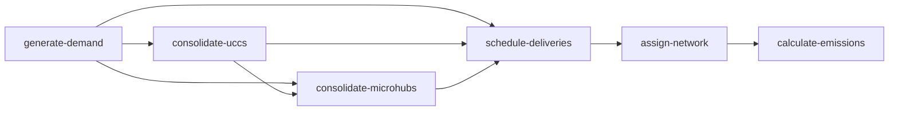

# urban-dollop

urban-dollop is a Python library for urban freight simulation. It generalizes
[MASS-GT](https://github.com/orgs/mass-gt/repositories) — a multi-agent freight
simulation system developed at TU Delft — covering demand generation, consolidation
routing, delivery scheduling, network assignment, and emission calculation including
road grade effects. It separates reusable model structure from study-area-specific
parameters so the same pipeline can be applied to any city.

---

## Modules

| Module | MASS-GT source | Status |
|---|---|---|
| Parcel demand generation | `parcel_dmnd` | implemented |
| Parcel consolidation (UCCs + microhubs) | `parcel_dmnd` | implemented |
| Parcel delivery scheduling | `parcel_schd` | implemented |
| Network / route assignment | `traf` | implemented |
| Emission calculation (COPERT V + grade) | `traf` + grade extension | implemented |
| KPI indicators | `outp` | planned |
| Service trip demand | `service` | planned |
| Freight shipment demand | `ship` | planned |
| Freight tour scheduling | `tour` | planned |
| Firm synthesizer | `fs` | planned |

---

## Installation

```bash
pip install urban-dollop
```

---

## Pipeline



The consolidation steps are optional and composable — run either, both, or
neither between demand generation and scheduling. All steps read inputs from a
required directory argument and write output to the current directory by default.
All steps are configured via `urban-dollop.toml` in the working directory.

---

## Usage

### generate-demand

Estimates daily parcel delivery demand by zone and carrier. Reads zone
socioeconomics, depot locations, carrier market shares, and a travel-time skim
matrix. Writes one `parcel_demand.csv` row per `(origin_zone, destination_zone,
carrier)` triple.

**Canonical output — `parcel_demand.csv`:**

| field | type | description |
|---|---|---|
| `origin_zone_id` | `int` | zone of the carrier depot serving this flow |
| `destination_zone_id` | `int` | zone receiving the parcels |
| `carrier` | `str` | carrier name |
| `n_parcels` | `int` | number of parcels |

#### Linear formulation

Demand for each zone is proportional to its household and employment counts:

$$D = \frac{H \cdot r_\text{B2C}}{s_\text{B2C}} + \frac{E \cdot r_\text{B2B}}{s_\text{B2B}}$$

$H$ is household count, $E$ is employment count, $r$ is a daily parcel rate per
person or employee, and $s$ is delivery success rate — the fraction of
first-attempt deliveries that succeed. Dividing by $s$ inflates demand upward to
account for parcels that require a re-delivery attempt.

**Canonical inputs:**

| file | field | type | description |
|---|---|---|---|
| `zones.gpkg` | `zone_id` | `int` | unique zone identifier |
| `zones.gpkg` | `households` | `float` | household count |
| `zones.gpkg` | `employment` | `float` | employee count |
| `depots.gpkg` | `depot_id` | `int` | unique depot identifier |
| `depots.gpkg` | `zone_id` | `int` | zone the depot is located in |
| `depots.gpkg` | `carrier` | `str` | carrier name |
| `carrier_shares.csv` | `name` | `str` | carrier name |
| `carrier_shares.csv` | `share` | `float` | market share fraction (all shares must sum to 1.0) |

`zones.gpkg` and `depots.gpkg` also accept `.csv`. Also requires a
`skim_time.mtx` binary skim matrix: flat float32 values, N² elements, one per
zone pair in zone file order. A gzip-compressed `skim_time.mtx.gz` is also
accepted.

**Config — `[parcel_demand]` in `urban-dollop.toml`:**

```toml
[parcel_demand]
parcels_per_household = 0.178
parcels_per_employee = 0.029
delivery_success_b2c = 0.80
delivery_success_b2b = 0.95
# calibration_target = 50000
```

All four rates are required and study-area specific — there are no defaults.
`calibration_target` is optional; when set, all zone demands are scaled
proportionally so the study-area total matches the target.

**CLI:**

```bash
urban-dollop generate-demand data/
urban-dollop generate-demand --outdir results/ data/
```

Reads `zones.gpkg`, `depots.gpkg`, `carrier_shares.csv`, and `skim_time.mtx`
from `data/`. Writes `parcel_demand.csv` to the current directory by default.

**Python API:**

```python
from urban_dollop import LinearZone, Depot, Carrier, SkimMatrix
from urban_dollop import generate_parcel_demand, ParcelDemandConfig, ParcelDemand

zones = LinearZone.from_file("zones.gpkg", columns={
    "zone_id": "id",
    "households": "hh",
    "employment": "emp"
})
depots = Depot.from_file("depots.gpkg")
carriers = Carrier.from_file("carrier_shares.csv")
skim = SkimMatrix.from_file("skim_time.mtx", zones)

demands = generate_parcel_demand(
    zones, depots, carriers, skim,
    config=ParcelDemandConfig(
        parcels_per_household=0.178,
        parcels_per_employee=0.029,
        delivery_success_b2c=0.80,
        delivery_success_b2b=0.95,
        calibration_target=50000,
    ),
)
ParcelDemand.to_file(demands, "parcel_demand.csv")
```

All `from_file` calls accept a `columns` mapping to translate your file's column
names to the expected field names. All other API calls support it the same way.

#### Ordered logit formulation

Use `--logit` when your zone data has population and an integer urbanization
classification rather than household and employment counts. This formulation is
adapted from the HARMONY v3 demand model.

The model treats parcel ordering as an ordered discrete choice. `parcel_levels`
defines the ordered categories of monthly parcel volume a resident can belong to
(e.g. 0, 1, 2, … parcels per month). For a zone with urbanization class $u$,
the linear predictor is $\eta = \beta_u$, and the probability that a resident
orders at most $L_k$ parcels per month is:

$$P(X \leq L_k) = \frac{1}{1 + e^{\eta - \mu_k}}$$

The `mu_thresholds` $(\mu_k)$ are the cut-points separating adjacent levels on
the latent scale — one per level except the last. Cell probabilities follow as
consecutive differences of the cumulative distribution:

$$p_k = P(X \leq L_k) - P(X \leq L_{k-1}), \quad P(X \leq L_{-1}) = 0$$

Expected monthly parcels per person is the probability-weighted sum over all
levels. Writing $N$ for zone `population` and $T$ for `monthly_to_daily_divisor`,
daily zone demand is:

$$D = \frac{N}{T} \sum_k p_k \cdot L_k$$

This makes each parameter concrete: `parcel_levels` supplies the $L_k$ values,
`mu_thresholds` controls how the probability mass distributes across them, and
$T$ converts the survey period to a daily figure.

When demographic stratification is available, the same equations apply within
each age × income cell using a cell-specific linear predictor
$\eta_{ai} = \beta_a[a] + \beta_i[i] + \beta_u$, and zone demand sums over all
cells weighted by their population count $n_{ai}$:

$$D = \frac{1}{T} \sum_a \sum_i n_{ai} \sum_k p_k(\eta_{ai}) \cdot L_k$$

**Zone inputs (replaces `households` and `employment`):**

| file | field | type | description |
|---|---|---|---|
| `zones.gpkg` | `population` | `float` | total resident population |
| `zones.gpkg` | `urbanization_level` | `int` | integer urbanization class matching a key in `beta_urbanization` |
| `population_strata.csv` | `zone_id` | `int` | zone this row belongs to |
| `population_strata.csv` | `age_cohort` | `int` | age cohort identifier matching a key in `beta_age` |
| `population_strata.csv` | `income_bracket` | `int` | income bracket identifier matching a key in `beta_income` |
| `population_strata.csv` | `population` | `float` | resident count for this zone × cohort × bracket cell |

`population_strata.csv` is optional. When present, the CLI and Python API use
the full stratified formulation; when absent, the model uses total population
and urbanization level only. All other canonical inputs (`depots.gpkg`,
`carrier_shares.csv`, `skim_time.mtx`) and the canonical output are identical
to the linear formulation.

**Config — `[parcel_demand_logit]` in `urban-dollop.toml`:**

```toml
[parcel_demand_logit.beta_urbanization]
1 = 2.0
2 = 1.2
3 = 0.4
4 = -0.3
5 = -1.0

[parcel_demand_logit]
mu_thresholds = [-0.5, 1.0, 2.0, 2.8, 3.5, 4.0, 5.5, 7.0]
parcel_levels = [0, 1, 2, 3, 4, 5, 10, 15, 20]
monthly_to_daily_divisor = 60.0
# beta_age = {1 = -0.2, 2 = 0.3}
# beta_income = {1 = -0.5, 2 = 0.0, 3 = 0.8}
# calibration_target = 50000
```

`mu_thresholds` must have exactly `len(parcel_levels) - 1` entries. `beta_age`
and `beta_income` are required when `population_strata.csv` is provided; both
must be set together or both omitted. All values are study-area specific and
must be estimated from a local household survey — the Dutch HARMONY v3 values
shown above are for reference only.

**CLI (add `--logit`):**

```bash
urban-dollop generate-demand --logit data/
urban-dollop generate-demand --logit --outdir results/ data/
```

Drop `population_strata.csv` into the data directory alongside `zones.gpkg` to
activate the stratified formulation automatically. If the file is absent the
urbanization-only formulation is used.

**Python API:**

```python
from urban_dollop import (
    LogitZone, Depot, Carrier, SkimMatrix,
    generate_logit_demand, LogitDemandConfig, ParcelDemand,
)

zones = LogitZone.from_file(
    "zones.gpkg",
    strata_path="population_strata.csv",
)
depots = Depot.from_file("depots.gpkg")
carriers = Carrier.from_file("carrier_shares.csv")
skim = SkimMatrix.from_file("skim_time.mtx", zones)

demands = generate_logit_demand(
    zones, depots, carriers, skim,
    config=LogitDemandConfig(
        beta_urbanization={1: 2.0, 2: 1.2, 3: 0.4, 4: -0.3, 5: -1.0},
        beta_age={1: -0.2, 2: 0.3},
        beta_income={1: -0.5, 2: 0.0, 3: 0.8},
        mu_thresholds=[-0.5, 1.0, 2.0, 2.8, 3.5, 4.0, 5.5, 7.0],
        parcel_levels=[0, 1, 2, 3, 4, 5, 10, 15, 20],
        monthly_to_daily_divisor=60.0,
    ),
)
ParcelDemand.to_file(demands, "parcel_demand.csv")
```

Omit `strata_path`, `beta_age`, and `beta_income` to use urbanization level
only — zones then load from file with `LogitZone.from_file("zones.gpkg")`.

---

### consolidate-uccs

Reroutes a fraction of parcels destined for UCC catchment zones through Urban
Consolidation Centres. Each rerouted flow is split into two legs: leg A
(origin → nearest UCC) and leg B (UCC → original destination). Non-catchment
parcels pass through unchanged.

The nearest UCC is selected per demand record by minimising total two-leg road
distance: `dist(origin → UCC) + dist(UCC → destination)`. UCCs are
carrier-agnostic — any carrier's parcels can be rerouted through any UCC.

**Canonical output — `parcel_demand.csv`:**

The output schema is identical to the input `parcel_demand.csv`. Rerouted flows
appear as two rows (depot → UCC and UCC → destination) replacing the original
single row; direct flows are unchanged.

**Canonical inputs:**

| file | field | type | description |
|---|---|---|---|
| `uccs.csv` | `ucc_id` | `int` | unique UCC identifier |
| `uccs.csv` | `zone_id` | `int` | zone the UCC is located in |
| `ucc_catchment_zones.csv` | `zone_id` | `int` | zone whose inbound parcels are eligible for UCC rerouting |

Also requires a `skim_distance.mtx` binary distance skim matrix: flat float32
values, N² elements, in zone file order. A `.mtx.gz` is also accepted.

**Config — `[ucc_consolidation]` in `urban-dollop.toml`:**

```toml
[ucc_consolidation]
probability = 0.30
```

`probability` is required and study-area specific. It controls the fraction of
catchment-zone parcels rerouted through a UCC; the remainder continue as direct
flows.

**CLI:**

```bash
urban-dollop consolidate-uccs data/
urban-dollop consolidate-uccs --outdir results/ data/
```

Reads `zones.gpkg`, `parcel_demand.csv`, `uccs.csv`, `ucc_catchment_zones.csv`,
and `skim_distance.mtx` from `data/`. `zones.csv` is also accepted. Writes
`parcel_demand.csv` to the current directory by default.

**Python API:**

```python
from urban_dollop import (
    ParcelDemand, SkimDistance, UCC, UCCCatchmentZone, UCCConfig, Zone,
    consolidate_uccs,
)

zones = Zone.from_file("zones.gpkg")
demands = ParcelDemand.from_file("parcel_demand.csv")
uccs = UCC.from_file("uccs.csv")
catchment_zones = UCCCatchmentZone.from_file("ucc_catchment_zones.csv")
skim_distance = SkimDistance.from_file("skim_distance.mtx", zones)

result = consolidate_uccs(
    demands=demands,
    uccs=uccs,
    catchment_zones=catchment_zones,
    skim_distance=skim_distance,
    config=UCCConfig(probability=0.30),
)
ParcelDemand.to_file(result, "parcel_demand.csv")
```

---

### consolidate-microhubs

Reroutes all parcels destined for zero-emission zones (ZEZs) through
carrier-specific microhubs. Each flow is split into two legs: leg A
(origin → nearest microhub) and leg B (microhub → destination, zero-emission
last mile). Non-ZEZ parcels pass through unchanged.

Unlike UCC consolidation, rerouting is unconditional — every ZEZ-bound parcel
is transferred at probability 1, since the constraint is a regulatory
requirement. Microhubs are also carrier-specific: a carrier's parcels can only
be routed through that carrier's facilities. The nearest microhub is selected by
minimising last-mile distance only: `dist(microhub → destination)`. Every
carrier with ZEZ-destined parcels must have at least one microhub configured.

**Canonical output — `parcel_demand.csv`:**

The output schema is identical to the input `parcel_demand.csv`. ZEZ-bound flows
appear as two rows (depot → microhub and microhub → destination) replacing the
original; non-ZEZ flows are unchanged.

**Canonical inputs:**

| file | field | type | description |
|---|---|---|---|
| `microhubs.csv` | `microhub_id` | `int` | unique microhub identifier |
| `microhubs.csv` | `zone_id` | `int` | zone the microhub is located in |
| `microhubs.csv` | `carrier` | `str` | carrier this microhub serves |
| `zero_emission_zones.csv` | `zone_id` | `int` | zone where conventional vehicles are prohibited |

Also requires `skim_distance.mtx` in the same format as `consolidate-uccs`.

This step has no config section — rerouting is 100% for all ZEZ-bound parcels.

**CLI:**

```bash
urban-dollop consolidate-microhubs data/
urban-dollop consolidate-microhubs --outdir results/ data/
```

Reads `zones.gpkg`, `parcel_demand.csv`, `microhubs.csv`,
`zero_emission_zones.csv`, and `skim_distance.mtx` from `data/`. `zones.csv`
is also accepted. Writes `parcel_demand.csv` to the current directory by default.

**Python API:**

```python
from urban_dollop import (
    Microhub, ParcelDemand, SkimDistance, Zone, ZeroEmissionZone,
    consolidate_microhubs,
)

zones = Zone.from_file("zones.gpkg")
demands = ParcelDemand.from_file("parcel_demand.csv")
microhubs = Microhub.from_file("microhubs.csv")
zez_zones = ZeroEmissionZone.from_file("zero_emission_zones.csv")
skim_distance = SkimDistance.from_file("skim_distance.mtx", zones)

result = consolidate_microhubs(
    demands=demands,
    microhubs=microhubs,
    zez_zones=zez_zones,
    skim_distance=skim_distance,
)
ParcelDemand.to_file(result, "parcel_demand.csv")
```

---

### schedule-deliveries

Converts the flat parcel demand table into vehicle delivery tours. For each
`(depot zone, carrier)` pair, it groups destination zones into
capacity-constrained tours, sequences stops within each tour to minimise
driving distance, and assigns a vehicle type. Returns one row per tour leg.

Demand records that meet or exceed the largest vehicle capacity are assigned
dedicated full-load tours immediately. Remaining records are grouped
iteratively: the destination furthest from the depot seeds each new cluster,
and the nearest unassigned destinations are added until the cluster fills
(furthest-seed, nearest-fill). Stop order within each cluster is then improved
by 2-opt: pairs of positions are reversed if doing so reduces total distance,
with passes repeating until no swap helps. The smallest vehicle whose capacity
meets the tour load is selected from the configured fleet.

**Canonical output — `parcel_trips.csv`:**

| field | type | description |
|---|---|---|
| `tour_id` | `int` | unique tour identifier |
| `trip_id` | `int` | sequential leg position within the tour |
| `carrier` | `str` | carrier operating the tour |
| `origin_zone_id` | `int` | zone at the start of this leg |
| `destination_zone_id` | `int` | zone at the end of this leg |
| `n_parcels` | `int` | parcels delivered at this stop (0 for the return leg) |
| `vehicle_id` | `int` | vehicle type assigned to this tour |
| `departure_hour` | `int \| null` | hour of departure (0–23); present only when `departure_time_distribution` is configured |

**Canonical inputs:**

| file | field | type | description |
|---|---|---|---|
| `zones.gpkg` | `zone_id` | `int` | unique zone identifier |
| `vehicles.csv` | `vehicle_id` | `int` | unique vehicle type identifier |
| `vehicles.csv` | `name` | `str` | vehicle type label |
| `vehicles.csv` | `max_parcels` | `int` | maximum parcel capacity |

Also requires a `skim_distance.mtx` binary distance skim matrix: flat float32
values, N² elements, in zone file order. A `.mtx.gz` is also accepted.
When zones are loaded from a GeoPackage, centroid coordinates are extracted
from the geometry column and blended with skim distance in the spatial
clustering step, improving cluster stability in sparse zones. `zones.csv` is
also accepted; include `x` and `y` columns to provide centroids explicitly
and get the same blend.

The scheduler assigns the smallest vehicle whose capacity fits the tour load.

**Config — `[parcel_scheduling]` in `urban-dollop.toml`:**

```toml
[parcel_scheduling]
# seed = 42
# departure_time_distribution = [
#     0.0, 0.0, 0.0, 0.0, 0.0, 0.0,   # hours 0–5 (no departures)
#     0.1, 0.3, 0.6, 0.85, 0.95, 1.0, # hours 6–11 (morning peak)
#     1.0, 1.0, 1.0, 1.0, 1.0, 1.0,   # hours 12–17 (all departed)
#     1.0, 1.0, 1.0, 1.0, 1.0, 1.0,   # hours 18–23
# ]
```

`seed` is optional; set it to make tour clustering and departure time sampling
reproducible. `departure_time_distribution` is optional; when omitted,
`departure_hour` is absent from the output and trips are treated as
time-invariant. When provided, it must be a 24-element array of cumulative
hourly shares (non-decreasing, last value exactly 1.0). Each tour draws a
departure hour from this distribution; all legs of the same tour share that
hour, enabling hourly traffic intensity reporting downstream.

**CLI:**

```bash
urban-dollop schedule-deliveries data/
urban-dollop schedule-deliveries --outdir results/ data/
```

Reads `zones.gpkg`, `vehicles.csv`, `skim_distance.mtx`, and `parcel_demand.csv`
from `data/`. `zones.csv` is also accepted. Writes `parcel_trips.csv` to the
current directory by default.

**Python API:**

```python
from urban_dollop import (
    DeliveryTrip, ParcelDemand, ParcelSchedulingConfig,
    SkimDistance, Vehicle, Zone,
    schedule_parcel_deliveries,
)

zones = Zone.from_file("zones.gpkg")
vehicles = Vehicle.from_file("vehicles.csv")
skim_distance = SkimDistance.from_file("skim_distance.mtx", zones)
demands = ParcelDemand.from_file("parcel_demand.csv")

trips = schedule_parcel_deliveries(
    demands=demands,
    vehicles=vehicles,
    skim_distance=skim_distance,
    zones=zones,
    config=ParcelSchedulingConfig(seed=42),
)
DeliveryTrip.to_file(trips, "parcel_trips.csv")
```

With a departure time distribution, pass it as a 24-element list of cumulative
hourly shares. Each tour is assigned a departure hour sampled from this
distribution; the `departure_hour` column appears in the output.

```python
peak = [0.1, 0.3, 0.6, 0.85, 0.95, 1.0]
tod = [0.0] * 6 + peak + [1.0] * 12   # morning peak, all departed by noon

trips = schedule_parcel_deliveries(
    demands=demands,
    vehicles=vehicles,
    skim_distance=skim_distance,
    zones=zones,
    config=ParcelSchedulingConfig(
        seed=42,
        departure_time_distribution=tod,
    ),
)
```

---

### assign-network

Assigns trip legs to road network links via shortest-path routing. For each
trip leg produced by any upstream scheduler, finds the minimum-distance path
through the road network using Dijkstra's algorithm and accumulates vehicle
traversal counts per link. Returns one row per `(link_id, vehicle_id)` pair
that carries at least one trip.

**Canonical output — `loaded_links.csv`:**

| field | type | description |
|---|---|---|
| `link_id` | `int` | joins back to `network_links` |
| `road_type` | `str` | `urban`, `rural`, or `highway` |
| `distance_m` | `float` | link length in metres |
| `grade_pct` | `float` | average grade (0.0 if not provided in input) |
| `vehicle_id` | `int` | vehicle type traversing this link |
| `hour` | `int \| null` | departure hour (0–23); present only when upstream trips carry `departure_hour` |
| `n_trips` | `int` | number of traversals by this vehicle type (and hour, if disaggregated) |

**Canonical inputs:**

| file | field | type | description |
|---|---|---|---|
| `*_trips.csv` | *(all fields)* | — | one or more trip files from upstream schedulers (e.g. `parcel_trips.csv`, `freight_trips.csv`) |
| `network_links.gpkg` | `link_id` | `int` | unique link identifier |
| `network_links.gpkg` | `from_node_id` | `int` | origin node |
| `network_links.gpkg` | `to_node_id` | `int` | destination node |
| `network_links.gpkg` | `road_type` | `str` | `urban`, `rural`, or `highway` |
| `network_links.gpkg` | `grade_pct` | `float` | average grade %; defaults to 0.0 if column absent |
| `zone_nodes.csv` | `zone_id` | `int` | zone identifier |
| `zone_nodes.csv` | `node_id` | `int` | network gateway node for trips entering or leaving this zone |
| `vehicles.csv` | *(all fields)* | — | same file as `schedule-deliveries` |

`network_links.csv` is also accepted; requires an explicit `distance_m` column
since there is no geometry to derive it from. When loading from a GeoPackage,
`distance_m` is derived from the LineString geometry automatically if the column
is absent.

`zone_nodes.csv` maps each zone to its entry point in the road network — the
node where vehicles from that zone join or leave the graph. This is a flat
two-column lookup; how the mapping is determined (e.g. nearest node to zone
centroid) is left to the user.

**Config — `[network_assignment]` in `urban-dollop.toml`:**

```toml
[network_assignment]
# seed = 42
```

No required parameters. `seed` is reserved for future multi-routing support.

**CLI:**

```bash
urban-dollop assign-network data/
urban-dollop assign-network --outdir results/ data/
```

Reads all `*_trips.csv` files found in `data/`, plus `network_links.gpkg` (or
`.csv`), `zone_nodes.csv`, and `vehicles.csv`. Writes `loaded_links.csv` to
the current directory by default. Multiple trip files (parcel, freight, service)
are concatenated automatically.

**Python API:**

```python
from urban_dollop import (
    DeliveryTrip, LoadedLink, NetworkAssignmentConfig, NetworkLink,
    Vehicle, ZoneNode, assign_network,
)

trips = DeliveryTrip.from_file("parcel_trips.csv")
links = NetworkLink.from_file("network_links.gpkg")
zone_nodes = ZoneNode.from_file("zone_nodes.csv")
vehicles = Vehicle.from_file("vehicles.csv")

result = assign_network(
    trips=trips,
    links=links,
    zone_nodes=zone_nodes,
    vehicles=vehicles,
    config=NetworkAssignmentConfig(seed=42),
)
LoadedLink.to_file(result, "loaded_links.csv")
```

---

### calculate-emissions

Calculates pollutant emissions for each loaded network link using COPERT V
emission factors. For each (link, vehicle, pollutant) combination, it
interpolates the emission factor (g/km) across both road gradient and vehicle
load using bilinear interpolation, then multiplies by trip count and link length.

Road grade flows directly from `loaded_links.csv` — the novel contribution of
this library relative to the original MASS-GT code, which does not account for
topography in emission accounting.

**Canonical output — `link_emissions.csv`:**

| field | type | description |
|---|---|---|
| `link_id` | `int` | joins back to `loaded_links` |
| `vehicle_id` | `int` | vehicle type |
| `hour` | `int \| null` | departure hour (0–23); `null` when not disaggregated |
| `pollutant` | `str` | pollutant name (e.g. `CO2`, `NOx`, `PM10`) |
| `n_trips` | `int` | number of vehicle traversals |
| `distance_m` | `float` | link length in metres |
| `grade_pct` | `float` | average grade used in EF interpolation |
| `emission_g` | `float` | total grams emitted: `n_trips × (distance_m/1000) × EF` |

**Canonical inputs:**

| file | field | type | description |
|---|---|---|---|
| `loaded_links.csv` | *(all fields)* | — | output from `assign-network` |
| `emission_factors.csv` | `vehicle_id` | `int` | vehicle type these factors apply to |
| `emission_factors.csv` | `pollutant` | `str` | pollutant name |
| `emission_factors.csv` | `gradient_pct` | `float` | road gradient bin (e.g. −6, −4, −2, 0, 2, 4, 6) |
| `emission_factors.csv` | `load_pct` | `float` | vehicle load bin (0, 50, or 100) |
| `emission_factors.csv` | `alpha` | `float` | COPERT V polynomial coefficient |
| `emission_factors.csv` | `beta` | `float` | COPERT V polynomial coefficient |
| `emission_factors.csv` | `gamma` | `float` | COPERT V polynomial coefficient |
| `emission_factors.csv` | `delta` | `float` | COPERT V polynomial coefficient |
| `emission_factors.csv` | `epsilon` | `float` | COPERT V polynomial coefficient |
| `emission_factors.csv` | `zeta` | `float` | COPERT V polynomial coefficient |
| `emission_factors.csv` | `eta` | `float` | COPERT V polynomial coefficient |
| `emission_factors.csv` | `rf` | `float` | deterioration correction factor (0.0 = no correction) |

The COPERT V polynomial gives emission factor (g/km) as a function of speed
$V$ (km/h):

$$\mathrm{EF}(V) = \frac{\alpha V^2 + \beta V + \gamma + \delta/V}{\varepsilon V^2 + \zeta V + \eta} \cdot (1 - \mathrm{RF})$$

The seven coefficients $\alpha, \beta, \gamma, \delta, \varepsilon, \zeta, \eta$
and the deterioration factor RF are vehicle- and pollutant-specific. Total
emissions for a link are $E = n_\text{trips} \times (d_m / 1000) \times \mathrm{EF}(V)$.

**How grade enters.** `emission_factors.csv` tabulates a full set of
coefficients for each `(vehicle_id, pollutant, gradient_pct, load_pct)`
combination. For a link with a given `grade_pct` and configured `fill_rate`,
the library bilinearly interpolates the coefficients across the two bracketing
`gradient_pct` bins and the two bracketing `load_pct` bins, then plugs the
interpolated coefficients into the formula above. Grade values outside the
tabulated bin range are clamped to the nearest bin. This per-link
grade-sensitive interpolation — rather than a single representative speed-grade
pair per road type — is the core improvement over the original MASS-GT
implementation.

For non-exhaust PM (tyre, brake, road wear), the polynomial reduces to a
constant rate — set $\alpha = \beta = \delta = 0$, $\varepsilon = \zeta = 0$,
$\eta = 1$ and encode the wear rate in $\gamma$.

Every `(vehicle_id, pollutant)` combination must cover the full Cartesian
product of gradient and load bins present in `emission_factors.csv`.

**Config — `[emission_calculation]` in `urban-dollop.toml`:**

```toml
[emission_calculation]
fill_rate = 0.5

[emission_calculation.speed_kmh]
urban = 30.0
rural = 80.0
highway = 120.0
```

Both `fill_rate` (vehicle load as a fraction, 0.0–1.0) and `speed_kmh` (mapping
from `road_type` to speed) are required. Speed maps directly to the `road_type`
values in `loaded_links.csv` — add an entry for every road type in your network.

**CLI:**

```bash
urban-dollop calculate-emissions data/
urban-dollop calculate-emissions --outdir results/ data/
```

Reads `loaded_links.csv` and `emission_factors.csv` from `data/`. Writes
`link_emissions.csv` to the current directory by default.

**Python API:**

```python
from urban_dollop import (
    EmissionCalculationConfig, EmissionFactor, LinkEmission, LoadedLink,
    calculate_emissions,
)

loaded_links = LoadedLink.from_file("loaded_links.csv")
emission_factors = EmissionFactor.from_file("emission_factors.csv")

result = calculate_emissions(
    loaded_links=loaded_links,
    emission_factors=emission_factors,
    config=EmissionCalculationConfig(
        speed_kmh={"urban": 30.0, "rural": 80.0, "highway": 120.0},
        fill_rate=0.5,
    ),
)
LinkEmission.to_file(result, "link_emissions.csv")
```
