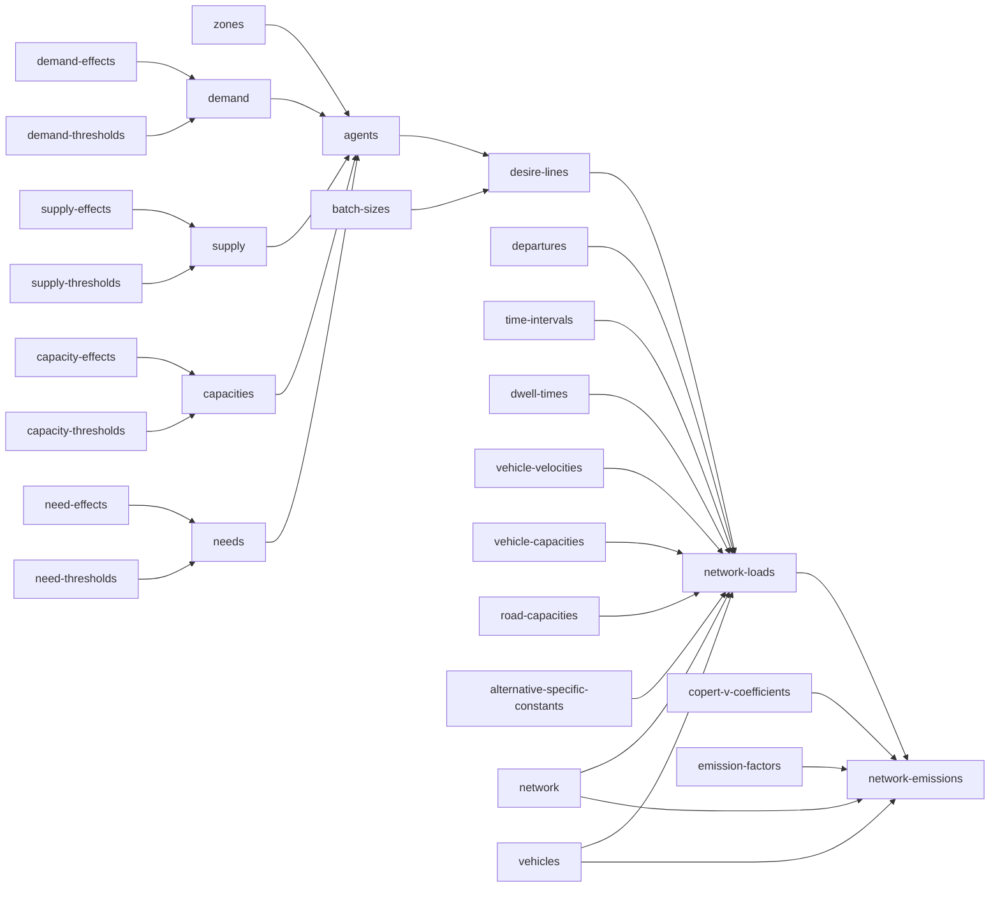

# urban-dollop

## `synth zones`

A GeoDataFrame of Voronoi-tessellated zone polygons over the unit square, one row per
`zone_id`, written to `zones.gpkg`. `zone_id` values are plain integers (`1`, `2`, ...),
matching the convention `effects.csv` uses for its own `zone_id` stratum.

### Synthesis

Fully self-contained, same leaf contract as every other command. Run it with nothing on
disk yet and it invents both the zone count (`ceil(lognormal(0, sigma))`, the only place
`--sigma` acts) and the labels, then tessellates geometry for them.

Alternatively, hand it a `zones.gpkg` that already has a `zone_id` column (real IDs are
welcome, and can be integers or strings) with `geometry` left entirely empty, and it
synthesizes geometry for exactly those zones, in that order -- the count comes from the
shape you gave it, not from `--sigma`. A file with geometry already populated anywhere is
left alone and the command is a no-op: it doesn't matter whether every zone has geometry or
only some do, any real geometry at all means the file is complete (partial geometry would
mean regenerating some zones' shapes but not others, which makes no sense for a
tessellation -- unlike `effects.csv`, there's no legitimate reason for geometry to be
partially populated on purpose). Passing `--sigma` against a file that already exists
throws either way (shape-only or complete): `--sigma` only ever controls count invention,
and a file that already has a zone_id list has nothing left for it to control.

## `synth supply-effects` / `synth demand-effects` / `synth capacity-effects` / `synth need-effects`

Coefficients for a textbook additive (main-effects, no interactions among stratum
dimensions) ordered-logit linear predictor -- the cumulative logit / proportional odds
model of McCullagh (1980). Output is wide: one row per (stratum, stratum value) pair, one
column per resource.

| stratum | stratum_value | resource_1 | resource_2 |
|---|---|---|---|
| zone_id | 1 | 0.734 | -0.310 |
| zone_id | 2 | -0.051 | 0.884 |
| stratum_1 | value_1 | 0.512 | -0.204 |

A stratum value can repeat across different strata (`value_1` could belong to both
`stratum_1` and `stratum_2`) -- values are only unique within their own stratum, not across
the file. Each resource column is its own independent linear predictor ($\beta$), the sum
of whichever rows apply to a given stratum combination *for that resource* -- a resource
column indexes which independent model a cell belongs to, not a covariate on a shared one.
A resource cell can be empty even in an otherwise-complete file: a stratum genuinely may not
participate in every resource's market (a zone that supplies grain may not supply parcels at
all), so an empty cell there is a real, permanent "not applicable," not a placeholder waiting
to be filled. The stratum shape (which dimensions exist, how many values each has) stays
shared across resources, but which rows actually carry a given resource's column at all is
independent per resource -- it's participation, not shape, that varies.

`supply`/`demand` describe a stratum's aggregate resource totals; `capacity`/`need`
describe the size distribution of individual agents drawn from that stratum later --
different questions, same statistical machinery, four independent files.

### Synthesis

Every effect value is drawn from a standard normal, `Normal(0, 1)`, fixed regardless of
`--sigma` -- it is the value being synthesized, not a count of how much to synthesize. Mean
zero is not an arbitrary default: with no reference category dropped and no separate
intercept anywhere in this design, each effect is a random effect (in the mixed-model
sense), and mean zero is exactly what makes that identifiable rather than an unmeasurable
duplicate of an intercept that doesn't exist here.

Each of these four commands is fully self-contained -- none of them look at any other file.
Run one with nothing on disk yet and it synthesizes shape and values together: dimension
count, each dimension's value count, and resource count are all `ceil(lognormal(0,
sigma))`, uncapped, `zone_id` always included. `zone_id` values are plain integers (`1`,
`2`, ...); every other dimension gets string labels (`value_1`, `value_2`, ...) -- `zone_id`
is the one stratum guaranteed to exist and the one with a natural real-world numeric
identity, so it's the one place that distinction is made. `--sigma 0` collapses this to the
smallest possible draw: one dimension (`zone_id`), one value, one resource column.

Each resource independently applies to a uniformly-random non-empty subset of the invented
rows (size drawn uniform over `[1, n]`, membership drawn without replacement) -- never
every row automatically, since that would silently assume every stratum participates in
every resource's market. This is deliberately *not* controlled by `--sigma`: choosing how
many of an already-fixed set of rows to include is a bounded selection problem, not an
unbounded count to invent, so it doesn't fit the `ceil(lognormal(0, sigma))` pattern used
everywhere else -- capping a lognormal draw at `n` would just pile up mass at the cap.

Alternatively, hand it a file that already has `stratum`/`stratum_value` filled in plus one
or more resource columns (real names and values are welcome here). If every resource cell
in the file is empty, it's shape-only -- the command fills every one of them, leaving the
shape untouched. If *any* resource cell already has a value, the file is treated as
complete and the command does nothing at all: it does not fill the remaining empty cells,
because by that point an empty cell no longer means "not yet decided" -- it means "this
stratum doesn't participate in this resource," and that's not a leaf command's call to make
or overwrite once real data exists. `stratum` must contain strings; `stratum_value` must be
a string for every row except `zone_id`'s, which may be int or string -- resource columns
are identified by header name, not by dtype, so this isn't needed for disambiguation, it's
just that only `zone_id` has a real-world numeric identity worth allowing. Filled resource
cells must contain floats. Passing `--sigma` against a file that already exists throws
either way (shape-only or complete): `--sigma` only ever controls shape invention, and a
file that already has shape has nothing left for it to control.

## `synth supply-thresholds` / `synth demand-thresholds` / `synth capacity-thresholds` / `synth need-thresholds`

Cutpoints ($\mu$) for the same cumulative-logit model: a resource with $n$ ordered levels
gets `n - 1` thresholds, partitioning a latent continuous scale into the `n` discrete
outcomes.

| resource | resource_level | threshold |
|---|---|---|
| resource_1 | 0 | 0.432 |
| resource_1 | 2 | 1.738 |
| resource_1 | 3 | (empty) |
| resource_2 | 4 | -0.220 |
| resource_2 | 9 | (empty) |

`resource` must contain strings; `resource_level` must contain integers only -- a resource
is always counted in whole units (finer granularity means switching to a smaller unit, e.g.
tonnes to kilograms, not a fractional level). `resource_level` is a genuine numeric
quantity, not a category label -- it is the actual amount of the resource at that outcome,
used directly in a weighted sum downstream, even though it plays the same shape-defining
role `stratum_value` plays for effects. Levels are always distinct within a resource (a
repeated level would mean two ordinal categories mapping to the identical real-world
quantity, which has no meaningful interpretation) and always ascending; the largest level
in a resource has no upper threshold, hence empty.

### Synthesis

Every `threshold` is `Normal(0, 1)`, sorted ascending per resource, fixed regardless of
`--sigma` -- a value, not a count, same reasoning as `effect` above. Resource *count* and
*level count per resource* are both `ceil(lognormal(0, sigma))`, uncapped -- genuine counts,
never zero. Level *values* are different: drawn from the same `--sigma` as the count that
determined how many are needed, repeated until the required number of levels is distinct
within that resource, but shifted down by one (`ceil(lognormal(0, sigma)) - 1`) so `0` is
reachable -- unlike a count of things to synthesize, a resource level legitimately starts at
zero (the "none of this resource" outcome), and needs a real threshold between zero and
whatever level comes next. `resource_level` plays the same shape-defining role
`stratum_value` plays for effects, even though it's numeric.

Same self-contained contract as the effects commands: nothing on disk synthesizes shape and
values together; a file with `resource`/`resource_level` filled in and `threshold` entirely
empty gets just its thresholds filled; anything with `threshold` already set anywhere is
left alone and the command throws. Passing `--sigma` against a file that already exists
throws too, same reasoning as effects.

## `synth supply` / `synth demand` / `synth capacities` / `synth needs`

Combines a pair of upstream files (`supply_effects.csv` + `supply_thresholds.csv`, and so on
for the other three) into the actual ordered-logit output. Unlike every other command, this
one invents nothing -- it's a pure function of already-computed data, so `--sigma` has no
meaning here at all: passing it throws unconditionally, not just when the output file
already exists.

Only resources present in **both** the effects file (as a column) and the thresholds file
(as a `resource` value) get combined -- a resource missing from either side has nothing to
evaluate it against. For each such resource, a full stratum combination (the cartesian
product of every dimension in `effects.csv`, e.g. every `zone_id` × every `stratum_1` value)
needs *every* constituent dimension-value's effect to compute a beta; if even one is
missing, that whole combination is omitted for that resource -- never given a
zero-contribution stand-in. `resource_level = 0` is itself a real, reachable outcome, so it
can never double as an "undefined" marker; omission and an explicit computed `0` stay
distinguishable all the way through.

`supply.csv`/`demand.csv` are wide: one column per stratum dimension plus one column per
combined resource, holding the **rounded** expected value of that resource's distribution --
resource is always counted in whole units, so a fractional expected value isn't a
deliverable quantity. A combination with no computable value for a resource simply doesn't
get that column set for that row.

`capacities.csv`/`needs.csv` are wide on stratum dimensions but long on resource: explicit
`resource`, `resource_level`, `probability` columns, multiple rows per stratum combination.
Nothing gets rounded or collapsed here -- this is the actual distribution individual agents
get sampled from later, so it has to stay a distribution.

### Synthesis

Deterministic, not random: the same effects + thresholds always produce the same output.
Because of that, once the output file exists, the command is a no-op rather than
overwriting it -- same protective posture as everywhere else in this arc (a user may have
hand-calibrated the output against real totals after generation), even though a fresh
recompute against unchanged inputs would give an identical file anyway. Delete the output
file to force a regenerate. If either upstream file is still absent or shape-only, the
command throws with a pointer to which leaf command to run first.
