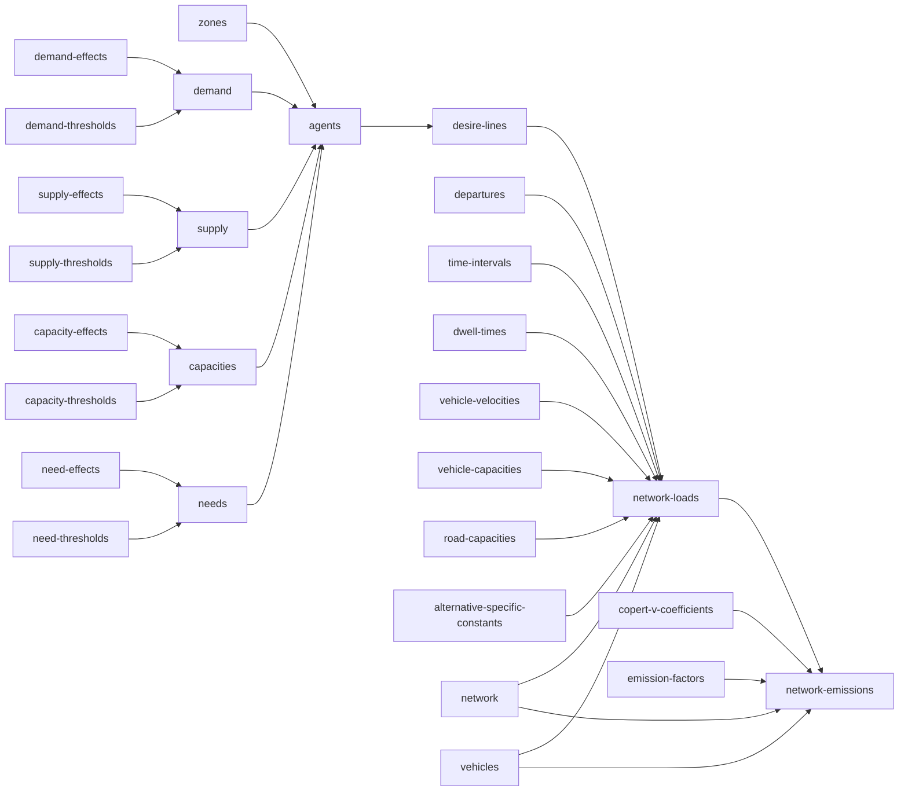

# urban-dollop

## `synth zones`

A GeoDataFrame of Voronoi-tessellated zone polygons over the unit square, one row per
`zone_id`, written to `zones.gpkg`. `zone_id` values are plain integers (`1`, `2`, ...),
matching the convention `effects.csv` uses for its own `zone_id` stratum.

| zone_id | geometry |
|---|---|
| 1 | POLYGON ((0.41 0.09, 0.63 0.22, ...)) |
| 2 | POLYGON ((0.12 0.55, 0.41 0.09, ...)) |

### Synthesis

Fully self-contained, same leaf contract as every other command. Run it with nothing on
disk yet and it invents both the zone count (`ceil(lognormal(0, sigma))`, the only place
`--sigma` acts) and the labels, then tessellates geometry for them.

Alternatively, hand it a `zones.gpkg` that already has a `zone_id` column (real IDs are
welcome, and can be integers or strings) with `geometry` left entirely empty, and it
synthesizes geometry for exactly those zones, in that order -- the count comes from the
shape you gave it, not from `--sigma`. A file with geometry already populated anywhere is
left alone and the command is a no-op: it doesn't matter whether every zone has geometry or
only some do, any real geometry at all means the file is complete (partial geometry would
mean regenerating some zones' shapes but not others, which makes no sense for a
tessellation -- unlike `effects.csv`, there's no legitimate reason for geometry to be
partially populated on purpose). Passing `--sigma` against a file that already exists
throws either way (shape-only or complete): `--sigma` only ever controls count invention,
and a file that already has a zone_id list has nothing left for it to control.

## `synth supply-effects` / `synth demand-effects` / `synth capacity-effects` / `synth need-effects`

Coefficients for a textbook additive (main-effects, no interactions among stratum
dimensions) ordered-logit linear predictor -- the cumulative logit / proportional odds
model of McCullagh (1980). Output is wide: one row per (stratum, stratum value) pair, one
column per resource.

| stratum | stratum_value | resource_1 | resource_2 |
|---|---|---|---|
| zone_id | 1 | 0.734 | -0.310 |
| zone_id | 2 | -0.051 | 0.884 |
| stratum_1 | value_1 | 0.512 | -0.204 |

A stratum value can repeat across different strata (`value_1` could belong to both
`stratum_1` and `stratum_2`) -- values are only unique within their own stratum, not across
the file. Each resource column is its own independent linear predictor ($\beta$), the sum
of whichever rows apply to a given stratum combination *for that resource* -- a resource
column indexes which independent model a cell belongs to, not a covariate on a shared one.
A resource cell can be empty even in an otherwise-complete file: a stratum genuinely may not
participate in every resource's market (a zone that supplies grain may not supply parcels at
all), so an empty cell there is a real, permanent "not applicable," not a placeholder waiting
to be filled. The stratum shape (which dimensions exist, how many values each has) stays
shared across resources, but which rows actually carry a given resource's column at all is
independent per resource -- it's participation, not shape, that varies.

`supply`/`demand` describe a stratum's aggregate resource totals; `capacity`/`need`
describe the size distribution of individual agents drawn from that stratum later --
different questions, same statistical machinery, four independent files.

### Synthesis

Every effect value is drawn from a standard normal, `Normal(0, 1)`, fixed regardless of
`--sigma` -- it is the value being synthesized, not a count of how much to synthesize. Mean
zero is not an arbitrary default: with no reference category dropped and no separate
intercept anywhere in this design, each effect is a random effect (in the mixed-model
sense), and mean zero is exactly what makes that identifiable rather than an unmeasurable
duplicate of an intercept that doesn't exist here.

Each of these four commands is fully self-contained -- none of them look at any other file.
Run one with nothing on disk yet and it synthesizes shape and values together: dimension
count, each dimension's value count, and resource count are all `ceil(lognormal(0,
sigma))`, uncapped, `zone_id` always included. `zone_id` values are plain integers (`1`,
`2`, ...); every other dimension gets string labels (`value_1`, `value_2`, ...) -- `zone_id`
is the one stratum guaranteed to exist and the one with a natural real-world numeric
identity, so it's the one place that distinction is made. `--sigma 0` collapses this to the
smallest possible draw: one dimension (`zone_id`), one value, one resource column.

Each resource independently applies to a uniformly-random non-empty subset of the invented
rows (size drawn uniform over `[1, n]`, membership drawn without replacement) -- never
every row automatically, since that would silently assume every stratum participates in
every resource's market. This is deliberately *not* controlled by `--sigma`: choosing how
many of an already-fixed set of rows to include is a bounded selection problem, not an
unbounded count to invent, so it doesn't fit the `ceil(lognormal(0, sigma))` pattern used
everywhere else -- capping a lognormal draw at `n` would just pile up mass at the cap.

Alternatively, hand it a file that already has `stratum`/`stratum_value` filled in plus one
or more resource columns (real names and values are welcome here). If every resource cell
in the file is empty, it's shape-only -- the command fills every one of them, leaving the
shape untouched. If *any* resource cell already has a value, the file is treated as
complete and the command does nothing at all: it does not fill the remaining empty cells,
because by that point an empty cell no longer means "not yet decided" -- it means "this
stratum doesn't participate in this resource," and that's not a leaf command's call to make
or overwrite once real data exists. `stratum` must contain strings; `stratum_value` must be
a string for every row except `zone_id`'s, which may be int or string -- resource columns
are identified by header name, not by dtype, so this isn't needed for disambiguation, it's
just that only `zone_id` has a real-world numeric identity worth allowing. Filled resource
cells must contain floats. Passing `--sigma` against a file that already exists throws
either way (shape-only or complete): `--sigma` only ever controls shape invention, and a
file that already has shape has nothing left for it to control.

## `synth supply-thresholds` / `synth demand-thresholds` / `synth capacity-thresholds` / `synth need-thresholds`

Cutpoints ($\mu$) for the same cumulative-logit model: a resource with $n$ ordered levels
gets `n - 1` thresholds, partitioning a latent continuous scale into the `n` discrete
outcomes.

| resource | resource_level | threshold |
|---|---|---|
| resource_1 | 0 | 0.432 |
| resource_1 | 2 | 1.738 |
| resource_1 | 3 | (empty) |
| resource_2 | 4 | -0.220 |
| resource_2 | 9 | (empty) |

`resource` must contain strings; `resource_level` must contain integers only -- a resource
is always counted in whole units (finer granularity means switching to a smaller unit, e.g.
tonnes to kilograms, not a fractional level). `resource_level` is a genuine numeric
quantity, not a category label -- it is the actual amount of the resource at that outcome,
used directly in a weighted sum downstream, even though it plays the same shape-defining
role `stratum_value` plays for effects. Levels are always distinct within a resource (a
repeated level would mean two ordinal categories mapping to the identical real-world
quantity, which has no meaningful interpretation) and always ascending; the largest level
in a resource has no upper threshold, hence empty.

### Synthesis

Every `threshold` is `Normal(0, 1)`, sorted ascending per resource, fixed regardless of
`--sigma` -- a value, not a count, same reasoning as `effect` above. Resource *count* and
*level count per resource* are both `ceil(lognormal(0, sigma))`, uncapped -- genuine counts,
never zero. Level *values* are different: drawn from the same `--sigma` as the count that
determined how many are needed, repeated until the required number of levels is distinct
within that resource, but shifted down by one (`ceil(lognormal(0, sigma)) - 1`) so `0` is
reachable -- unlike a count of things to synthesize, a resource level legitimately starts at
zero (the "none of this resource" outcome), and needs a real threshold between zero and
whatever level comes next. `resource_level` plays the same shape-defining role
`stratum_value` plays for effects, even though it's numeric.

Same self-contained contract as the effects commands: nothing on disk synthesizes shape and
values together; a file with `resource`/`resource_level` filled in and `threshold` entirely
empty gets just its thresholds filled; anything with `threshold` already set anywhere is
left alone and the command throws. Passing `--sigma` against a file that already exists
throws too, same reasoning as effects.

## `synth supply` / `synth demand` / `synth capacities` / `synth needs`

Combines a pair of upstream files (`supply_effects.csv` + `supply_thresholds.csv`, and so on
for the other three) into the actual ordered-logit output. Unlike every other command, this
one invents nothing -- it's a pure function of already-computed data, so `--sigma` has no
meaning here at all: passing it throws unconditionally, not just when the output file
already exists.

Only resources present in **both** the effects file (as a column) and the thresholds file
(as a `resource` value) get combined -- a resource missing from either side has nothing to
evaluate it against. For each such resource, a full stratum combination (the cartesian
product of every dimension in `effects.csv`, e.g. every `zone_id` × every `stratum_1` value)
needs *every* constituent dimension-value's effect to compute a beta; if even one is
missing, that whole combination is omitted for that resource -- never given a
zero-contribution stand-in. `resource_level = 0` is itself a real, reachable outcome, so it
can never double as an "undefined" marker; omission and an explicit computed `0` stay
distinguishable all the way through.

`supply.csv`/`demand.csv` are wide: one column per stratum dimension plus one column per
combined resource, holding the **rounded** expected value of that resource's distribution --
resource is always counted in whole units, so a fractional expected value isn't a
deliverable quantity. A combination with no computable value for a resource simply doesn't
get that column set for that row.

`capacities.csv`/`needs.csv` are wide on stratum dimensions but long on resource: explicit
`resource`, `resource_level`, `probability` columns, multiple rows per stratum combination.
Nothing gets rounded or collapsed here -- this is the actual distribution individual agents
get sampled from later, so it has to stay a distribution.

`supply.csv` / `demand.csv`:

| zone_id | stratum_1 | resource_1 | resource_2 |
|---|---|---|---|
| 1 | value_1 | 12 | 5 |
| 1 | value_2 | 8 | (empty) |
| 2 | value_1 | 3 | 1 |

`capacities.csv` / `needs.csv`:

| zone_id | stratum_1 | resource | resource_level | probability |
|---|---|---|---|---|
| 1 | value_1 | resource_1 | 0 | 0.412 |
| 1 | value_1 | resource_1 | 2 | 0.588 |
| 1 | value_1 | resource_2 | 4 | 1.000 |

### Synthesis

Deterministic, not random: the same effects + thresholds always produce the same output.
Because of that, once the output file exists, the command is a no-op rather than
overwriting it -- same protective posture as everywhere else in this arc (a user may have
hand-calibrated the output against real totals after generation), even though a fresh
recompute against unchanged inputs would give an identical file anyway. Delete the output
file to force a regenerate. If either upstream file is still absent or shape-only, the
command throws with a pointer to which leaf command to run first.

## `synth agents`

Combines `supply.csv`, `demand.csv`, `capacities.csv`, `needs.csv`, and `zones.gpkg` --
five independently-synthesized files -- into `agents.gpkg`: one row per synthesized agent,
with `agent_id`, `geometry`, the stratum dimension columns, and `{resource}_capacity` /
`{resource}_need` for every usable resource.

A stratum combination is only usable if its dimension *set* matches exactly across all four
data files -- not just overlaps. A dimension present in one file but not another means their
notion of "stratum" isn't even the same shape, so under pure independent synthesis (no
aligned shape-only input across the four upstream commands) this intersection can easily be
sparse or empty; that's expected, not a bug -- `--sigma 0` collapses every file to the same
single minimal stratum, so it always matches there, but larger, independent `--sigma` draws
make agreement increasingly unlikely by construction. Zone identity is matched separately
against `zones.gpkg`, normalized on both sides to guard against a numeric `zone_id`
silently stringifying on a CSV round-trip in a file that also has string-labeled sibling
dimensions.

A resource is usable for a stratum combination only if it has a real value in **all four**
files for that exact combination: supply and demand each need a defined aggregate (not an
omitted cell), and capacities and needs each need an actual distribution. An agent is a
single coherent record needing a valid draw for every usable resource at once, so a resource
missing from even one of the four isn't included for that stratum at all -- there'd be no
way to give an agent a well-defined value for it.

| agent_id | zone_id | stratum_1 | resource_1_capacity | resource_1_need | geometry |
|---|---|---|---|---|---|
| 1 | 1 | value_1 | 6 | 0 | POINT (0.42 0.71) |
| 2 | 1 | value_1 | 0 | 4 | POINT (0.38 0.65) |
| 3 | 2 | value_2 | 3 | 0 | POINT (0.81 0.10) |

### Synthesis

Agents are drawn one at a time per stratum, depleting that stratum's supply/demand budget as
they go. Each draw independently truncates the capacity distribution to the remaining supply
and the need distribution to the remaining demand, renormalizes, and draws one value from
each via `uniform(0, 1)` -- capacity and need for the same resource are independent draws,
not correlated. Generation for a stratum halts the moment *any* resource can't produce a
feasible draw (its distribution's smallest level exceeds what's left) -- a single agent is
one coherent record, so if even one resource can't be given a valid value, no valid agent
can be produced, and every later attempt would only face equal-or-worse depletion. It also
halts after committing an agent that made zero progress on every tracked resource
simultaneously (e.g. a resource whose only synthesized level in that stratum is `0`, which
is always feasible and never depletes anything) -- otherwise that state would repeat forever
by the same idempotency the truncation itself relies on. A depleting-toward-zero-need agent
is a completely ordinary, expected outcome, not a stopping condition by itself.

Agent placement: uniform random `(x, y)` in the zone polygon's bounding box, rejected and
redrawn until the point actually falls inside the polygon.

Like `synth supply` and friends, this invents nothing new (agent *count* is emergent from
the depletion loop, not a synthesized shape), so `--sigma` throws unconditionally, and the
command is a no-op once `agents.gpkg` already exists -- even more important here than for
the pure combiners, since agent synthesis has genuine randomness: an accidental re-run
wouldn't just redundantly recompute the same file, it would silently replace the whole agent
population with a different random draw.

## `synth desire-lines`

Combines pairs of agents from `agents.gpkg` into `desire_lines.gpkg`: one row per resource
transaction between two agents -- `resource`, `quantity`, `origin_agent_id`,
`destination_zone_id`, and a 2-point `LineString` directed from the provider (capacity side)
to the consumer (need side). The same two agents can produce more than one line, one per
resource they trade, or even more than one line for the *same* resource across separate
draws -- each transaction is its own row regardless of who's involved.

`origin_agent_id` and `destination_zone_id` are what let `network-loads` consolidate
transactions into depot-to-zone shipments, so a vehicle can be filled with deliveries bound
for the same zone instead of running one near-empty trip per transaction. Both come straight
off the paired agent records during pairing -- `agents.gpkg` already carries `zone_id` as one
of its stratum dimensions, so no downstream spatial join against `zones.gpkg` is needed. The
consumer's own agent id is deliberately not carried: the destination that matters downstream
is the zone, and the consumer's exact location is already in the line's end point.

`agents.gpkg` alone has everything needed: capacity, need, zone, and location, for every
resource that survived Layer 3 (found the same way Layer 3 finds them -- matching
`{resource}_capacity`/`{resource}_need` column pairs, no other file read). There is no
`batch_sizes.csv` anymore -- see Synthesis below for why.

| resource | quantity | origin_agent_id | destination_zone_id | geometry |
|---|---|---|---|---|
| resource_1 | 4 | 3 | 2 | LINESTRING (0.42 0.71, 0.81 0.10) |
| resource_1 | 2 | 7 | 2 | LINESTRING (0.38 0.65, 0.90 0.22) |
| resource_2 | 1 | 5 | 1 | LINESTRING (0.81 0.10, 0.42 0.71) |

### Synthesis

For each resource independently: the *currently* more-constrained side (whichever has less
total remaining across all agents, capacity or need) picks a primary agent weighted by their
own remaining value; the other side picks a secondary agent weighted by their remaining
value times a distance decay from the primary agent's location (`logistic(-distance)` --
the same sigmoid used for the ordered-logit models elsewhere in this pipeline, reused here
purely as a spatial gravity term, not a probability -- closer agents are more likely
paired). Self-pairing is excluded by agent id, not by coincidental location. The transacted quantity is `min` of the two specific agents' remaining values on
their respective sides -- that's the batch size now, derived from the actual pair instead of
sampled from an independent distribution, which is why `batch_sizes.csv` is gone: whichever
agent runs out first *is* the batch size for that transaction. Both agents' remaining values
are depleted by that quantity, and every quantity is recomputed -- which side is
constrained, and every candidate's weight -- fresh on every iteration, since depleting one
pair changes the totals for everyone.

The loop for a resource stops once either total (recomputed each pass) hits zero. Unlike
`synth agents`' stopping condition, no separate "made zero progress" check is needed here:
weight *is* the remaining value directly (not a probability of drawing a value that happens
to be zero), so a zero-remaining agent has zero weight and can never be selected, so every
drawn pair has strictly positive remaining on both sides and every iteration depletes a
real, positive amount. Termination is guaranteed by construction.

Same deterministic-consumer-with-real-randomness contract as `synth agents`: `--sigma`
throws unconditionally (nothing here is an invented shape either), and the command is a
no-op once `desire_lines.gpkg` already exists, for the same reason -- the pairing draws are
genuinely random, so a re-run would silently produce a different set of lines rather than
recomputing the same ones.

## `synth network`

A GeoDataFrame of road links, written to `network.gpkg`: `link_id`, `grade`, `road_type`,
`oneway`, and a 2-point `LineString`. Self-contained -- never reads any other file.

| link_id | grade | road_type | oneway | geometry |
|---|---|---|---|---|
| 0 | 2.145 | road_type_1 | True | LINESTRING (0.12 0.88, 0.53 0.41) |
| 1 | -4.732 | road_type_2 | False | LINESTRING (0.53 0.41, 0.77 0.09) |
| 2 | 0.318 | road_type_1 | True | LINESTRING (0.77 0.09, 0.12 0.88) |

### Synthesis

Points are scattered uniformly over the unit square and connected by Delaunay triangulation,
which needs at least 3 non-degenerate points -- below that, the two smaller cases are handled
directly rather than attempted: zero or one point produces zero edges (nothing to connect),
and exactly two points are connected directly to each other, skipping triangulation.
`random_count(sigma)` is the only place `--sigma` acts, for both the point count and the size
of the invented `road_type` vocabulary (`road_type_1`, `road_type_2`, ...); `grade`
(`triangular(-6.0, 6.0, 0.0)`, unchanged from the original implementation) is a value, not a
count, and stays fixed regardless of sigma.

`oneway` is a plain boolean rather than a three-way flag. A `LineString`'s start and end are
just two points with no inherent direction of travel, so when a link is one-way the start/end
order is chosen (a coin flip) to already match the allowed direction, rather than storing an
arbitrary order alongside a flag saying whether to walk it backward -- the same footgun OSM's
`oneway=-1` tag exists to patch, avoided here by controlling construction instead of
correcting it after the fact. When `oneway` is false, both directions are legal and the
stored order is immaterial. `grade` is always relative to whichever order ends up stored --
the reverse direction is its negation, not an independently sampled value, since a road's
slope is one physical fact, not two.

Alternatively, hand it a `network.gpkg` that already has `geometry` entirely populated (a
real road network extract, for instance) with `grade`/`road_type`/`oneway` left entirely
empty, and it synthesizes those attributes for exactly that geometry, in that order --
ignoring `--sigma` for the point/edge count, since there's nothing left for it to invent
there. `link_id` isn't part of this contract either way -- it's a plain positional index, not
a real identifier, so it's always reassigned fresh, the same way `agent_id` is never
something a caller supplies. One asymmetry worth naming: for invented geometry, `oneway`'s
start/end choice is guaranteed correct by construction (see above); for given geometry, a
one-way link's "forward" direction is just whatever the input's coordinate order already is
-- there's no way to guarantee that matches anything real without having authored the
geometry ourselves, an unavoidable property of the shape-only case rather than a gap in this
logic. A file with any of `grade`/`road_type`/`oneway` already populated anywhere is left
alone and the command is a no-op: partial attribute filling would mean regenerating some
links' attributes but not others, which has no well-defined meaning. Passing `--sigma`
against a file that already exists throws either way (shape-only or complete): `--sigma` only
ever controls count invention, and a file that already has geometry has nothing left for it
to control.

## `synth time-intervals`

One row per time interval, written to `time_intervals.csv`: a label (`interval_1`,
`interval_2`, ... when invented) and a `duration`. Self-contained -- never reads any other
file.

| time_interval | duration |
|---|---|
| interval_1 | 1.158 |
| interval_2 | 2.030 |
| interval_3 | 0.487 |

### Synthesis

`random_count(sigma)` is the only place `--sigma` acts, for the interval count. `duration` is
a value, not a count, and its distribution is deliberately unassuming
(`lognormvariate(0.0, 1.0)`, fixed regardless of sigma): the simulation period and what a
single interval represents (an hour, a day, a month) are entirely up to whoever uses this
data, so there's no canonical shape worth preserving or inventing around.

Row order is not incidental: `network_loads` treats file order as chronological order,
walking intervals in the order they appear rather than parsing the label, so rows are always
written `interval_1`, `interval_2`, ... in that order and never shuffled.

Alternatively, hand it a `time_intervals.csv` that already has `time_interval` filled in
(real labels like `AM_peak`/`midday` are welcome) with `duration` left entirely empty, and it
synthesizes durations for exactly those labels, in that order -- the count and the labels
come from what you gave it, not from `--sigma`. A file with `duration` already populated
anywhere is left alone and the command is a no-op: partial duration filling would mean
regenerating some intervals' durations but not others, which has no well-defined meaning.
Passing `--sigma` against a file that already exists throws either way (shape-only or
complete): `--sigma` only ever controls count invention, and a file that already has interval
labels has nothing left for it to control.

## `synth departures`

One row per (`resource`, `time_interval`) a resource departs in, written to `departures.csv`:
`resource`, `time_interval`, and `probability` -- each resource's probabilities sum to 1
across the intervals it uses. Self-contained -- never reads any other file, so its own
interval labels are independent of `time_intervals.csv`, invented or given.

| resource | time_interval | probability |
|---|---|---|
| resource_1 | interval_1 | 0.214 |
| resource_1 | interval_3 | 0.786 |
| resource_2 | interval_2 | 1.000 |

### Synthesis

`random_count(sigma)` is the only place `--sigma` acts, twice: once for `n_resources`, and
once for the size of a shared time-slot menu (`interval_1`, `interval_2`, ...). That menu is
a property of the simulated period itself, decided once, not derived from any one resource's
needs -- unlike the old version of this file, which sized the menu after the fact as the
max of independently-drawn per-resource counts. Each resource then draws a `random_subset` of
that menu -- bounded selection from an already-fixed set, not new invention, so deliberately
not sigma-driven either, the same "doesn't necessarily participate in everything" pattern
`random_strata` uses for resource/stratum participation.

Within a resource's chosen intervals, probabilities come from the same canonical ordered
logit used throughout this pipeline (McCullagh 1980): a single `beta` and
`len(intervals) - 1` sorted cutpoints (`mus`), both `Normal(0, 1)` and fixed regardless of
sigma, since they're values, not counts. `logistic(mu - beta)` turns the cutpoints into
cumulative probabilities from 0 to 1; consecutive differences are the probability mass for
each interval, in the same sorted order the intervals were drawn in.

Alternatively, hand it a `departures.csv` that already has `resource`/`time_interval` filled
in (real resource names and which intervals each one uses) with `probability` left entirely
empty, and it fills probabilities for exactly those pairs, grouped by resource -- the shape
comes from what you gave it, not from `--sigma`. The row order within a resource's given
pairs doesn't need to mean anything -- unlike `time_intervals.csv`, this file makes no
chronological claim, so pairs are grouped and filled in whatever order they're given. A file
with `probability` already populated anywhere is left alone and the command is a no-op:
probability is filled per resource-group internally, but eligibility to fill anything at all
is still a file-wide, all-or-nothing check, same as every other leaf command -- partial
filling would mean regenerating some resources' distributions but not others, which has no
well-defined meaning. Passing `--sigma` against a file that already exists throws either way
(shape-only or complete): `--sigma` only ever controls count invention, and a file that
already has resource/interval pairs has nothing left for it to control.

## `synth dwell-times`

One row per resource, written to `dwell_times.csv`: `dwell_time` (how long a vehicle dwells
before its return trip) and `load_pct` (the fraction of load carried back). Self-contained --
never reads any other file.

| resource | dwell_time | load_pct |
|---|---|---|
| resource_1 | 0.915 | 0.329 |
| resource_2 | 2.481 | 0.774 |

### Synthesis

`random_count(sigma)` is the only place `--sigma` acts, for the resource count. `dwell_time`
and `load_pct` are both values, not counts, and stay fixed regardless of sigma: `dwell_time`
gets the same deliberately unassuming `lognormvariate(0.0, 1.0)` treatment as
`time-intervals`' `duration` (a positive time span with no canonical shape to preserve), and
`load_pct` is already the canonical choice for "a fraction in `[0, 1)`" as plain
`random.random()`, nothing legacy to migrate there.

Alternatively, hand it a `dwell_times.csv` that already has `resource` filled in (real
resource names are welcome) with `dwell_time`/`load_pct` left entirely empty, and it fills
both for exactly those resources -- checked jointly, since they're synthesized together, so
one column filled while the other isn't is rejected rather than partially accepted. A file
with `dwell_time`/`load_pct` already populated anywhere is left alone and the command is a
no-op. Passing `--sigma` against a file that already exists throws either way (shape-only or
complete): `--sigma` only ever controls count invention, and a file that already has resource
labels has nothing left for it to control.

## `synth vehicle-velocities`

One row per (`vehicle`, `road_type`) pair, written to `vehicle_velocities.csv`: `vehicle`,
`road_type`, and a `velocity`. Self-contained -- never reads any other file.

| vehicle | road_type | velocity |
|---|---|---|
| vehicle_1 | road_type_1 | 1.563 |
| vehicle_1 | road_type_2 | 0.842 |
| vehicle_2 | road_type_1 | 2.104 |

### Synthesis

`random_count(sigma)` is the only place `--sigma` acts, for `n_vehicles` and `n_road_types`
independently -- their full cross product is what gets a row each. `velocity` is a value, not
a count, and gets the same deliberately unassuming `lognormvariate(0.0, 1.0)` treatment as
`time-intervals`' `duration` and `dwell-times`' `dwell_time`.

Alternatively, hand it a `vehicle_velocities.csv` that already has `vehicle`/`road_type`
filled in (real vehicle and road types are welcome) with `velocity` left entirely empty, and
it fills velocities for exactly those pairs, in that order -- the shape comes from what you
gave it, not from `--sigma`. Given pairs don't need to be a full cross product: a caller who
knows a `boat` has no meaningful velocity on `highway` can simply omit that pair, rather than
being forced to enumerate every combination the way full synthesis does. A file with
`velocity` already populated anywhere is left alone and the command is a no-op. Passing
`--sigma` against a file that already exists throws either way (shape-only or complete):
`--sigma` only ever controls count invention, and a file that already has vehicle/road_type
pairs has nothing left for it to control.

## `synth vehicle-capacities`

One row per (`vehicle`, `resource`) pair, written to `vehicle_capacities.csv`: `vehicle`,
`resource`, and a `capacity`. Self-contained -- never reads any other file.

| vehicle | resource | capacity |
|---|---|---|
| vehicle_1 | resource_1 | 4 |
| vehicle_1 | resource_2 | 1 |
| vehicle_2 | resource_1 | 7 |

### Synthesis

`random_count(sigma)` is the only place `--sigma` acts, for `n_vehicles` and `n_resources`
independently -- their full cross product is what gets a row each. `capacity` is a value, not
a count, despite needing the same "positive whole number" shape a count needs -- a vehicle
carries 12 pallets, not 12.7, but that's a domain constraint on this value's type, not a
reason to tie it to sigma (unlike `resource_level` in `capacities.csv`/`needs.csv`, which
legitimately is sigma-driven because it plays a dual shape-defining role `capacity` doesn't
have here). So `capacity` is fixed regardless of sigma, drawn with the same shape
`random_count` uses (`ceil(lognormvariate(0, 1))`) but as a literal, not parameterized by
`--sigma`.

Alternatively, hand it a `vehicle_capacities.csv` that already has `vehicle`/`resource`
filled in (real vehicles and resources are welcome) with `capacity` left entirely empty, and
it fills capacities for exactly those pairs, in that order -- the shape comes from what you
gave it, not from `--sigma`. Given pairs don't need to be a full cross product, same reasoning
as `vehicle-velocities`. A file with `capacity` already populated anywhere is left alone and
the command is a no-op; whichever state the file is in, every non-empty `capacity` must be a
whole number. Passing `--sigma` against a file that already exists throws either way
(shape-only or complete): `--sigma` only ever controls count invention, and a file that
already has vehicle/resource pairs has nothing left for it to control.

## `synth road-capacities`

One row per road type, written to `road_capacities.csv`: `road_type` and a `capacity`.
Self-contained -- never reads any other file.

| road_type | capacity |
|---|---|
| road_type_1 | 2.001 |
| road_type_2 | 0.667 |

### Synthesis

`random_count(sigma)` is the only place `--sigma` acts, for the road type count. `capacity`
is a value, not a count, and gets the same deliberately unassuming `lognormvariate(0.0, 1.0)`
treatment as `vehicle-velocities`' `velocity` -- a plain continuous PCU (passenger-car-unit)
figure, no whole-number constraint the way `vehicle-capacities`' `capacity` had.

Alternatively, hand it a `road_capacities.csv` that already has `road_type` filled in (real
road types are welcome) with `capacity` left entirely empty, and it fills capacities for
exactly those road types, in that order -- the count comes from the shape you gave it, not
from `--sigma`. A file with `capacity` already populated anywhere is left alone and the
command is a no-op. Passing `--sigma` against a file that already exists throws either way
(shape-only or complete): `--sigma` only ever controls count invention, and a file that
already has road type labels has nothing left for it to control.

## `synth alternative-specific-constants`

One row per (`vehicle`, `resource`) pair, written to `alternative_specific_constants.csv`:
`vehicle`, `resource`, and an `alternative_specific_constant`. Self-contained -- never reads
any other file.

| vehicle | resource | alternative_specific_constant |
|---|---|---|
| vehicle_1 | resource_1 | -0.368 |
| vehicle_1 | resource_2 | 1.569 |
| vehicle_2 | resource_1 | 0.766 |

### Synthesis

`random_count(sigma)` is the only place `--sigma` acts, for `n_vehicles` and `n_resources`
independently -- their full cross product is what gets a row each.
`alternative_specific_constant` is the discrete-choice model's ASC: the baseline utility of
choosing this vehicle for this resource before time/distance are factored in. Unlike
`vehicle-capacities`' `capacity`, it's genuinely unrestricted in sign by definition -- one
alternative is typically normalized to zero and the rest float above or below it -- so it
gets the same `Normal(0, 1)` treatment as every other effect coefficient in this pipeline
(`supply-effects` and friends), fixed regardless of sigma since it's a value, not a count.

Alternatively, hand it an `alternative_specific_constants.csv` that already has
`vehicle`/`resource` filled in (real vehicles and resources are welcome) with
`alternative_specific_constant` left entirely empty, and it fills constants for exactly those
pairs, in that order -- the shape comes from what you gave it, not from `--sigma`. Given pairs
don't need to be a full cross product, same reasoning as `vehicle-velocities`. A file with
`alternative_specific_constant` already populated anywhere is left alone and the command is a
no-op. Passing `--sigma` against a file that already exists throws either way (shape-only or
complete): `--sigma` only ever controls count invention, and a file that already has
vehicle/resource pairs has nothing left for it to control.

## `synth vehicles`

One row per vehicle, written to `vehicles.csv`: `vehicle`, `vehicle_type`, `bpr_alpha`,
`bpr_beta`, `time_coefficient`, `distance_coefficient`, and `pcu`. Self-contained -- never
reads any other file. `vehicle_type` isn't used anywhere in this pipeline yet, but
`emission-factors` needs it once it's built.

| vehicle | vehicle_type | bpr_alpha | bpr_beta | time_coefficient | distance_coefficient | pcu |
|---|---|---|---|---|---|---|
| vehicle_1 | vehicle_type_3 | 0.206 | 2.755 | -0.299 | -0.607 | 0.849 |
| vehicle_2 | vehicle_type_6 | 1.238 | 6.361 | -2.075 | -0.162 | 0.436 |

### Synthesis

`random_count(sigma)` is the only place `--sigma` acts, for the vehicle count and for the
size of the `vehicle_type` vocabulary (`vehicle_type_1`, `vehicle_type_2`, ...) each vehicle
draws from -- the vocabulary size stays sigma-driven even when a `vehicle_list` is given
(shape-only mode below), the same way `network`'s `road_type` vocabulary stays sigma-driven
even when geometry is given: `--sigma` always throws once `vehicles.csv` already exists, so a
caller can never actually exercise that control either way.

`bpr_alpha`/`bpr_beta` are the BPR congestion function's parameters
(`t = t0 * (1 + alpha * (v/c)^beta)`), and unlike every other positive value in this
pipeline, they're `triangular`, not `lognormal`. Both have a well-known real convention (the
1964 Bureau of Public Roads defaults, `alpha=0.15`, `beta=4`) and a well-known calibrated
range in the transportation literature (roughly `alpha` in `[0.05, 2]`, `beta` in `[2, 10]`),
so `triangular`'s hard bounds plus a mode at the standard value map onto that directly --
`bpr_alpha = triangular(0.05, 2.0, 0.15)`, `bpr_beta = triangular(2.0, 10.0, 4.0)` -- the same
reasoning `network`'s `grade` uses `triangular(-6, 6, 0)` instead of an unbounded
distribution.

`time_coefficient`/`distance_coefficient` are the discrete-choice model's marginal utility of
route time/distance. Unlike `alternative_specific_constant`, these aren't sign-free: a longer
route should never look more attractive, so both are forced negative
(`-lognormvariate(0.0, 1.0)`) -- a positive draw would be a real modeling error, not just an
unusual value. No real-world magnitude convention exists for them the way BPR's parameters
have one, since route time/distance are in this pipeline's own arbitrary units, so only the
sign is constrained, not the magnitude.

`pcu` (passenger-car-unit equivalent) stays a plain unassuming positive value
(`lognormvariate(0.0, 1.0)`) -- median 1.0 already coincides with the real PCU baseline for a
car, and there's no way to tie it more precisely to `vehicle_type` here since those labels
are synthetic, not real categories with known PCU multipliers.

Alternatively, hand it a `vehicles.csv` that already has `vehicle` filled in (real vehicle
names are welcome) with the other six columns left entirely empty, and it fills all six for
exactly those vehicles, in that order -- checked jointly, since they're synthesized together,
so some columns filled while others aren't is rejected rather than partially accepted. A file
with those six columns already populated anywhere is left alone and the command is a no-op.
Passing `--sigma` against a file that already exists throws either way (shape-only or
complete): `--sigma` only ever controls count invention, and a file that already has a
vehicle list has nothing left for it to control.

## `synth network-loads`

Combines ten upstream files -- `network.gpkg`, `desire_lines.gpkg`, `departures.csv`,
`time_intervals.csv`, `dwell_times.csv`, `vehicles.csv`, `vehicle_velocities.csv`,
`vehicle_capacities.csv`, `road_capacities.csv`, and
`alternative_specific_constants.csv` -- into `network_loads.csv`: one row per (link, time
interval, vehicle) the simulation actually put traffic on.

| link_id | time_interval | vehicle | vehicle_count | velocity | load_pct |
|---|---|---|---|---|---|
| 19 | morning | van | 2 | 0.919 | 1.000 |
| 16 | morning | van | 1 | 5.298 | 0.400 |
| 28 | evening | van | 1 | 0.820 | 0.500 |

`vehicle_count` is a whole number of vehicles: presence on a link during an interval is a
yes-or-no question, not a fraction. `velocity` is that vehicle's actual velocity there
(grade- and congestion-adjusted, averaged if several of its trips crossed the same link that
interval), and `load_pct` is the mean fraction of capacity those vehicles were carrying --
below 1 for a part-loaded final vehicle in a run, and for return trips, which run at
`dwell_times.csv`'s `load_pct`.

### Synthesis

The network is filtered twice before anything moves. Links whose `road_type` has no entry in
`road_capacities.csv` are dropped outright -- with no capacity there's no meaningful v/c
ratio. Then each vehicle keeps only the links whose `road_type` it has a velocity for in
`vehicle_velocities.csv`, so every vehicle routes on its own subgraph and a vehicle simply
never appears on a road it can't use.

Each resource's whole transacted flow is spread across intervals by `departures.csv`,
renormalized over just the intervals `time_intervals.csv` actually defines (the two files are
synthesized independently, so departures may name intervals that don't exist) and rounded to
whole units, since a resource is counted in whole units.

Flow leaves as **shipments**, not as individual transactions. Every delivery the same origin
agent owes the same zone for the same resource is grouped into one shipment, which is what
stops a single package from becoming a single van trip. Within an interval, a weighted draw
picks a shipment (by outstanding quantity), a second weighted draw picks which of that
shipment's destinations ride along on this run, and the run drives to the **centroid of those
specific destinations** rather than to any one of them -- the centroid of the agents actually
being served, not the zone polygon's geometric centroid, which could sit in empty space in a
zone shaped nothing like where its agents cluster.

Vehicles that have both an ASC and a capacity for the resource bid for the run. Those that
can actually reach the centroid are entered into a multinomial logit on
`alternative_specific_constant + time_coefficient * route time + distance_coefficient * route
distance`, and one is drawn -- a genuine probabilistic choice, not the utility-maximizing
`argmax` an earlier version of this file used. Enough of that vehicle then go out to carry
the flow, the last one part-loaded with whatever's left over. If no vehicle can reach the
centroid, that origin-agent/destination-zone pair is dropped entirely rather than retried
against a different draw of destinations: a different subset might well succeed, but there's
no non-arbitrary number of retries to allow, and the pair is already looking unreachable.

Grade is signed relative to a link's own start-to-end coordinate order, so traversing a
two-way link backward flips it -- the climb becomes the descent. That's why a route carries a
direction alongside each link id rather than a bare link id: the sign has to be recoverable
when the trip is simulated, not just when the graph is built.

Velocities are frozen for the duration of an interval and recomputed at the end of it, from
the loads that interval actually produced, via the BPR volume-delay function
(`1 + alpha * (v/c)^beta`, with each vehicle's own `bpr_alpha`/`bpr_beta`). So every trip in
an interval sees the same congestion, and routing decides on the state the network was in
when the interval opened. Loads deliberately do **not** accumulate across intervals: a
vehicle that has driven on is no longer on the link behind it, so v/c is recomputed from
scratch each interval rather than summed forever.

Trips that don't finish within an interval carry their position into the next one and resume
at the updated velocities. On arrival, `dwell_times.csv` decides how long the vehicle sits
before returning; the return departs at the start of the first interval beginning at or after
that, since every trip fires at an interval boundary, and is dropped if that falls past the
end of the simulated period or if no return route exists.

Like `synth agents` and `synth desire-lines`, this invents no shape, so `--sigma` throws
unconditionally, and the command is a no-op once `network_loads.csv` already exists -- the
draws here are genuinely random, so a re-run would silently produce a different assignment
rather than recomputing the same one.

## `synth copert-v-coefficients`

One row per (`vehicle_type`, `pollutant`, `gradient_bin`, `payload_bin`) key, written to
`copert_v_coefficients.csv`: that key plus the COPERT V hot-emission-function coefficients
`alpha` through `eta` and a reduction factor `rf`. Self-contained -- never reads any other
file, including `vehicles.csv`; `vehicle_type` is matched up against it later, by whichever
command combines them.

| vehicle_type | pollutant | gradient_bin | payload_bin | alpha | beta | gamma | delta | epsilon | zeta | eta | rf |
|---|---|---|---|---|---|---|---|---|---|---|---|
| vehicle_type_1 | pollutant_1 | -6 | 0 | 1.502 | 1.358 | -0.753 | -0.358 | 0.891 | 0.017 | -1.565 | 0.157 |
| vehicle_type_1 | pollutant_1 | -6 | 50 | -0.450 | -0.061 | 0.854 | 0.908 | -0.698 | 0.550 | -0.183 | 0.829 |
| vehicle_type_1 | pollutant_1 | -4 | 0 | 0.643 | -0.650 | 0.252 | 1.285 | -0.188 | -1.771 | 0.958 | 0.462 |

### Synthesis

`gradient_bin` (`-6, -4, -2, 0, 2, 4, 6`) and `payload_bin` (`0, 50, 100`) are fixed COPERT V
categories, not something `--sigma` or a caller invents -- the same status as `vehicles.py`'s
BPR defaults. `random_count(sigma)` is the only place `--sigma` acts, for `n_vehicle_types` and
`n_pollutants` independently; on full synthesis, their full cross product against the fixed
bins is what gets a row each.

`alpha` through `eta` are the fitted coefficients of COPERT's hot-emission speed function.
Unlike `vehicles.csv`'s `bpr_alpha`/`bpr_beta`, there's no single real-world default to anchor
to: COPERT's published values are indexed by real vehicle/pollutant/Euro-class categories, and
`vehicle_type`/`pollutant` here are synthetic labels, not entries in that taxonomy, so there's
no principled real coefficient set to center on. They get the same sign-free `Normal(0, 1)`
treatment as `alternative_specific_constant`. `rf`, the reduction factor, is conventionally
bounded to `[0, 1]`, so it's a plain uniform draw.

Alternatively, hand it a `copert_v_coefficients.csv` that already has all four key columns
filled in (real categories are welcome) with the eight coefficient columns left entirely
empty, and it fills them for exactly those rows, in that order -- checked jointly, so some
coefficients filled while others aren't is rejected rather than partially accepted. Given rows
don't need to cover the full bin grid, same reasoning as `vehicle-velocities`' pairs. A file
with those eight columns already populated anywhere is left alone and the command is a no-op.
Passing `--sigma` against a file that already exists throws either way (shape-only or
complete): `--sigma` only ever controls count invention, and a file that already has its key
columns has nothing left for it to control.
